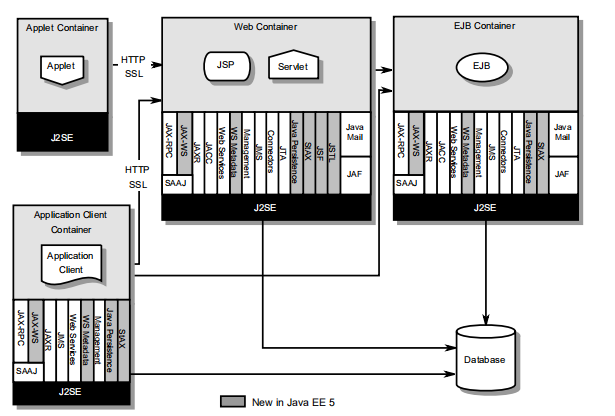
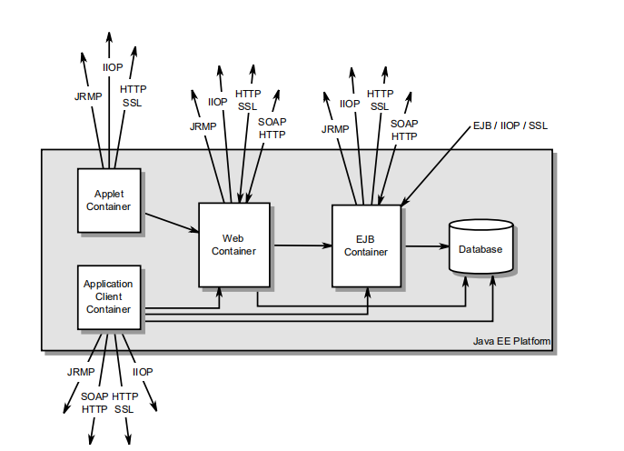

# 平台概述	

## 架构

## 应用组件

JavaEE运行时环境定义了JavaEE产品必须支持的四种应用程序组件类型：

* GUI应用程序

  应用程序客户端是Java编程语言程序，通常是在桌面计算机上执行的GUI程序。应用程序客户端提供与本机类似的用户体验。应用程序，并且可以访问JavaEE中间层的所有工具。

* Applet

  Applet 通常是执行在 Web 浏览器的 GUI 组件，但也可以执行在支持 Applet 程序模 型的其他应用或设备上。Applet 可以为 Java EE 应用提供很强的用户界面。（简单的 HTML 页面也可以用于提供非常有限的用户界面）  

* Servlet

  Servlet，JSP 页面，JSF 应用，过滤器和 web 事件监听器通常都是执行在 web 容器 中，它们可以响应来自 web 客户端的 HTTP 请求

* EJB 

  EJB 组件执行在受管理的支持事务的环境中。

## 容器

容器为 Java EE 应用组件提供了运行环境。容器为应用组件提供了一个后台 Java EE API 的联合视图。

主要包括：

* 应用客户端容器
* applet 容器
* web 容器
* 企业 bean 容器

## 资源适配器

资源适配器是系统级的软件组件，它通常实现对外部资源管理器的网络连接。资源适配 器可以通过实现 Java EE 标准服务 API（例如 JDBC 驱动）或定义和实现对外部应用系统进行 连接的资源适配器来扩展 Java EE 平台的功能。资源适配器也可以提供完全是本地的、可能 和本地资源进行交互的服务。资源适配器通过 Java EE 服务提供者的接口（Java EE SPI）与 Java  EE平台衔接。使用SPI附加到Java EE平台的资源适配器能够和所有的Java EE产品一起工作

## 数据库

JavaEE平台需要通过JDBCAPI访问的数据库来存储业务数据。数据库可从web组件、企业bean和应用程序客户端访问。组件。数据库不需要通过applet访问。

## Java EE 标准服务

### HTTP

HTTP客户端API由java.net包定义。HTTP服务器端API由servlet、JSP和JSF接口以及作为JavaEE一部分的Web服务支持定义台.

### HTTPS

基于 SSL 协议的 HTTP 协议，由与 HTTP 相同的客户端和服务器端 API 支持。 

### JTA(java transaction api) 

java 事务API有两部分组成：

* 应用程序级别分界接口，容器和应用程序组件使用它来划分事务边界。
* 在JavaEESPI级别上使用的事务管理器和资源管理器之间的接口。

###  RMI‐IIOP

RMI‐IIOP 子系统由用于 RMI 风格的不依赖后台协议的程序的 API 和支持 J2SE 本地 RMI 协议（JRMP） 和 CORBA IIOP 协议的  API 实现组成。Java EE 应用可以使用 RMI‐IIOP（支持 IIOP） 来访问兼容RMI编程限制的CORBA服务（参见RMI‐IIOP规范了解更详细信息） 

###  Java IDL 

Java IDL 可以让 Java EE 应用组件调用外部的使用 IIOP 协议的 CORBA 对象

### JDBC API 

JDBC API 是与关系数据库系统进行连接的 API.

应用程序组件用于访问数据库的应用程序级接口，以及用于将jdbc驱动程序附加到JavaEE平台的服务提供者接口。

### Java 持久化 API （JPA）

Java 持久化 API 是持久化管理和 O/R 映射的标准 API。本规范为使用 Java 域模型来管理 关系数据库的应用开发者提供了 O/R 映射的工具。在 Java  EE 中必须支持 Java 持久化 API。 它也可以用于 Java SE 环境。 

###  Java 消息服务（JMS） 

Java 消息服务是用于支持可靠的点对点和发布‐订阅模型的消息的标准 API。本规范要求 JMS 提供者要实现点对点和发布‐订阅两种模型。 

### Java 命名和目录接口（JNDI） 

JNDI API 是命名和目录服务的标准 API。JNDI API 有两个部分：由访问命名和目录服务的 应用组件使用的应用级接口和目录服务提供者接口。 

###  JavaMail 

Java EE 平台包含了 JavaMail API 和可以让 应用组件发送邮件的 JavaMail 服务提供者。JavaMail  API 有两个部分：由应用组件用于发送 邮件的应用级接口和用于 Java EE SPI 层的服务提供者接口。 

###  JavaBean 活动框架（JAF） 

JAF(JavaBeans™ Activation Framework)  API 为处理不同 MIME 类型、来自不同的格式和位置的数据提供了一个框架。因为 JavaMail API 使用 JAF API，因此也必须包含 JAF API。 

###  XML 处理 

JAXP(Java™ API for XML Processing) 提供了对用于解析 XML 文档的工业标准 SAX 和 DOM API 的支持，也支持 XSLT 转换 引擎。StAX（Streaming API for XML）为 XML 提供了拉式解析 API。 

### JavaEE™连接器体系结构

Connector架构是一个JavaEESPI，它允许支持访问企业信息系统(EnterpriseInformationSystems)的资源适配器插入到任何JavaEE产品。连接器体系结构d在JavaEE服务器和资源适配器之间设置一组标准的系统级契约。标准合同包括：

* 连接管理契约，它允许JavaEE服务器池连接到基础EIS，并允许应用程序组件连接到EIS。
* 事务管理器和EIS之间的事务管理契约，支持对EIS资源管理器的事务访问。该协议允许JavaEE服务器使用事务管理器管理跨多个资源管理器的事务
* 一种安全契约，可以安全访问EIS。 此血月提供对安全应用程序环境的支持，该环境可减少对EIS的安全威胁并保护EIS管理的有价值的信息资源。
* 一种线程管理协议，允许资源适配器将工作委托给其他线程，并允许应用服务器管理线程池。
* 一种线程管理契约，允许资源适配器将工作委托给其他线程，并允许应用服务器管理线程池。辅助线程使用的安全上下文和事务上下文。
* 允许资源适配器将消息传递到消息驱动Bean的协定，与用于传递消息的特定消息传递样式，消息传递语义和消息传递基础结构无关。 此合同还充当标准消息提供程序可插入性合同，允许通过资源适配器将消息提供程序插入任何Java EE服务器
* 允许资源适配器将导入的事务上下文传播到JavaEE服务器的契约，使其与服务器和任何应用程序组件的交互成为e进口交易。本合同保留进口交易的酸性(原子性、一致性、隔离性、耐久性)特性。
* 在应用程序和资源适配器之间提供通用命令接口的可选协议。

### 安全服务

JAAS（Java™ Authentication and Authorization Service）

Java™身份验证和授权服务（JAAS）支持服务对用户进行身份验证和强制执行访问控制。 它实现了Java技术版标准可插拔认证模块（PAM）最终发布框架并支持基于用户的授权。 容器的Java™授权服务提供商合同（JACC）定义Java EE应用程序服务器和授权服务提供程序之间的合同，允许将自定义授权服务提供程序插入任何Java EE产品

## 互操作性

上面表述的许多 API 都提供了与非 Java  EE 平台组件的互操作性

# 安全

除了JavaEE需求之外，每个JavaEE产品提供商还将确定它们的实现所提供的安全和安全保证的级别。

## 简介

每个企业都有安全需求，并且有满足他们的基础设施。

尽管质量保证和实现细节不同，它们都有以下的特征：

* 认证：对通讯进行认证加密
* 对资源进行访问控制：对资源设置访问权限
* 数据完整性：对数据进行完整性验证
* 保密性或数据隐私：确保信息只提供给有权访问信息的用户的方法。
* 不可抵赖：一种用来证明用户执行了某种操作的方法，使用户不能合理地否认这样做。
* 审计：用于捕获与安全相关事件的抗篡改记录的方法，以便能够评估安全策略和机制的有效性。

## 安全架构

本节描述了本规范定义的安全需求所基于的JavaEE安全体系结构。

### 目标

以下是安全架构的目标

* 可移植性。安全架构必须支持一次编写，到处运行。

* 透明性：在编写应用程序时，应用程序组件提供程序不应该知道任何关于安全性的信息。

* 隔离性：Java EE平台应该能够根据部署者使用部署属性建立的指令执行身份验证和访问控制，并由系统管理员管理

* 可扩展性：安全感知应用程序使用平台服务不得损害应用程序的可移植性。

  该规范在组件编程模型中提供API，用于与容器/服务器安全信息交互。 限制与提供的API交互的应用程序将保留可移植性

* 灵活性

* 抽象

* 独立性

* 兼容性

* 安全互操作性

