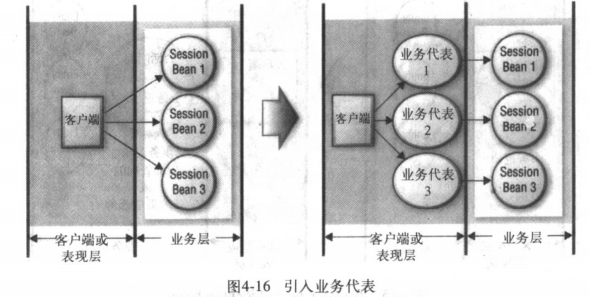
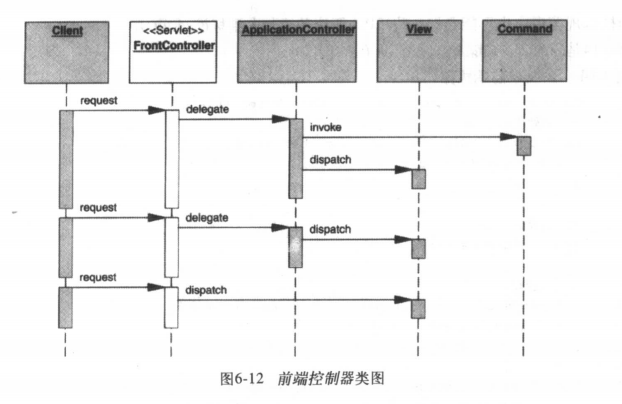

# 模式和J2EE

## 模式的定义

模式是一个通用，[可重复使用的](https://en.wikipedia.org/wiki/Reusability)在给定的范围内解决普遍发生问题[的软件设计](https://en.wikipedia.org/wiki/Software_design)

具有以下特征：

* 模式是通过经验观察得出的
* 一般来说模式都要按一种专门的结构格式来记录
* 采用模式能够避免重复发明轮子
* 不同模式处于不同的抽象层次上
* 模式要经历不断的改进、完善
* 模式是可以重用的组件
* 模式可以用来让大家交流系统设计和最佳实践
* 多个模式可以用来拼合使用，从而解决一个大型文体。

## 模式的分类

按照功能主要分为

### 功能分类

#### 创建型模式

| 名称                                                         | 描述                                                         | 在*设计模式中* | 在*代码完成*[[13\]](https://en.wikipedia.org/wiki/Software_design_pattern#cite_note-McConnell2004-13) | 其他                                                         |
| ------------------------------------------------------------ | ------------------------------------------------------------ | -------------- | ------------------------------------------------------------ | ------------------------------------------------------------ |
| [抽象工厂](https://en.wikipedia.org/wiki/Abstract_factory_pattern) | 提供用于创建相关或从属对象*族*的接口，而无需指定其具体类。   | 是             | 是                                                           | N / A                                                        |
| [建造者](https://en.wikipedia.org/wiki/Builder_pattern)      | 将复杂对象的构造与其表示分开，允许相同的构造过程创建各种表示。 | 是             | 没有                                                         | N / A                                                        |
| [依赖注入](https://en.wikipedia.org/wiki/Dependency_injection) | 类从注入器接受它需要的对象，而不是直接创建对象。             | 没有           | 没有                                                         | N / A                                                        |
| [工厂方法](https://en.wikipedia.org/wiki/Factory_method_pattern) | 定义用于创建*单个*对象的接口，但让子类决定实例化哪个类。Factory Method允许类将实例化延迟到子类。 | 是             | 是                                                           | N / A                                                        |
| [延迟初始化](https://en.wikipedia.org/wiki/Lazy_initialization) | 延迟创建对象，计算值或其他一些昂贵的过程直到第一次需要的策略。此模式在GoF目录中显示为“虚拟代理”，即[代理](https://en.wikipedia.org/wiki/Proxy_pattern)模式的实现策略。 | 是             | 没有                                                         | PoEAA [[14\]](https://en.wikipedia.org/wiki/Software_design_pattern#cite_note-PoEAA-14) |
| [多例](https://en.wikipedia.org/wiki/Multiton_pattern)       | 确保一个类只有命名实例，并提供对它们的全局访问点。           | 没有           | 没有                                                         | N / A                                                        |
| [对象池](https://en.wikipedia.org/wiki/Object_pool_pattern)  | 通过回收不再使用的对象，避免昂贵的资源获取和释放。可以认为是[连接池](https://en.wikipedia.org/wiki/Connection_pool)和[线程池](https://en.wikipedia.org/wiki/Thread_pool)模式的一般化。 | 没有           | 没有                                                         | N / A                                                        |
| [原型](https://en.wikipedia.org/wiki/Prototype_pattern)      | 使用原型实例指定要创建的对象类型，并从现有对象的“骨架”创建新对象，从而提高性能并将内存占用量降至最低。 | 是             | 没有                                                         | N / A                                                        |
| [资源获取是初始化](https://en.wikipedia.org/wiki/Resource_Acquisition_Is_Initialization)（RAII） | 确保通过将资源绑定到合适对象的生命周期来正确释放资源。       | 没有           | 没有                                                         | N / A                                                        |
| [单例模式](https://en.wikipedia.org/wiki/Singleton_pattern)  | 确保一个类只有一个实例，并提供一个全局访问点。               | 是             | 是                                                           | N / A                                                        |

#### 结构性模式

| 名称                                                         | 描述                                                         | 在*设计模式中* | 在*代码完成*[[13\]](https://en.wikipedia.org/wiki/Software_design_pattern#cite_note-McConnell2004-13) | 其他                                                         |
| ------------------------------------------------------------ | ------------------------------------------------------------ | -------------- | ------------------------------------------------------------ | ------------------------------------------------------------ |
| [适配器](https://en.wikipedia.org/wiki/Adapter_pattern)，包装器或转换器 | 将类的接口转换为客户期望的另一个接口。适配器允许类一起工作，否则由于不兼容的接口。企业集成模式等同于翻译。 | 是             | 是                                                           | N / A                                                        |
| [桥接](https://en.wikipedia.org/wiki/Bridge_pattern)         | 将抽象与其实现分离，允许两者独立变化。                       | 是             | 是                                                           | N / A                                                        |
| [组合](https://en.wikipedia.org/wiki/Composite_pattern)      | 将对象组合成树结构以表示部分整体层次结构。Composite允许客户端统一处理单个对象和对象组合。 | 是             | 是                                                           | N / A                                                        |
| [装饰](https://en.wikipedia.org/wiki/Decorator_pattern)      | 将附加职责附加到动态保持相同接口的对象。装饰器为子类化提供了灵活的替代扩展功能。 | 是             | 是                                                           | N / A                                                        |
| 扩展对象                                                     | 向层次结构添加功能而不更改层次结构。                         | 没有           | 没有                                                         | 敏捷软件开发，原则，模式和实践[[15\]](https://en.wikipedia.org/wiki/Software_design_pattern#cite_note-Agile_Software_Development-15) |
| [门面模式](https://en.wikipedia.org/wiki/Facade_pattern)     | 为子系统中的一组接口提供统一接口。Facade定义了一个更高级别的接口，使子系统更易于使用。 | 是             | 是                                                           | N / A                                                        |
| [享元模式](https://en.wikipedia.org/wiki/Flyweight_pattern)  | 使用共享可以有效地支持大量类似对象。                         | 是             | 没有                                                         | N / A                                                        |
| [前控制器](https://en.wikipedia.org/wiki/Front_controller)   | 该模式与Web应用程序的设计有关。它为处理请求提供了一个集中的入口点。 | 没有           | 没有                                                         | J2EE模式[[16\]](https://en.wikipedia.org/wiki/Software_design_pattern#cite_note-J2EE_Patterns-16) PoEAA [[17\]](https://en.wikipedia.org/wiki/Software_design_pattern#cite_note-PoEAA2-17) |
| [标记](https://en.wikipedia.org/wiki/Marker_interface_pattern) | 用于将元数据与类关联的空接口。                               | 没有           | 没有                                                         | [有效的Java ](https://en.wikipedia.org/wiki/Joshua_Bloch)[[18\]](https://en.wikipedia.org/wiki/Software_design_pattern#cite_note-EffectiveJava-18) |
| [模](https://en.wikipedia.org/wiki/Module_pattern)           | 将几个相关元素（例如，全局使用的类，单例，方法）分组到单个概念实体中。 | 没有           | 没有                                                         | N / A                                                        |
| [代理](https://en.wikipedia.org/wiki/Proxy_pattern)          | 为另一个对象提供代理或占位符以控制对它的访问。               | 是             | 没有                                                         | N / A                                                        |
| [双亲](https://en.wikipedia.org/wiki/Twin_pattern) [[19\]](https://en.wikipedia.org/wiki/Software_design_pattern#cite_note-19) | Twin允许在不支持此功能的编程语言中对多重继承进行建模。       | 没有           | 没有                                                         | N / A                                                        |

#### 行为模式

| 名称                                                         | 描述                                                         | 在*设计模式中* | 在*代码完成*[[13\]](https://en.wikipedia.org/wiki/Software_design_pattern#cite_note-McConnell2004-13) | 其他  |
| ------------------------------------------------------------ | ------------------------------------------------------------ | -------------- | ------------------------------------------------------------ | ----- |
| [黑板](https://en.wikipedia.org/wiki/Blackboard_(design_pattern)) | 用于组合不同数据源的[人工智能](https://en.wikipedia.org/wiki/Artificial_intelligence)模式（参见[黑板系统](https://en.wikipedia.org/wiki/Blackboard_system)） | 没有           | 没有                                                         | N / A |
| [责任链](https://en.wikipedia.org/wiki/Chain_of_responsibility_pattern) | 通过为多个对象提供处理请求的机会，避免将请求的发送者耦合到其接收者。链接接收对象并沿链传递请求，直到对象处理它。 | 是             | 没有                                                         | N / A |
| [命令](https://en.wikipedia.org/wiki/Command_pattern)        | 将请求封装为对象，从而允许对具有不同请求的客户端进行参数化，以及对请求进行排队或记录。它还允许支持可撤销操作。 | 是             | 没有                                                         | N / A |
| [**解释器模式**](https://en.wikipedia.org/wiki/Interpreter_pattern) | 给定一种语言，定义其语法的表示以及使用该表示来解释该语言中的句子的解释器。 | 是             | 没有                                                         | N / A |
| [迭代器](https://en.wikipedia.org/wiki/Iterator_pattern)     | 提供一种顺序访问[聚合](https://en.wikipedia.org/wiki/Aggregate_pattern)对象元素的方法，而不会暴露其基础表示。 | 是             | 是                                                           | N / A |
| [中间人](https://en.wikipedia.org/wiki/Mediator_pattern)     | 定义一个封装一组对象如何交互的对象。介体通过使对象明确地相互引用来促进[松散耦合](https://en.wikipedia.org/wiki/Loose_coupling)，并且它允许它们的交互独立地变化。 | 是             | 没有                                                         | N / A |
| [**备忘录模式**](https://en.wikipedia.org/wiki/Memento_pattern) | 在不违反封装的情况下，捕获并外部化对象的内部状态，以便稍后将对象恢复到此状态。 | 是             | 没有                                                         | N / A |
| [空对象](https://en.wikipedia.org/wiki/Null_Object_pattern)  | 通过提供默认对象来避免空引用。                               | 没有           | 没有                                                         | N / A |
| [观察者](https://en.wikipedia.org/wiki/Observer_pattern)或[发布/订阅](https://en.wikipedia.org/wiki/Publish/subscribe) | 定义对象之间的一对多依赖关系，其中一个对象中的状态更改导致其所有依赖项自动得到通知和更新。 | 是             | 是                                                           | N / A |
| [仆人](https://en.wikipedia.org/wiki/Design_pattern_Servant) | 为一组类定义通用功能。                                       | 没有           | 没有                                                         | N / A |
| [规范](https://en.wikipedia.org/wiki/Specification_pattern)  | 可重组[业务逻辑](https://en.wikipedia.org/wiki/Business_logic)的[布尔](https://en.wikipedia.org/wiki/Boolean_algebra)时尚。 | 没有           | 没有                                                         | N / A |
| [状态](https://en.wikipedia.org/wiki/State_pattern)          | 允许对象在其内部状态更改时更改其行为。该对象似乎会更改其类。 | 是             | 没有                                                         | N / A |
| [策略](https://en.wikipedia.org/wiki/Strategy_pattern)       | 定义一系列算法，封装每个算法，并使它们可互换。策略允许算法独立于使用它的客户端。 | 是             | 是                                                           | N / A |
| [模板方法](https://en.wikipedia.org/wiki/Template_method_pattern) | 在操作中定义算法的骨架，将一些步骤推迟到子类。模板方法允许子类重新定义算法的某些步骤而不改变算法的结构。 | 是             | 是                                                           | N / A |
| [访问者](https://en.wikipedia.org/wiki/Visitor_pattern)      | 表示要对对象结构的元素执行的操作。访问者可以定义新操作，而无需更改其操作元素的类。 | 是             | 没有                                                         | N / A |

#### [并发模式][(https://en.wikipedia.org/wiki/Concurrency_pattern)]

| 名称                                                         | 描述                                                         | 在*POSA2* [[20\]](https://en.wikipedia.org/wiki/Software_design_pattern#cite_note-POSA2-20) | 其他                                                         |
| ------------------------------------------------------------ | ------------------------------------------------------------ | ------------------------------------------------------------ | ------------------------------------------------------------ |
| [活动对象](https://en.wikipedia.org/wiki/Active_object)      | 将方法执行与驻留在其自己的控制线程中的方法调用分离。目标是通过使用[异步方法调用](https://en.wikipedia.org/wiki/Asynchronous_method_invocation)和用于处理请求的[调度程序](https://en.wikipedia.org/wiki/Scheduling_(computing))来引入并发性。 | 是                                                           | N / A                                                        |
| [止步](https://en.wikipedia.org/wiki/Balking_pattern)        | 仅当对象处于特定状态时才对对象执行操作。                     | 没有                                                         | N / A                                                        |
| [绑定属性](https://en.wikipedia.org/wiki/Binding_properties_pattern) | 组合多个观察者以强制不同对象中的属性以某种方式同步或协调。[[21\]](https://en.wikipedia.org/wiki/Software_design_pattern#cite_note-21) | 没有                                                         | N / A                                                        |
| [计算内核](https://en.wikipedia.org/wiki/Compute_kernel)     | 相同的计算并行多次，不同于非分支指针数学用于共享数组的整数参数，例如[GPU](https://en.wikipedia.org/wiki/GPU)优化的[矩阵乘法](https://en.wikipedia.org/wiki/Matrix_multiplication)或[卷积神经网络](https://en.wikipedia.org/wiki/Convolutional_neural_network)。 | 没有                                                         | N / A                                                        |
| [双重检查锁定](https://en.wikipedia.org/wiki/Double_checked_locking_pattern) | 通过首先以不安全的方式测试锁定标准（“锁定提示”）来减少获取锁的开销; 只有成功的话，实际的锁定逻辑才会继续。在某些语言/硬件组合中实现时可能不安全。因此，它有时可以被认为是[反模式](https://en.wikipedia.org/wiki/Anti-pattern)。 | 是                                                           | N / A                                                        |
| [基于事件的异步](https://en.wikipedia.org/wiki/Event-Based_Asynchronous_Pattern) | 解决了多线程程序中出现的异步模式的问题。[[22\]](https://en.wikipedia.org/wiki/Software_design_pattern#cite_note-PC#2008-22) | 没有                                                         | N / A                                                        |
| [守卫停赛](https://en.wikipedia.org/wiki/Guarded_suspension) | 管理需要获取锁定的操作以及在执行操作之前满足的前提条件。     | 没有                                                         | N / A                                                        |
| [加入](https://en.wikipedia.org/wiki/Join-pattern)           | Join-pattern提供了一种通过消息传递编写并发，并行和分布式程序的方法。与线程和锁的使用相比，这是一种高级编程模型。 | 没有                                                         | N / A                                                        |
| [锁](https://en.wikipedia.org/wiki/Lock_(computer_science))  | 一个线程在资源上放置“锁定”，阻止其他线程访问或修改它。[[23\]](https://en.wikipedia.org/wiki/Software_design_pattern#cite_note-23) | 没有                                                         | PoEAA[[14\]](https://en.wikipedia.org/wiki/Software_design_pattern#cite_note-PoEAA-14) |
| [消息传递设计模式（MDP）](https://en.wikipedia.org/wiki/Messaging_pattern) | 允许在组件和应用程序之间交换信息（即消息）。                 | 没有                                                         | N / A                                                        |
| [监控对象](https://en.wikipedia.org/wiki/Monitor_(synchronization)) | 一种对象，其方法可以[互斥](https://en.wikipedia.org/wiki/Mutual_exclusion)，从而防止多个对象同时错误地尝试使用它。 | 是                                                           | N / A                                                        |
| [反应堆](https://en.wikipedia.org/wiki/Reactor_pattern)      | reactor对象为必须同步处理的资源提供异步接口。                | 是                                                           | N / A                                                        |
| [读写锁定](https://en.wikipedia.org/wiki/Read/write_lock_pattern) | 允许对对象进行并发读访问，但需要对写操作进行独占访问。       | 没有                                                         | N / A                                                        |
| [调度](https://en.wikipedia.org/wiki/Scheduler_pattern)      | 明确控制线程何时可以执行单线程代码。                         | 没有                                                         | N / A                                                        |
| [线程池](https://en.wikipedia.org/wiki/Thread_pool_pattern)  | 创建了许多线程来执行许多任务，这些任务通常组织在队列中。通常，除了线程之外还有许多任务。可以认为是[对象池](https://en.wikipedia.org/wiki/Object_pool)模式的特例。 | 没有                                                         | N / A                                                        |
| [特定于线程的存储](https://en.wikipedia.org/wiki/Thread-Specific_Storage) | 线程本地的静态或“全局”内存。                                 | 是                                                           | N / A                                                        |

### 逻辑分类

#### 表现层

* 拦截过滤器(Intercepting filter)：对请求的预处理和后处理
* 前端控制器(Front Controller)：提供了用于管理请求处理的一个集中控制器
* Context对象(Context Object):以独立于具体通讯协议的形式封装了状态，使状态能够在整个应用系统中共享。
* 应用控制器(Application Controller)：实现了操作(action)和视图管理的集中化、模块化。
* 视图助手（view helper）:把与表现层无关的逻辑封装在助手组件中。
* 复合视图(composite view):包含了多个子组件的聚合视图
* 服务到工作者(Service to worker):把前端控制器、视图助手模式和一个分配器组件组合起来。
* 分配器视图(dispatcher Viem):把前端控制器模式、视图助手模式和一个分配器组件组合起来，延迟了很多视图处理操作

#### 业务层

* 业务代表(business delegate)：封装了对业务服务的访问
* 服务定位器(Service locator): 封装了服务和组件的寻址
* 会话门面(session facade): 封装了业务组件，把粗粒度服务暴露给远程客户端。
* 应用服务(Application Service):集中，聚合了系统行为，提供了统一的服务层。
* 业务对象(business Object):使用业务模型区分业务数据和业务逻辑
* 复合实体(composite entity):使用本地entity bean和POJO实现业务对象
* 传输对象(transfer object):在各层之间传输数据
* 传输对象组装器(transfer object assembler):把来自多个数据源的数据组装成一个复合传输对象。
* 值列表处理器(value list handler): 处理查询、缓存结果。

#### 集成层

* 数据访问对象(data access Object):抽象并封装了对持久化存储的访问
* 服务激活器(Service activator):接收消息，并异步调用处理过程
* 业务领域存储(domain store):为业务对象提供了一套透明的持久化机制
* Web Service中转(web service broker):通过xml和web协议暴露出一个或多个服务

# 第二章视图层设计考虑和不佳实践

## 视图层设计考虑

### 会话管理

#### 在客户端保存会话

* HTML隐藏字段
* HTTP cookie

在客户端保存会话信息，必须对会话信息进行加密。

#### 在视图层保存会话信息

当会话状态有服务器管理时，通过sessionId来获取状态。状态通常都在服务端之久保存。除非：

* 会话超时
* 人工指定会话无效
* 一个状态从会话中删除了

### 控制客户端访问

限制或控制客户端访问

#### 保护视图

* 增加应用逻辑，当控制器或视图被处理时，运行此逻辑
* 配置运行时系统，在访问某些资源之前，必须通过另一种应用资源的内部调用才能完成。

##### 在视图(页面)中实现保护

1、阻塞整个资源访问。

2、只阻塞对局部资源的访问。

#### 通过配置实现保护

通过配置servlet控制器来实现。

#### 表单重复提交

解决方案：

##### 同步器令牌

1、在客户端进入指定页面时，生成一个令牌内嵌在页面，同时服务端保存一份。

2、表单提交时，携带令牌

3、比较令牌是否匹配。

4、匹配放行，并将服务端的令牌清空。不匹配，禁止执行。

### 验证

对数据的合法性进行验证。通过包括客户端验证和服务端验证

#### 客户端验证

通常在客户端视图中加入javascript脚本进行验证。只作为辅助验证。

#### 服务端验证

服务端验证有几种常见策略：

##### 基于表单的验证

针对每个web表单都有一个专门验证的方法。会导致代码重复和臃肿。

##### 基于抽象类型验证

从状态中抽象出类型和限制信息，放入一个通用的框架中。

# 第三章 业务层设计考虑和不佳实践

## 业务层设计考虑

### session bean

session bean是一种具有以下特征的分布式业务组件：

* 每个session bean专门服务于一个客户端或用户
* 生命周期等于客户端会话周期
* 在服务器崩溃后不能存活
* 不是一个持久化对象
* 具有超时时间
* 涉及事务
* 既可以用来构造客户端和业务层组件之间的有状态对话模型，也可以用来构造二者间的无状态对话模型。

#### 状态

**无状态**

不保存任何对象状态，容器把无状态的session bean保存到池中，这样可以实现在多个客户端之间共享。

**有状态**

session bean保存了对话状态，有状态的session bean 也可以被放入池中。但是可能被多个客户端共享。

在设计时必须按照实现业务的流程选择session bean。

* 如果一个业务流程只需要一次方法调用就能完成服务，这样的流程适合由无状态sessionbean实现。
* 业务流程需要多次方法调用才能完成服务，适合用有状态的session bean实现

### 使用 entity bean

entity bean具有以下的特征：

* 为持久化数据提供了一种对象视图
* 具有事务
* 服务于多个对象
* 持久存活
* 在容器崩溃之后还能存活。

#### entity bean主键

每个bean都能通过主键进行识别。

主键类型：

* 简单主键
* 复合主键：必须定义一个单独的主键类型

主键类型应该事先java.lang.Object的可选方法，比如equals和hashCode。

* 之所以覆盖equals()方法，是为了通过比较复合主键的每个部分，来确定两个主键是否为同一主键
* 覆盖java.lang.Object#hashCode()，是为了返回每个主键实例的hashCode的唯一数值。以保证每个主键实例是唯一的

#### entity bean业务逻辑

`entity bean`包含的业务逻辑应该是自足的，只处理它本身的数据及它从属对象的数据。

# 第四章J2EE重构

## 视图层重构

### 引入控制器

将多个控制逻辑抽取至一个或多个控制器类，使其作为处理客户端请求时的第一个接触点

控制器是一个中转站，用来判断“如何处理客户端请求”，并将请求委派给合适的业务组件。

### 引入同步器令牌

用一个共享令牌来监控请求流程及客户端对特定资源的访问。为了解决表单重复提交。

#### 作法

创建一个或多个辅助类，用于生成一次性、唯一的令牌，并负责对令牌进行比对。

### 隔离不同逻辑

将业务逻辑抽取至一个或多个辅助类，并由JSP或者控制器来调用它们。

### 对业务层隐藏表现层细节

* 将业务层设计到表现层数据接口的地方替换成更通用的数据结构。

### 去除视图中的转换

将所有转换代码抽离视图组件，将其封装到一个或多个辅助类

### 对客户端隐藏资源

利用容器配置或者控制组件将这些资源隐藏起来。

#### 作法:

* 将资源移到web应用的/WEB-INF/目录(或其子目录)下
* 用控制组件来限制对资源的访问(拦截器等)

## 业务层和集成层的重构

### 用session bean包装entity bean

entity bean是粗粒度的分布式持久化对象，如果将其暴露给位于另一个层次的客户端会导致不必要的网络开销，进而影响系统性能。

使用会话门面模式对entity bean加以封装。

#### 作法

* 将“与entity bean交互”的业务逻辑移除客户端，使用`提炼类(extract class)`将这部分业务逻辑抽取出来
* 用一个session bean作为entity bean的门面。
* 使用一个或多个session组成访问层，隐藏entitybean
* 如果涉及事务，需要在session bean中实现事务逻辑。

#### 引入业务代表

使用业务代表模式，消除不通层次之间的耦合，隐藏实现细节

#### 作法

* 为每个跨层暴露给客户端的session bean 引入一个业务代表。业务代表以POJO的形式实现，封装业务层细节，并拦截俯服务层的异常。
* 每个业务代表对应一个session bean。（单一职责）

#### 合并session bean

在业务服务和session bean之间建立一对一的对应。如果某些session bean只作为entitybean的代理存在，应将它们去掉或者合并。让session bean代表粗粒度的业务服务。

#### 减少entity bean之间通信

使用粗粒度的entity bean(复合实体)将彼此依赖的对象包容在一起。

#### 将业务逻辑移至session bean

将涉及entity bean之间关联的工作流逻辑封装到一个session bean内部

## 一般重构

### 分离数据访问代码

建立更为清晰的抽象结构，提高内聚度，降低耦合度。从而提升模块化成都和可复用性。

#### 作法

* 将控制器类中的数据访问逻辑抽取到一个数据访问类中。
* 在控制器中使用数据访问类来访问数据

## 按层重构系统架构

让数据访问代码从逻辑上或物理上靠近实际的数据源。将处理逻辑从客户端和表现层移至业务层

* 将数据访问代码从控制对象和实体对象分离出来，移至数据访问对象中。
* 将表现逻辑和业务逻辑分厘卡，引入session bean 用于负责业务处理。
* 引入entity bean，使其作为模型共享的、事务性的、粗粒度的持久化业务对象。
* 使用业务代表，消除表现层和业务层组件之间的耦合

## 使用数据库连接池

使用连接池，在池中保存几个预先初始化好的链接，以此提升可扩展性和性能。

# 第五章模式概览

## 什么是模式

在一种**`上下文`**中，一类**`问题`**的一种**`可重复使用`**的**`解决方案`**

## 模式VS策略

* 相对于策略，模式处于较高的抽象层次
* 模式中包含了策略
* 策略为模式提供了扩展点
* 策略命名了特定模式中的一些底层方面

## 分层思路

### 客户端层

包括了访问系统或应用的所有设备或系统客户端。浏览器、java应用程序、其他的客户端

### 表现层

封装了服务于访问系统的客户端的所有表现逻辑。servlet、jsp、controller等。

# 第六章表现层模式

## 拦截过滤器

## 前端控制器

使用前端控制器，作为最初的接触点，用来处理所有相关请求。前端控制器集中了控制逻辑，避免了逻辑的重复，完成了主要的请求操作。

* 操作管理，把控制权路由到特定的操作上，由它处理请求
* 视图管理，找到指定的视图，把任务分配到该视图上。

在请求处理过程中，表现层又必须进行集中操作：

* 协议处理和上下文转换
* 导航和路由:确定特定请求的路由
* 核心处理：对请求的实际处理
* 分派:把控制权从一个部分转交给另一个部分

前端控制器一般采用`命令+控制器策略`

