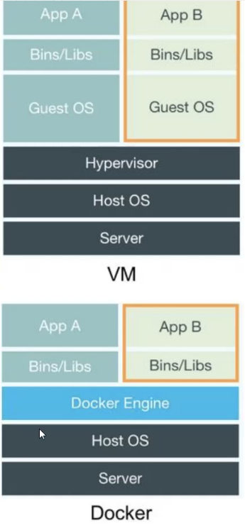
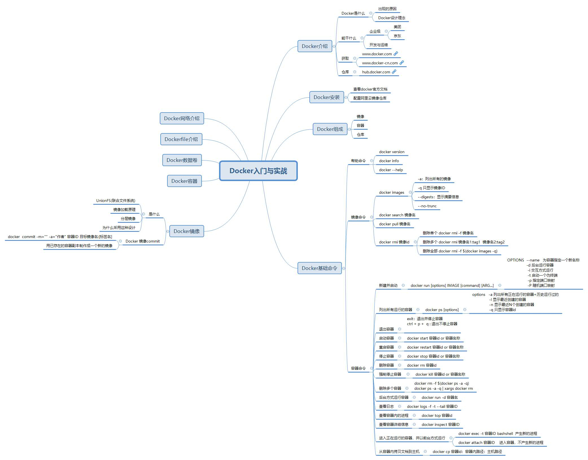

# 传统交付

传统交付支付软件，不交付环境。

# docker

Docker 是一个开源的应用容器引擎，让开发者可以打包他们的应用以及依赖包到一个可移植的容器中，然后发布到任何流行的[Linux](https://baike.baidu.com/item/Linux)机器上，也可以实现虚拟化，容器是完全使用沙箱机制，相互之间不会有任何接口。

是一种容器技术，基于GO语言编写。

一个完整的Docker有以下几个部分组成：

1.  dockerClient客户端
2.  Docker Daemon守护进程
3.  Docker Image镜像
4.  DockerContainer容器 

## Docker能干什么

## Docker与传统的虚拟化技术差异(vmware)

虚拟化技术就是虚拟了整套环境

缺点：资源占用多，启动慢





## Docker架构


## docker网站

### [官网](http://www.docker.com)

### [中文网站](http://www.docker-cn.com)


### [仓库](https://hub.docker.com)

# docker命令



## 基础命令

### 命令格式

>   docker [OPTIONS] COMMAND

#### Options:

      * --config string     客户端配置文件的位置（默认为“/root/.docker”）
      * -D, --debug              启用调试模式
      * -H, --host list          要连接的守护程序套接字
      * -l, --log-level string   设置日志记录级别（“debug”|“info”|“warn”|“error”|“fatal”）（默认为“info”）
      * --tls                使用TLS; implied by --tlsverify
      *  --tlscacert string   仅由此CA签名的信任证书（默认为“/root/.docker/ca.pem”）
    
      * --tlscert string     TLS证书文件的路径（默认为“/root/.docker/cert.pem”）
      *  --tlskey string     TLS密钥文件的路径（默认为“/root/.docker/key.pem”）
    
      * --tlsverify         使用TLS并验证远程
      * -v, --version            打印版本信息并退出

## 帮助命令

*   docker version:查看版本
*   docker --help: 获取命令信息
*   docker info :基本信息

## 镜像命令

*   docker images :列出所有镜像

    *   -a :列出所有的镜像

    *   -q :只显示镜像ID

    *   --digests :显示摘要信息

    *   ## --no-trunc :完整的信息

*   docker search 镜像名 ： 从远程仓库中搜索镜像

*   docker pull 镜像名 ： 拉取镜像

*   docker rmi 镜像id ：删除镜像

    *   docker rmi -f 镜像名 ：强制删除
    *   docker rmi -f $(docker images -q)：删除所有镜像


## 容器命令

### 容器生命周期管理

#### **docker run**

创建一个新的容器并运行一个命令

```shell
docker run [OPTIONS] IMAGE [COMMAND] [ARG...]
```

OPTIONS说明：

-   **-a stdin:** 指定标准输入输出内容类型，可选 STDIN/STDOUT/STDERR 三项；
-   **-d:** 后台运行容器，并返回容器ID；
-   **-i:** 以交互模式运行容器，通常与 -t 同时使用；
-   **-p:** 端口映射，格式为：主机(宿主)端口:容器端口
-   **-t:** 为容器重新分配一个伪输入终端，通常与 -i 同时使用；
-   **--name="nginx-lb":** 为容器指定一个名称；
-   **--dns 8.8.8.8:** 指定容器使用的DNS服务器，默认和宿主一致；
-   **--dns-search example.com:** 指定容器DNS搜索域名，默认和宿主一致；
-   **-h "mars":** 指定容器的hostname；
-   **-e username="ritchie":** 设置环境变量；
-   **--env-file=[]:** 从指定文件读入环境变量；
-   **--cpuset="0-2" or --cpuset="0,1,2":** 绑定容器到指定CPU运行；
-   **-m :**设置容器使用内存最大值；
-   **--net="bridge":** 指定容器的网络连接类型，支持 bridge/host/none/container: 四种类型；
-   **--link=[]:** 添加链接到另一个容器；
-   **--expose=[]:** 开放一个端口或一组端口；

##### 实例

使用docker镜像nginx:latest以后台模式启动一个容器,并将容器命名为mynginx。

```
docker run --name mynginx -d nginx:latest
```

使用镜像nginx:latest以后台模式启动一个容器,并将容器的80端口映射到主机随机端口。

```
docker run -P -d nginx:latest
```

使用镜像 nginx:latest，以后台模式启动一个容器,将容器的 80 端口映射到主机的 80 端口,主机的目录 /data 映射到容器的 /data。

```
docker run -p 80:80 -v /data:/data -d nginx:latest
```

绑定容器的 8080 端口，并将其映射到本地主机 127.0.0.1 的 80 端口上。

```
$ docker run -p 127.0.0.1:80:8080/tcp ubuntu bash
```

使用镜像nginx:latest以交互模式启动一个容器,在容器内执行/bin/bash命令。

```
runoob@runoob:~$ docker run -it nginx:latest /bin/bash
root@b8573233d675:/# 
```

####  start/stop/restart 命令

**docker start** :启动一个或多个已经被停止的容器

**docker stop** :停止一个运行中的容器

**docker restart** :重启容器

##### 语法

```
docker start [OPTIONS] CONTAINER [CONTAINER...]
docker stop [OPTIONS] CONTAINER [CONTAINER...]
docker restart [OPTIONS] CONTAINER [CONTAINER...]
```

##### 实例

启动已被停止的容器myrunoob

```
docker start myrunoob
```

停止运行中的容器myrunoob

```
docker stop myrunoob
```

重启容器myrunoob

```
docker restart myrunoob
```

#### kill 命令

**docker kill** :杀掉一个运行中的容器。

##### 语法

```
docker kill [OPTIONS] CONTAINER [CONTAINER...]
```

OPTIONS说明：

-   **-s :**向容器发送一个信号

##### 实例

杀掉运行中的容器mynginx

```
runoob@runoob:~$ docker kill -s KILL mynginx
mynginx
```

#### rm 命令

**docker rm ：**删除一个或多少容器

##### 语法

```
docker rm [OPTIONS] CONTAINER [CONTAINER...]
```

OPTIONS说明：

-   **-f :**通过SIGKILL信号强制删除一个运行中的容器
-   **-l :**移除容器间的网络连接，而非容器本身
-   **-v :**-v 删除与容器关联的卷

##### 实例

强制删除容器db01、db02

```
docker rm -f db01 db02
```

移除容器nginx01对容器db01的连接，连接名db

```
docker rm -l db 
```

删除容器nginx01,并删除容器挂载的数据卷

```
docker rm -v nginx01
```

#### pause/unpause 命令

**docker pause** :暂停容器中所有的进程。

**docker unpause** :恢复容器中所有的进程。

##### 语法

```
docker pause [OPTIONS] CONTAINER [CONTAINER...]
docker unpause [OPTIONS] CONTAINER [CONTAINER...]
```

##### 实例

暂停数据库容器db01提供服务。

```
docker pause db01
```

恢复数据库容器db01提供服务。

```
docker unpause db01
```

#### create 命令

**docker create ：**创建一个新的容器但不启动它

用法同 [docker run](http://www.runoob.com/docker/docker-run-command.html)

##### 语法

```
docker create [OPTIONS] IMAGE [COMMAND] [ARG...]
```

语法同 [docker run](http://www.runoob.com/docker/docker-run-command.html)

##### 实例

使用docker镜像nginx:latest创建一个容器,并将容器命名为myrunoob

```
runoob@runoob:~$ docker create  --name myrunoob  nginx:latest      
09b93464c2f75b7b69f83d56a9cfc23ceb50a48a9db7652ee4c27e3e2cb1961f
```

#### exec 命令

**docker exec ：**在运行的容器中执行命令

##### 语法

```
docker exec [OPTIONS] CONTAINER COMMAND [ARG...]
```

OPTIONS说明：

-   **-d :**分离模式: 在后台运行
-   **-i :**即使没有附加也保持STDIN 打开
-   **-t :**分配一个伪终端

##### 实例

在容器mynginx中以交互模式执行容器内/root/runoob.sh脚本


```
runoob@runoob:~$ docker exec -it mynginx /bin/sh /root/runoob.sh
http://www.runoob.com/
```

在容器mynginx中开启一个交互模式的终端

```
runoob@runoob:~$ docker exec -i -t  mynginx /bin/bash
root@b1a0703e41e7:/#
```

### 容器操作

#### ps 命令

**docker ps :** 列出容器

##### 语法

```
docker ps [OPTIONS]
```

OPTIONS说明：

-   **-a :**显示所有的容器，包括未运行的。

-   **-f :**根据条件过滤显示的内容。

-   **--format :**指定返回值的模板文件。

-   **-l :**显示最近创建的容器。

-   **-n :**列出最近创建的n个容器。

-   **--no-trunc :**不截断输出。

-   **-q :**静默模式，只显示容器编号。

-   **-s :**显示总的文件大小。

##### 实例

列出所有在运行的容器信息。

```
runoob@runoob:~$ docker ps
CONTAINER ID   IMAGE          COMMAND                ...  PORTS                    NAMES
09b93464c2f7   nginx:latest   "nginx -g 'daemon off" ...  80/tcp, 443/tcp          myrunoob
96f7f14e99ab   mysql:5.6      "docker-entrypoint.sh" ...  0.0.0.0:3306->3306/tcp   mymysql
```

列出最近创建的5个容器信息。

```
runoob@runoob:~$ docker ps -n 5
CONTAINER ID        IMAGE               COMMAND                   CREATED           
09b93464c2f7        nginx:latest        "nginx -g 'daemon off"    2 days ago   ...     
b8573233d675        nginx:latest        "/bin/bash"               2 days ago   ...     
b1a0703e41e7        nginx:latest        "nginx -g 'daemon off"    2 days ago   ...    
f46fb1dec520        5c6e1090e771        "/bin/sh -c 'set -x \t"   2 days ago   ...   
a63b4a5597de        860c279d2fec        "bash"                    2 days ago   ...
```

列出所有创建的容器ID。

```
runoob@runoob:~$ docker ps -a -q
09b93464c2f7
b8573233d675
b1a0703e41e7
f46fb1dec520
a63b4a5597de
6a4aa42e947b
de7bb36e7968
43a432b73776
664a8ab1a585
ba52eb632bbd
...
```

#### inspect 命令

**docker inspect :** 获取容器/镜像的元数据。

##### 语法

```
docker inspect [OPTIONS] NAME|ID [NAME|ID...]
```

OPTIONS说明：

-   **-f :**指定返回值的模板文件。
-   **-s :**显示总的文件大小。
-   **--type :**为指定类型返回JSON。

##### 实例

获取镜像mysql:5.6的元信息。

```
runoob@runoob:~$ docker inspect mysql:5.6
[
    {
        "Id": "sha256:2c0964ec182ae9a045f866bbc2553087f6e42bfc16074a74fb820af235f070ec",
        "RepoTags": [
            "mysql:5.6"
        ],
        "RepoDigests": [],
        "Parent": "",
        "Comment": "",
        "Created": "2016-05-24T04:01:41.168371815Z",
        "Container": "e0924bc460ff97787f34610115e9363e6363b30b8efa406e28eb495ab199ca54",
        "ContainerConfig": {
            "Hostname": "b0cf605c7757",
            "Domainname": "",
            "User": "",
            "AttachStdin": false,
            "AttachStdout": false,
            "AttachStderr": false,
            "ExposedPorts": {
                "3306/tcp": {}
            },
...
```

获取正在运行的容器mymysql的 IP。

```
runoob@runoob:~$ docker inspect --format='{{range .NetworkSettings.Networks}}{{.IPAddress}}{{end}}' mymysql
172.17.0.3
```