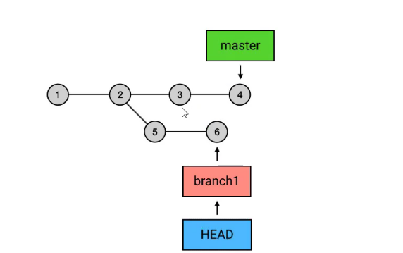
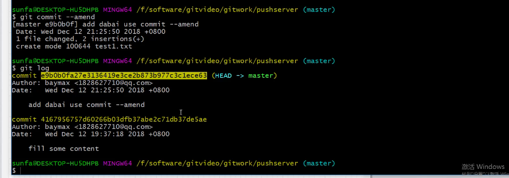

## 版本回退

`git reset --soft`: 将本地库回退到上一个版本

`git reset--Mixed ` :将本地库和暂存区回退到上一个版本

`git reset --hard`: 将本地库、暂存区、工作区

`git reflog`:查看版本移动记录

`git reset --hard 版本号`:回头到指定的版本。

## 命令

### git log

查看git的提交记录

### rebase

将两条分支合并到一个分支上。

可以改变基准点的。

执行`git rebase branch1`命令

breanch1的5、6，会合并到master分支上，在4的后面

### ``git commit --amend``

覆盖上次的提交记录

当上次提交的信息出错时，使用此命令。

在弹出的文件内添加`add 提交信息 use commit --amend`

