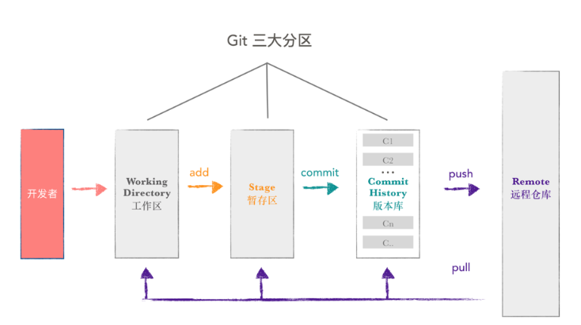

# git仓库分区

Git 本地数据管理，大概可以分为三个区，工作区,暂存区和版本库。 

可以通过`git status`查看：红色表示文件在工作，绿色代表文件在暂存区。

* 工作区：新建的文件会放在此区，文件尚未被git管理起来。 通过`git add`将文件加入暂存区
* 暂存区（Stage 或 Index） 
  数据暂时存放的区域。 文件已经被git管理，暂时未提交至版本库。通过`git commit`将文件提交至本地库。
* 本地库（commit History） 
  存放已经提交的数据，push 的时候，就是把这个区的数据 push 到远程git仓库了。

