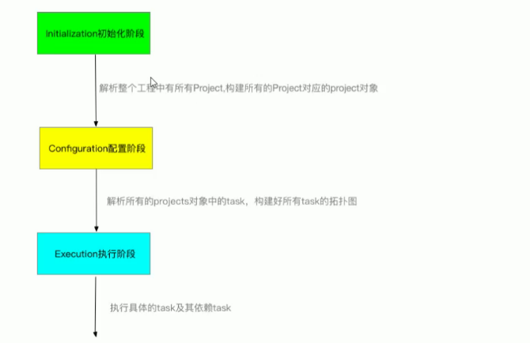
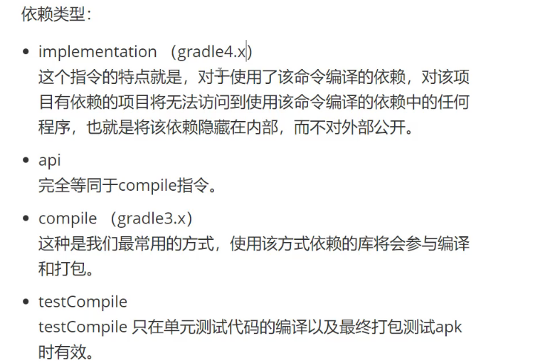
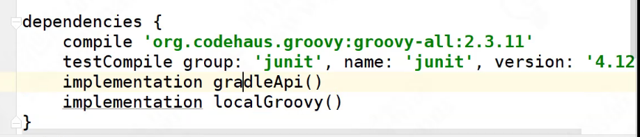

# gradle执行过程

# gradle生命周期

# 拓扑:有向无环图

# 问题

## build.gradle是什么，有什么用？

构建逻辑，gradle工具通过build.gradle完成构建。

## setting.gradle是什么，有什么用？

标记根项目和子项目

## Gradlew是什么，有什么用？

对gradle可实行命令的包装，屏蔽不同版本之间的差异。

## gradle生命周期

### 初始化

Initialization 在这个阶段，gradle会首先生成gradle对象和settings对象，然后执行init.gradle中脚本，再执行settings.gradle中的脚本，根据settings.gradle给每个项目生成一个project对象

### 配置

Configuration 在这个阶段，gradle会运行参与本次构建的所有project中的build.gradle文件，这个阶段完成之后，每个project中的所有task以及相互关系就确定了

### 执行

  Execution 执行阶段，gradle会根据传给它的task名字运行指定的task

# 依赖管理

## 查看依赖

`gradle dependency`

