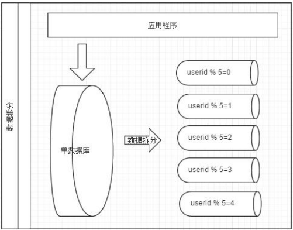

# 概述

Mycat 是一个数据库中间件，不仅仅可以用作读写分离、以及分表分库、容灾备份而且可以用于多
租户应用开发、云平台基础设施、让你的架构具备很强的适应性和灵活性，借助于即将发布的 Mycat 智能优化模块，系统的数据访问瓶颈和热点一目了然，根据这些统计分析数据，你可以自动或手工调整后端存储，将不同的表映射到不同存储引擎上，而整个应用的代码一行也不用改变。

## Mycat 原理

Mycat 的原理中最重要的一个动词是“拦截”，它拦截了用户发送过来的 SQL 语句，首先对 SQL 语句做了
一些特定的分析：如分片分析、路由分析、读写分离分析、缓存分析等，然后将此 SQL 发往后端的真实数据库，并将返回的结果做适当的处理，最终再返回给用户。

## 应用场景

* 单纯的读写分离，此时配置最为简单，支持读写分离，主从切换；
* 分表分库，对于超过 1000 万的表进行分片，最大支持 1000 亿的单表分片；
* 多租户应用，每个应用一个库，但应用程序只连接 Mycat，从而不改造程序本身，实现多租户化；
* 报表系统，借助于 Mycat 的分表能力，处理大规模报表的统计；
* 替代 Hbase，分析大数据；

# 数据库切分

为了解决单台设备(数据库)性能问题，通过特定的条件，将放在同一个数据库的数据拆分到多个数据库(主机)上面。

根据切分(sharding)规则的类型可以分为两种切分模式：

* 垂直切分: 按表切分。
* 水平切分:按照某个字段的某种规则切分。

## 垂直切分

按照业务将表进行分类，分到不同的数据库上面。这样可以将数据压力分散到不同的数据库上。

### 优点

* 拆分规则简单
* 拆分后业务清晰
* 系统之间整合或扩展容易
* 数据维护简单

### 缺点

* 部分业务表无法join查询，只能通过接口方式解决，提高了系统复杂度。
* 受不同业务的限制存在单库性能瓶颈，数据扩展和性能很难
* 事物处理复杂

垂直拆分是按照业务的分类将表分散到不同的数据库。有些数据表会过于庞大，存在单库读写和存储瓶颈。

## 水平切分

按照某个字段的某种规则将数据分散到多个数据库中。每个数据中包含一部分数据。我们可以将数据的水平切分理解为是按照数据行的切分，就是将表中的某些行切分到一个数据库，而另外的某些行又切分到其他的数据库中。

**拆分规则**

拆分数据就需要定义分片规则。

几种典型的分片规则：

* 按照`主键`求模拆分，将具有相同数据分散到同一个库上。
* 按照日期拆分
* 按照某个字段求模，或者根据特定范围

### 优点

* 拆分规则抽象好，join 操作基本可以数据库做；
* 不存在单库大数据，高并发的性能瓶颈；
* 应用端改造较少；
* 提高了系统的稳定性跟负载能力。

### 缺点

* 拆分规则难以抽象；
* 分片事务一致性难以解决；
* 数据多次扩展难度跟维护量极大；
* 跨库 join 性能较差

## 切分后的问题

* 引入分布式事务的问题；
* 跨节点 Join 的问题； 
* 跨节点合并排序分页问题；
* 多数据源管理问题。

# Mycat 中的概念

## 数据库中间件

就是介于数据库与应用之间，进行数据处理与交互的中间服务。

