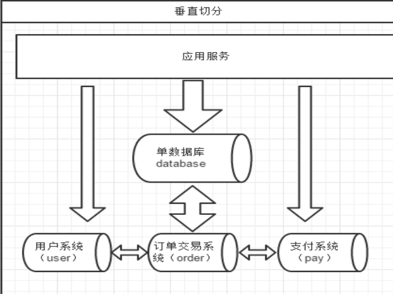
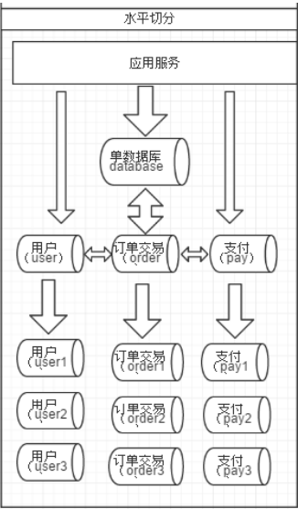
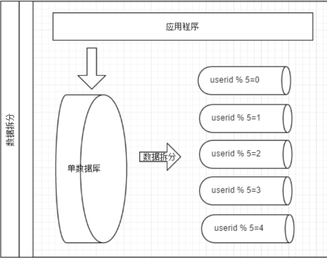

# 大数据量系统数据库性能优化方案

## 性能瓶颈原因

### 连接数

### 

### 硬件资源

硬盘、CPU

## 解决方案

1、sql优化

2、缓存

3、建好索引

4、读写分离

5、分库分表

### 读写分离

### 分库分表

#### 垂直拆分

一个数据库由很多表的构成，每个表对应着不同的业务，垂直切分是指按照业务将表进行分类，分布到不同
的数据库上面，这样也就将数据或者说压力分担到不同的库上面，如下图

**优点**

*   拆分后业务清洗，拆分规则mingque
*   系统之间整合或扩展容易
*   数据维护简单

**缺点**

*   事务处理复杂
*   部分业务无法连接查询，只能通过接口方式。提高了系统的复杂性
*   受每种业务不同的限制存在单库性能瓶颈，不易数据扩展跟性能提高

#### 水平拆分

相对于垂直拆分，水平拆分不是将表做分类，而是按照某个字段的某种规则来分散到多个库之中，每个表中
包含一部分数据。

几种典型的分片规则包括：

*   按照用户 ID 求模，将数据分散到不同的数据库，具有相同数据用户的数据都被分散到一个库中。
*    按照日期，将不同月甚至日的数据分散到不同的库中。
*    按照某个特定的字段求摸，或者根据特定范围段分散到不同的库中。

**优点**：

*   拆分规则抽象好，join 操作基本可以数据库做。
*   不存在单库大数据，高并发的性能瓶颈。
*    应用端改造较少。
*    提高了系统的稳定性跟负载能力。

**缺点**：

*    拆分规则难以抽象。
*    分片事务一致性难以解决。
*    数据多次扩展难度跟维护量极大。
*    跨库 join 性能较差。

## 主从配置

### 延迟是怎么产生的

1、当master的TPS高于slave的sql线程所能承受的范围

2、网路原因

3、磁盘读写耗时

###  判断延时

1、在slave上执行`show slave status \G;`

2、mk-heartbeat

### 怎么解决

1、配置更高的硬件资源

2、把IO线程改成多线程。