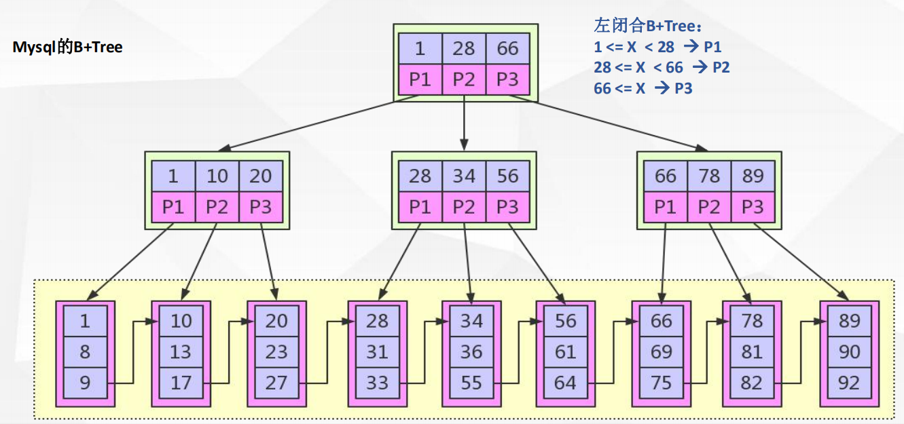

# mysql体系结构

## Connectors 

接入方 支持协议很多

 

## Management Serveices & Utilities： 

系统管理和控制工具

例如：备份恢复，mysql复制集群等

 

## Connection Pool 

连接池：管理缓冲用户连接、用户名、密码、权限校验、线程处理等需要缓存的需求 

 

## SQL Interface

SQL接口：接受用户的SQL命令，并且返回用户需要查询的结果。比如select from就是调用SQL Interface

 

## Parser

解析器，SQL命令传递到解析器的时候会被解析器验证和解析。解析器是由Lex和YACC实现的。

 

## Optimizer

 查询优化器，SQL语句在查询之前会使用查询优化器对查询进行优化

 

## Cache和Buffer（高速缓存区）：

 查询缓存，如果查询缓存有命中的查询结果，查询语句就可以直接去查询缓存中取数据。 

 

## pluggable storage Engines

插件式存储引擎。存储引擎是MySql中具体的与文件打交道的子系统。也是Mysql最具有特色的一个地方。 Mysql的存储引擎是插件式的。

 

## file system

文件系统，数据、日志（redo，undo）、索引、错误日志、查询记录、慢查询等

## **运行时机理图**

# 索引

## 概念

索引是为了加速对表中数据行的检索而创建的一种分散存储的**数据结构**

## 为什么要用索引

*   索引能极大的减少存储引擎需要扫描的数据量

*   索引可以把随机IO变成顺序IO

*   索引可以帮助我们在进行分组、排序等操作时，避免使用临时表

## 为什么mysql是B+ TREE

树形数据结构;

左子节点比根节点小，右子节点比根节点大

[数据演示](https://www.cs.usfca.edu/~galles/visualization/Algorithms.html)

### 二叉树（binary search tree）

	二叉树是每个结点最多有两个子树的树结构。通常子树被称作“左子树”（left subtree）和“右子树”（right subtree）。二叉树常被用于实现二叉查找树和二叉堆。
	
	一棵深度为k，且有2^k-1个节点的二叉树，称为满二叉树。这种树的特点是每一层上的节点数都是最大节点数。而在一棵二叉树中，除最后一层外，若其余层都是满的，并且最后一层或者是满的，或者是在右边缺少连续若干节点，则此二叉树为完全二叉树。具有n个节点的完全二叉树的深度为floor(log2n)+1。深度为k的完全二叉树，至少有2k-1个叶子节点，至多有2k-1个节点。

#### 相关术语

树的结点（node）：包含一个数据元素及若干指向子树的分支；

孩子结点（child node）：结点的子树的根称为该结点的孩子；

双亲结点：B 结点是A 结点的孩子，则A结点是B 结点的双亲；

兄弟结点：同一双亲的孩子结点； 堂兄结点：同一层上结点；

祖先结点: 从根到该结点的所经分支上的所有结点

子孙结点：以某结点为根的子树中任一结点都称为该结点的子孙

结点层：根结点的层定义为1；根的孩子为第二层结点，依此类推；

树的深度：树中最大的结点层

结点的度：结点子树的个数

树的度： 树中最大的结点度。

叶子结点：也叫终端结点，是度为 0 的结点；

分枝结点：度不为0的结点；

有序树：子树有序的树，如：家族树；

无序树：不考虑子树的顺序；

#### 二叉树性质

(1) 在非空二叉树中，第i层的结点总数不超过

 , i>=1；

(2) 深度为h的二叉树最多有

  个结点(h>=1)，最少有h个结点；

(3) 对于任意一棵二叉树，如果其叶结点数为N0，而度数为2的结点总数为N2，则N0=N2+1；

(4) 具有n个结点的完全二叉树的深度为

  （注：[ ]表示向下取整）

(5)有N个结点的[完全二叉树](https://baike.baidu.com/item/%E5%AE%8C%E5%85%A8%E4%BA%8C%E5%8F%89%E6%A0%91)各结点如果用顺序方式存储，则结点之间有如下关系：

若I为结点编号则 如果I>1，则其父结点的编号为I/2；

如果2*I<=N，则其左孩子（即左子树的根结点）的编号为2*I；若2*I>N，则无左孩子；

如果2*I+1<=N，则其右孩子的结点编号为2*I+1；若2*I+1>N，则无右孩子。

(6)给定N个节点，能构成h(N)种不同的二叉树。

h(N)为[卡特兰数](https://baike.baidu.com/item/%E5%8D%A1%E7%89%B9%E5%85%B0%E6%95%B0)的第N项。h(n)=C(2*n，n)/(n+1)。

(7)设有i个枝点，I为所有枝点的道路长度总和，J为叶的道路长度总和J=I+2i [2] 

### 平衡二叉树

平衡二叉搜索树（Self-balancing binary search tree）又被称为AVL树（有别于AVL算法），且具有以下性质：它是一 棵空树或它的左右两个子树的高度差的绝对值不超过1，并且左右两个子树都是一棵平衡二叉树。平衡二叉树的常用实现方法有[红黑树](https://baike.baidu.com/item/%E7%BA%A2%E9%BB%91%E6%A0%91/2413209)、[AVL](https://baike.baidu.com/item/AVL/7543015)、[替罪羊树](https://baike.baidu.com/item/%E6%9B%BF%E7%BD%AA%E7%BE%8A%E6%A0%91/13859070)、[Treap](https://baike.baidu.com/item/Treap)、[伸展树](https://baike.baidu.com/item/%E4%BC%B8%E5%B1%95%E6%A0%91/7003945)等。 最小二叉平衡树的节点总数的公式如下 F(n)=F(n-1)+F(n-2)+1 这个类似于一个递归的[数列](https://baike.baidu.com/item/%E6%95%B0%E5%88%97/731531)，可以参考Fibonacci(斐波那契)数列，1是根节点，F(n-1)是左子树的节点数量，F(n-2)是右子树的节点数量。

[平衡二叉搜索树](https://baike.baidu.com/item/%E5%B9%B3%E8%A1%A1%E4%BA%8C%E5%8F%89%E6%90%9C%E7%B4%A2%E6%A0%91)（Balanced Binary Tree）具有以下性质：它是一棵空树或它的左右两个子树的高度差的绝对值不超过1，并且左右两个子树都是一棵平衡二叉树。常用算法有红黑树、AVL、Treap、伸展树等。在平衡二叉搜索树中，我们可以看到，其高度一般都良好地维持在O（log（n）），大大降低了操作的时间复杂度。

#### 存在的问题

*   数据量大时数的高度太高了。数据所处(高)深度决定着I/O操作的次数，I/O操作耗时大。
*   每个磁盘块(节点/页)保存的数据量太小了。
*   没有很好的利用磁盘I/O的数据交换特性。
*   没有利用好磁盘I/O的预读能力(空间局部性原理)，从而带来频繁的I/O操作

### [ B-Tree（多路平衡查找树）](https://en.wikipedia.org/wiki/B-tree)

B-tree（多路搜索树，并不是二叉的）是一种常见的数据结构。使用B-tree结构可以显著减少定位记录时所经历的中间过程，从而加快存取速度。，B 通常认为是Balance的简称。这个数据结构一般用于数据库的索引，综合效率较高。

**B树**是一种自平衡[树数据结构](https://en.wikipedia.org/wiki/Tree_data_structure)，它维护有序数据并允许以[对数时间](https://en.wikipedia.org/wiki/Logarithmic_time)进行搜索，顺序访问，插入和删除。

B树是[二叉搜索树](https://en.wikipedia.org/wiki/Binary_search_tree)的一般化，因为节点可以有两个以上的子节点。[[1\]](https://en.wikipedia.org/wiki/B-tree#cite_note-Comer-1)与[自平衡二进制搜索树不同](https://en.wikipedia.org/wiki/Self-balancing_binary_search_tree)，B树非常适合读取和写入相对较大的数据块（如光盘）的存储系统。它通常用于[数据库](https://en.wikipedia.org/wiki/Database)和[文件系统](https://en.wikipedia.org/wiki/File_system)。

在B树中，内部（[非叶](https://en.wikipedia.org/wiki/Leaf_node)）节点可以在某个预定义范围内具有可变数量的子节点。从节点插入或删除数据时，其子节点数会发生变化。为了保持预定义的范围，可以连接或拆分内部节点。

在B树中，内部（[非叶](https://en.wikipedia.org/wiki/Leaf_node)）节点可以在某个预定义范围内具有可变数量的子节点。从节点插入或删除数据时，其子节点数会发生变化。为了保持预定义的范围，可以连接或拆分内部节点。

B树的每个内部节点包含许多[键](https://en.wikipedia.org/wiki/Unique_key)。键用作分隔其[子树的](https://en.wikipedia.org/wiki/Subtree)分隔值。

#### 特性

*m*阶的B树是满足以下属性的树：

1.  每个节点最多有*m个*孩子。
2.  每个非叶子节点（除了根）具有至少⌈ m /2⌉子节点。
3.  如果根不是叶节点，则根至少有两个子节点。
4.  具有*k*个子节点的非叶节点包含*k* -1个键。
5.  所有叶子都出现在同一水平。

## [B+Tree](https://en.wikipedia.org/wiki/B%2B_tree)

**B +树**是一个[N进制](https://en.wikipedia.org/wiki/K-ary_tree)树具有可变但通常大量每节点的孩子。B +树由根，内部节点和叶子组成。[[1\]](https://en.wikipedia.org/wiki/B%2B_tree#cite_note-Navathe-1)根可以是叶子或具有两个或更多子节点的节点。

B +树可以被视为[B树](https://en.wikipedia.org/wiki/B-tree)，其中每个节点仅包含键（不是键值对），并且在底部添加了附加级别的链接叶。

B +树的主要价值在于存储数据，以便在[面向块的]存储环境中进行有效检索- 特别是[文件系统](https://en.wikipedia.org/wiki/Filesystems)。这主要是因为与[二叉搜索树](https://en.wikipedia.org/wiki/Binary_search_tree)不同，B +树具有非常高的扇出（节点中指向子节点的指针数，[[1\]](https://en.wikipedia.org/wiki/B%2B_tree#cite_note-Navathe-1)通常大约为100或更多），这减少了所需的I / O操作数量。在树中找到一个元素。

### 概述

B +树的顺序或分支因子b测量树中内部节点的节点容量（即，子节点的数量）节点的实际子节点数（此处称为 m）受内部节点约束，因此。根是一个例外：它允许只有两个孩子。

| 节点类型                         | 子节点类型       | 最小子节点数                                                 | 最大子节点数                                                 | 例  | 例  |
| -------------------------------- | ---------------- | ------------------------------------------------------------ | ------------------------------------------------------------ | ------------------------------------------------------------ | ------------------------------------------------------------ |
| 根节点（当它是树中唯一的节点时） | 记录             | 1                                                            |  | 1-6                                                          | 1-99                                                         |
| 根节点                           | 内部节点或叶节点 | 2                                                            | b                                                            | 2-7                                                          | 2-100                                                        |
| 内部节点                         | 内部节点或叶节点 |  | b                                                            | 4-7                                                          | 50-100                                                       |
| 叶节点                           | 记录             |  |  | 4-7                                                          | 50-100                                                       |

### 特点

对于具有h级索引的b阶B +树：[ *需要引证* ]

-   存储的最大记录数为 
-   存储的最小记录数是 
-   最小键数是 
-   最大键数是 
-   存储树所需的空间是 
-   插入记录需要 操作
-   找到记录需要  操作
-   删除（以前定位的）记录需要 操作
-   执行[范围查询](https://en.wikipedia.org/wiki/Range_query)，*其中*包含在该范围内发生的*k个*元素 操作

### B+Tree和B-Tree的区别

-   B+Tree节点关键字搜索采用闭合区间
-   B+Tree非叶子节点不保存数据相关信息，只保存关键字和子节点的引用
-   B+Tree关键字对应的数据保存在叶子节点中。
-   B+Tree是顺序排列的，并且相邻的节点具有顺序引用的关系

## mysql中的B+Tree

### 为什么选择B+Tree

*   B+Tree是B-Tree的变种(PLUS版)多路绝对平衡查找树，他拥有B-Tree的优势
*   B+Tree扫库、表能力更强
*   B+Tree的磁盘读写能力更强
*   B+Tree的排序能力更强
*    B+Tree的查询效率更加稳定

# 搜索引擎

## myisam

## innodb

如果不设置主键，会默认创建一个隐式的主键索引。

### 主键索引

以聚集索引的形式存储(索引和数据存放在一起)

### 辅助索引

非主键索引，数据存储的是主键索引

# 索引知识补充

## 列的离散性

结论：离散性越高选择性就越好

## 最左匹配原则

对索引中关键字进行计算（对比），一定是从左往右依次进行，且不可跳过。

## 联合索引

单列索引
	节点中关键字[name]
联合索引
	节点中关键字[name,phoneNum]
单列索引是特殊的联合索引
联合索引列选择原则
1，经常用的列优先 【最左匹配原则】
2，选择性（离散度）高的列优先【离散度高原则】
3，宽度小的列优先【最少空间原则】

## 覆盖索引

如果查询列可通过索引节点中的关键字直接返回，则该索引称之为覆盖索引。
覆盖索引可减少数据库IO，将随机IO变为顺序IO，可提高查询性能。

例如：索引列为name，age

sql: select name , age from user;

## 索引常识

索引列的数据长度能少则少。
索引一定不是越多越好，越全越好，一定是建合适的。
匹配列前缀可用到索引 like 9999%，like %9999%、like %9999用不到索引；
Where 条件中 not in 和 <>操作无法使用索引；
匹配范围值，order by 也可用到索引；
多用指定列查询，只返回自己想到的数据列，少用select *；
联合索引中如果不是按照索引最左列开始查找，无法使用索引；
联合索引中精确匹配最左前列并范围匹配另外一列可以用到索引；
联合索引中如果查询中有某个列的范围查询，则其右边的所有列都无法使用索引；

