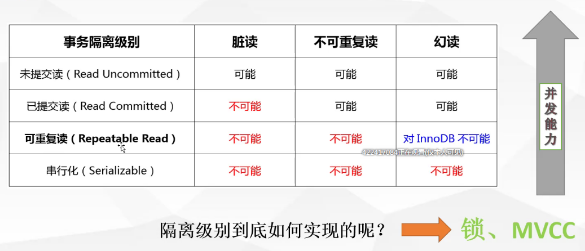

# innodb存储引擎深入浅出

## innodb的特性

**InnoDB存储引擎功能**

| 特征                                                         | 支持                                                         |
| ------------------------------------------------------------ | ------------------------------------------------------------ |
| **B树索引**                                                  | 是                                                           |
| **备份/时间点恢复**（在服务器中实现，而不是在存储引擎中实现。） | 是                                                           |
| **群集数据库支持**                                           | 没有                                                         |
| **聚集索引**                                                 | 是                                                           |
| **压缩数据**                                                 | 是                                                           |
| **数据缓存**                                                 | 是                                                           |
| **加密数据**（通过加密功能在服务器中实现。在MySQL 5.7及更高版本中提供静态数据表空间加密。） | 是                                                           |
| **外键支持**                                                 | 是                                                           |
| **全文搜索索引**                                             | 是（在MySQL 5.6及更高版本中可以使用InnoDB对FULLTEXT索引的支持。） |
| **地理空间数据类型支持**                                     | 是                                                           |
| **地理空间索引支持**                                         | 是（在MySQL 5.7及更高版本中可以使用InnoDB对地理空间索引的支持。） |
| **哈希索引**                                                 | 否（InnoDB在内部利用哈希索引来实现其自适应哈希索引功能。）   |
| **索引缓存**                                                 | 是                                                           |
| **锁定粒度**                                                 | 行                                                           |
| **MVCC**                                                     | 是                                                           |
| **复制支持**（在服务器中实现，而不是在存储引擎中实现。）     | 是                                                           |
| **存储限制**                                                 | 64TB                                                         |
| **T树索引**                                                  | 没有                                                         |
| **交易**                                                     | 是                                                           |
| **更新数据字典的统计信息**                                   | 是                                                           |

## 事务

数据库操作的最小单元，是作为单个逻辑工作单元执行的一系列做操；

事务是一组不可再分割的操作集合(工作单元)

在自动提交的情况下，手动提交事务

begin、start transaction开启事务

commit提交事务

rollback回滚事务

### 事务的ACID特性

#### 原子性(Atomicity)

最小的工作单元，整个工作单元么一起提交成功，要么全部失败回滚。

#### 一致性(Consistency)

事务中操作的数据及状态改变是一致的，即写入资料的结果必须安全符合预设的原则，不会因为出现系统意外等原因导致状态的不一致。

### 事务隔离级别

### innodb引擎对隔离级别的支持程度

## 锁

锁是用于管理不同事务对共享资源的并发访问。

表锁与行锁的去表

锁定粒度：表锁>行锁

加锁效率：表锁>行锁

冲突概率：表锁>行锁

并发性能：表锁<行锁

InnoBD存储引擎支持行锁和表锁(另类的行锁,把所有行都加锁)

### [锁的类型](https://dev.mysql.com/doc/refman/5.7/en/innodb-locking.html)

#### 自增锁

###  innodb行锁锁的是什么

如果where条件不是索引项，会锁全表

如果条件是辅助索引，会在辅助索引及其主键索引上都会加锁。

### 临键锁(Next-key)

当查询是range时，命中索引时。例如图中会锁定4-10之间的索引。

innodb选择临键锁next-key的原因是为了解决幻读的问题。因为innodb算法采用的是B+TREE,左小右大。

### 间隙锁(Gap)

### 记录锁(Record)

普通索引时，使用等值查询，命中索引，会锁住上一条和下一条记录之间的数据。

## 死锁

### 避免死锁

1.  类似的业务逻辑以固定的顺序访问表和行
2.  大事务拆小
3.  在同一个事务中，尽可能做到一次锁定所需要的所有资源，减少死锁概率
4.  降低隔离级别
5.  为表添加合理的索引。

