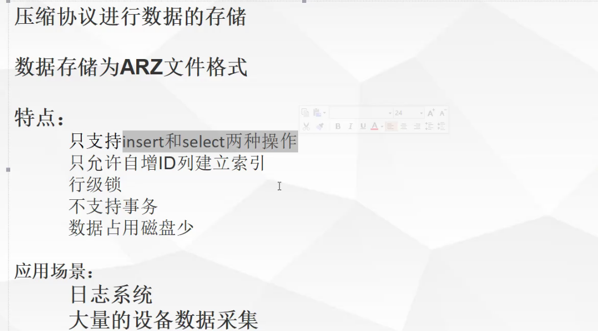
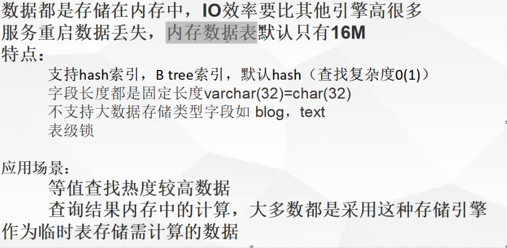
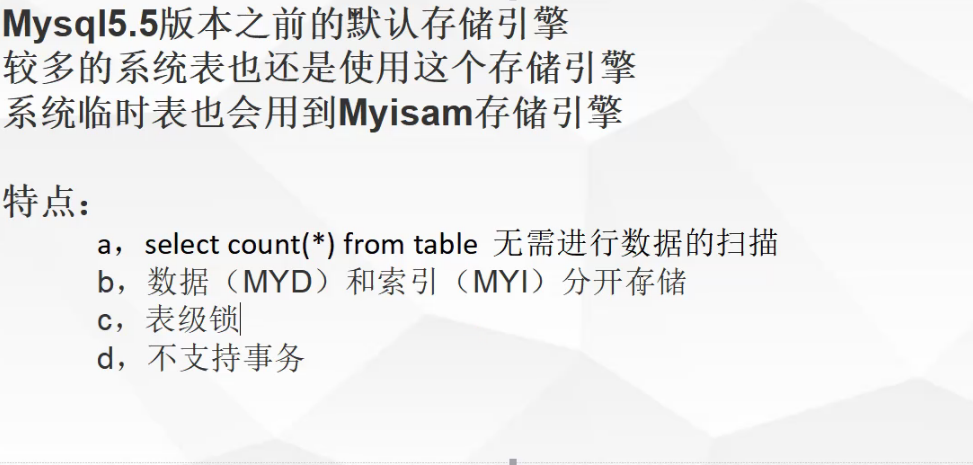
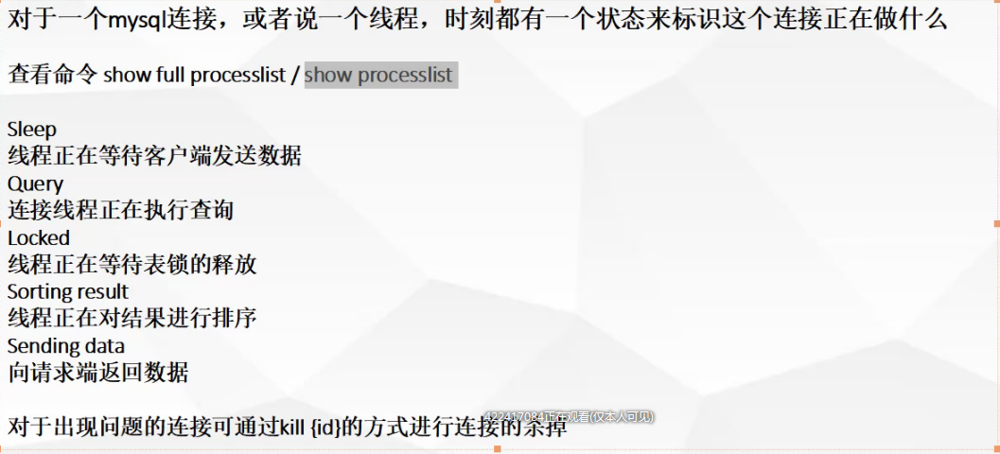
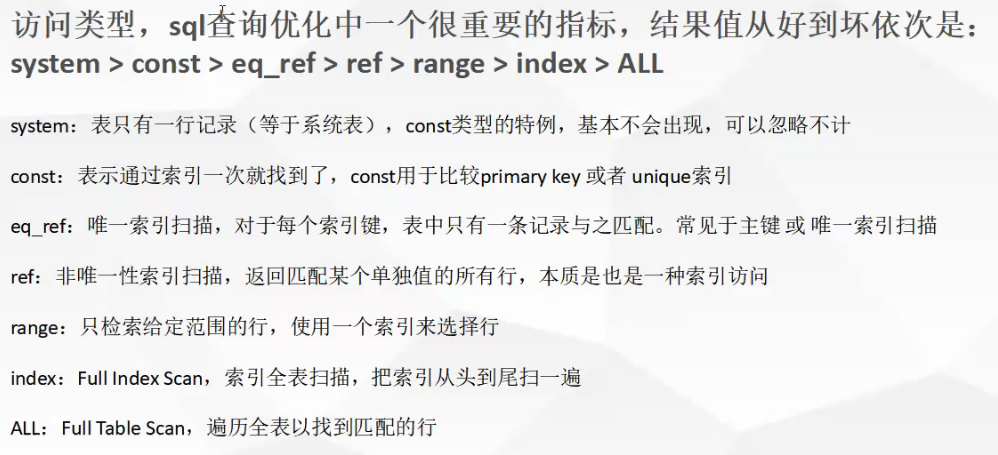
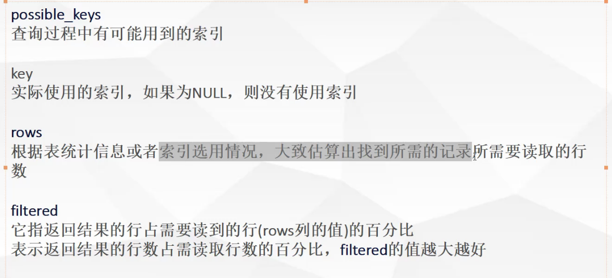
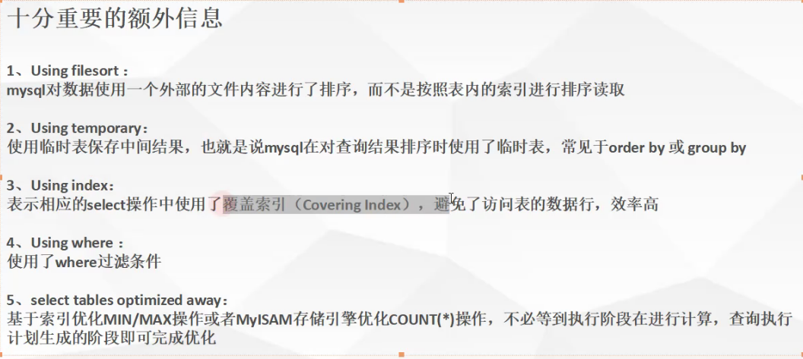

# Mysql的插拔式存储引擎

MySQL Server使用可插拔的存储引擎架构，可以将存储引擎加载到正在运行的MySQL服务器中或从中卸载。

**插入存储引擎**

在使用存储引擎之前，必须使用该[`INSTALL PLUGIN`](https://dev.mysql.com/doc/refman/5.7/en/install-plugin.html)语句将存储引擎插件共享库加载到MySQL中 。例如，如果`EXAMPLE`命名了引擎插件并且命名`example`了共享库 `ha_example.so`，则使用以下语句加载它：

```sql
INSTALL PLUGIN example SONAME 'ha_example.so';
```

要安装可插拔存储引擎，插件文件必须位于MySQL插件目录中，并且发出该[`INSTALL PLUGIN`](https://dev.mysql.com/doc/refman/5.7/en/install-plugin.html)语句的用户 必须具有[`INSERT`](https://dev.mysql.com/doc/refman/5.7/en/privileges-provided.html#priv_insert)该`mysql.plugin`表的权限 。

共享库必须位于MySQL服务器插件目录中，其位置由[`plugin_dir`](https://dev.mysql.com/doc/refman/5.7/en/server-system-variables.html#sysvar_plugin_dir)系统变量给出 。

**拔掉存储引擎**

要拔出存储引擎，请使用以下 [`UNINSTALL PLUGIN`](https://dev.mysql.com/doc/refman/5.7/en/uninstall-plugin.html)语句：

```sql
UNINSTALL PLUGIN example;
```

如果拔下现有表所需的存储引擎，则这些表将无法访问，但仍将出现在磁盘上（如果适用）。在拔下存储引擎之前，请确保没有使用存储引擎的表。

## 介绍


1、插拔式的插件方式

2、存储引擎是指定在表智商的，即一个库中的每一个表都可以指定专用的存储引擎

3、不管采用什么样的存储引擎，都会在数据区，产生对应的一个frm文件(表结构定义描述文件)

## [CSV存储引擎](https://dev.mysql.com/doc/refman/5.7/en/csv-storage-engine.html)

在`CSV`使用逗号分隔值格式的文本文件存储引擎存储数据。

创建`CSV`表时，服务器会在数据库目录中创建表格式文件。该文件以表名开头并具有`.frm`扩展名。存储引擎还会创建一个数据文件。它的名称以表名开头，并有一个`.CSV`扩展名。数据文件是纯文本文件。将数据存储到表中时，存储引擎会以逗号分隔值格式将其保存到数据文件中。


## [ARCHIVE存储引擎](https://dev.mysql.com/doc/refman/5.7/en/archive-storage-engine.html)

该`ARCHIVE`存储引擎产生大量未索引数据存储在一个非常小的足迹专用表。

| 特征                                                         | 支持 |
| ------------------------------------------------------------ | ---- |
| **B树索引**                                                  | 没有 |
| **备份/时间点恢复**（在服务器中实现，而不是在存储引擎中实现。） | 是   |
| **群集数据库支持**                                           | 没有 |
| **聚集索引**                                                 | 没有 |
| **压缩数据**                                                 | 是   |
| **数据缓存**                                                 | 没有 |
| **加密数据**（通过加密功能在服务器中实现。在MySQL 5.7及更高版本中提供静态数据表空间加密。） | 是   |
| **外键支持**                                                 | 没有 |
| **全文搜索索引**                                             | 没有 |
| **地理空间数据类型支持**                                     | 是   |
| **地理空间索引支持**                                         | 没有 |
| **哈希索引**                                                 | 没有 |
| **索引缓存**                                                 | 没有 |
| **锁定粒度**                                                 | 行   |
| **MVCC**                                                     | 没有 |
| **复制支持**（在服务器中实现，而不是在存储引擎中实现。）     | 是   |
| **存储限制**                                                 | 没有 |
| **T树索引**                                                  | 没有 |
| **交易**                                                     | 没有 |
| **更新数据字典的统计信息**                                   | 是   |



查询比InnoDB慢,可以用来做数据备份。

## [MEMORY|heap存储引擎](https://dev.mysql.com/doc/refman/5.7/en/memory-storage-engine.html)



的`MEMORY`存储引擎（以前称为 `HEAP`）创建具有存储在存储器中的内容的专用的表。由于数据容易受到崩溃，硬件问题或断电的影响，因此只能将这些表用作临时工作区或从其他表中提取数据的只读缓存。


**表15.4 MEMORY存储引擎功能**

| 特征                                                         | 支持                           |
| ------------------------------------------------------------ | ------------------------------ |
| **B树索引**                                                  | 是                             |
| **备份/时间点恢复**（在服务器中实现，而不是在存储引擎中实现。） | 是                             |
| **群集数据库支持**                                           | 没有                           |
| **聚集索引**                                                 | 没有                           |
| **压缩数据**                                                 | 没有                           |
| **数据缓存**                                                 | N / A                          |
| **加密数据**（通过加密功能在服务器中实现。在MySQL 5.7及更高版本中提供静态数据表空间加密。） | 是                             |
| **外键支持**                                                 | 没有                           |
| **全文搜索索引**                                             | 没有                           |
| **地理空间数据类型支持**                                     | 没有                           |
| **地理空间索引支持**                                         | 没有                           |
| **哈希索引**                                                 | 是                             |
| **索引缓存**                                                 | N / A                          |
| **锁定粒度**                                                 | 表                             |
| **MVCC**                                                     | 没有                           |
| **复制支持**（在服务器中实现，而不是在存储引擎中实现。）     | 有限（请参阅本节后面的讨论。） |
| **存储限制**                                                 | 内存                           |
| **T树索引**                                                  | 没有                           |
| **交易**                                                     | 没有                           |
| **更新数据字典的统计信息**                                   | 是                             |

## Myiasm



`MyISAM`基于旧的（不再可用）`ISAM`存储引擎，但有许多有用的扩展。


**表15.2 MyISAM存储引擎功能**

| 特征                                                         | 支持                                                         |
| ------------------------------------------------------------ | ------------------------------------------------------------ |
| **B树索引**                                                  | 是                                                           |
| **备份/时间点恢复**（在服务器中实现，而不是在存储引擎中实现。） | 是                                                           |
| **群集数据库支持**                                           | 没有                                                         |
| **聚集索引**                                                 | 没有                                                         |
| **压缩数据**                                                 | 是（仅当使用压缩行格式时才支持压缩MyISAM表。使用压缩行格式和MyISAM的表是只读的。） |
| **数据缓存**                                                 | 没有                                                         |
| **加密数据**（通过加密功能在服务器中实现。在MySQL 5.7及更高版本中提供静态数据表空间加密。） | 是                                                           |
| **外键支持**                                                 | 没有                                                         |
| **全文搜索索引**                                             | 是                                                           |
| **地理空间数据类型支持**                                     | 是                                                           |
| **地理空间索引支持**                                         | 是                                                           |
| **哈希索引**                                                 | 没有                                                         |
| **索引缓存**                                                 | 是                                                           |
| **锁定粒度**                                                 | 表                                                           |
| **MVCC**                                                     | 没有                                                         |
| **复制支持**（在服务器中实现，而不是在存储引擎中实现。）     | 是                                                           |
| **存储限制**                                                 | 256TB                                                        |
| **T树索引**                                                  | 没有                                                         |
| **交易**                                                     | 没有                                                         |
| **更新数据字典的统计信息**                                   | 是                                                           |

| 特征 | 支持 |
| ---- | ---- |
|      |      |

每个`MyISAM`表都存储在三个文件的磁盘上。这些文件的名称以表名开头，并具有指示文件类型的扩展名。一个`.frm` 文件存储表格式。数据文件具有 `.MYD`（`MYData`）扩展名。索引文件具有`.MYI` （`MYIndex`）扩展名。

## [InnoDB存储引擎](https://dev.mysql.com/doc/refman/5.7/en/innodb-storage-engine.html)


# mysql查询优化

## 查询执行路径


## mysql客户端/服务端通信

“全双工”：类似打电话，同一时间双方都可以互相发送数据

“半双工”：类似对讲机，同一时间只能有一方发送消息

“单工”：只能一方发送消息

mysql客户端与服务端的通信方式是“半双工”，

mysql通讯特点和限制：

*   客户端一旦开始发送消息另一端要接收整个消息才能响应
*   客户端一单开始接收数据就没法停下来发送指令

### [mysql客户端/服务端通信-连接状态](https://dev.mysql.com/doc/refman/5.7/en/general-thread-states.html)

SHOW PROCESSLIST



## 查询缓存

### 工作原理：

缓存SELECT操作的结果集和SQL语句；
新的SELECT语句，先去查询缓存，判断是否存在可用的记录集；

### 判断标准：

与缓存的SQL语句，是否完全一样，区分大小写 (简单认为存储了一个key-value结构，key为sql，value为sql查询结果集)

在解析之前，将传入的查询与查询缓存中的查询进行比较，因此查询缓存将以下两个查询视为不同：

```sql
SELECT * FROM tbl_name
Select * from tbl_name
```

查询必须*完全相同*（字节为字节）才能看作相同

表数据修改将导致此表相关的所有缓存失效

缓存不用于以下类型的查询：

-   查询是外部查询的子查询
-   在存储的函数，触发器或事件的主体内执行的查询

如果查询使用以下任何功能，则无法缓存该查询：

-   [`AES_DECRYPT()`](https://dev.mysql.com/doc/refman/5.7/en/encryption-functions.html#function_aes-decrypt)
-   [`AES_ENCRYPT()`](https://dev.mysql.com/doc/refman/5.7/en/encryption-functions.html#function_aes-encrypt)
-   [`BENCHMARK()`](https://dev.mysql.com/doc/refman/5.7/en/information-functions.html#function_benchmark)
-   [`CONNECTION_ID()`](https://dev.mysql.com/doc/refman/5.7/en/information-functions.html#function_connection-id)
-   [`CONVERT_TZ()`](https://dev.mysql.com/doc/refman/5.7/en/date-and-time-functions.html#function_convert-tz)
-   [`CURDATE()`](https://dev.mysql.com/doc/refman/5.7/en/date-and-time-functions.html#function_curdate)
-   [`CURRENT_DATE()`](https://dev.mysql.com/doc/refman/5.7/en/date-and-time-functions.html#function_current-date)
-   [`CURRENT_TIME()`](https://dev.mysql.com/doc/refman/5.7/en/date-and-time-functions.html#function_current-time)
-   [`CURRENT_TIMESTAMP()`](https://dev.mysql.com/doc/refman/5.7/en/date-and-time-functions.html#function_current-timestamp)
-   [`CURRENT_USER()`](https://dev.mysql.com/doc/refman/5.7/en/information-functions.html#function_current-user)
-   [`CURTIME()`](https://dev.mysql.com/doc/refman/5.7/en/date-and-time-functions.html#function_curtime)
-   [`DATABASE()`](https://dev.mysql.com/doc/refman/5.7/en/information-functions.html#function_database)
-   [`ENCRYPT()`](https://dev.mysql.com/doc/refman/5.7/en/encryption-functions.html#function_encrypt) 有一个参数
-   [`FOUND_ROWS()`](https://dev.mysql.com/doc/refman/5.7/en/information-functions.html#function_found-rows)
-   [`GET_LOCK()`](https://dev.mysql.com/doc/refman/5.7/en/locking-functions.html#function_get-lock)
-   [`IS_FREE_LOCK()`](https://dev.mysql.com/doc/refman/5.7/en/locking-functions.html#function_is-free-lock)
-   [`IS_USED_LOCK()`](https://dev.mysql.com/doc/refman/5.7/en/locking-functions.html#function_is-used-lock)
-   [`LAST_INSERT_ID()`](https://dev.mysql.com/doc/refman/5.7/en/information-functions.html#function_last-insert-id)
-   [`LOAD_FILE()`](https://dev.mysql.com/doc/refman/5.7/en/string-functions.html#function_load-file)
-   [`MASTER_POS_WAIT()`](https://dev.mysql.com/doc/refman/5.7/en/miscellaneous-functions.html#function_master-pos-wait)
-   [`NOW()`](https://dev.mysql.com/doc/refman/5.7/en/date-and-time-functions.html#function_now)
-   [`PASSWORD()`](https://dev.mysql.com/doc/refman/5.7/en/encryption-functions.html#function_password)
-   [`RAND()`](https://dev.mysql.com/doc/refman/5.7/en/mathematical-functions.html#function_rand)
-   [`RANDOM_BYTES()`](https://dev.mysql.com/doc/refman/5.7/en/encryption-functions.html#function_random-bytes)
-   [`RELEASE_ALL_LOCKS()`](https://dev.mysql.com/doc/refman/5.7/en/locking-functions.html#function_release-all-locks)
-   [`RELEASE_LOCK()`](https://dev.mysql.com/doc/refman/5.7/en/locking-functions.html#function_release-lock)
-   [`SLEEP()`](https://dev.mysql.com/doc/refman/5.7/en/miscellaneous-functions.html#function_sleep)
-   [`SYSDATE()`](https://dev.mysql.com/doc/refman/5.7/en/date-and-time-functions.html#function_sysdate)
-   [`UNIX_TIMESTAMP()`](https://dev.mysql.com/doc/refman/5.7/en/date-and-time-functions.html#function_unix-timestamp) 没有参数
-   [`USER()`](https://dev.mysql.com/doc/refman/5.7/en/information-functions.html#function_user)
-   [`UUID()`](https://dev.mysql.com/doc/refman/5.7/en/miscellaneous-functions.html#function_uuid)
-   [`UUID_SHORT()`](https://dev.mysql.com/doc/refman/5.7/en/miscellaneous-functions.html#function_uuid-short)

在这些条件下也不会缓存查询：

-   它指的是用户定义的函数（UDF）或存储的函数。

-   它指的是用户变量或本地存储的程序变量。

-   它是指在表`mysql`， `INFORMATION_SCHEMA`或 `performance_schema`数据库。

-   它指的是任何分区表。

-   它具有以下任何一种形式：

    ```sql
    SELECT ... LOCK IN SHARE MODE
    SELECT ... FOR UPDATE
    SELECT ... INTO OUTFILE ...
    SELECT ... INTO DUMPFILE ...
    SELECT * FROM ... WHERE autoincrement_col IS NULL
    ```

    最后一个表单未缓存，因为它用作ODBC解决方法以获取最后一个插入ID值。请参见[第27章*连接器和API*](https://dev.mysql.com/doc/refman/5.7/en/connectors-apis.html)的Connector / ODBC部分 。

    使用[`SERIALIZABLE`](https://dev.mysql.com/doc/refman/5.7/en/innodb-transaction-isolation-levels.html#isolevel_serializable)隔离级别的事务中的语句 也无法缓存，因为它们使用`LOCK IN SHARE MODE`锁定。

-   它使用`TEMPORARY`表格。

-   它不使用任何表。

-   它会生成警告。

-   用户对任何涉及的表都具有列级权限。

## [查询优化处理](https://dev.mysql.com/doc/refman/5.7/en/select-optimization.html)

查询优化处理的三个阶段：

*   解析sql
    通过lex词法分析,yacc语法分析将sql语句解析成解析树
    https://www.ibm.com/developerworks/cn/linux/sdk/lex/
*   预处理阶段
    根据mysql的语法的规则进一步检查解析树的合法性，如：检查数据的表
    和列是否存在，解析名字和别名的设置。还会进行权限的验证
*   查询优化器
    优化器的主要作用就是找到最优的执行计划

### 查询优化器如何找到最优执行计划

*   使用等价变化规则
    *   5 = 5 and a > 5 改写成 a > 5
    *   a < b and a = 5 改写成 b > 5 and a = 5
    *   基于联合索引，调整条件位置等
*    优化count 、min、max等函数min函数只需找索引最左边max函数只需找索引最右边myisam引擎count(*) 
*   覆盖索引扫描
*   子查询优化 
*   提前终止查询用了
    *   limit关键字或者使用不存在的条件
*   IN的优化先进性排序，再采用二分查找的方式

用IN比用OR执行速度快

IN会先将条件进行排序，然后使用二分查找。

OR会使用等式，一条一条比对。

## [执行计划](https://dev.mysql.com/doc/refman/5.7/en/execution-plan-information.html)

### 执行计划-id

select查询的序列号，标识执行的顺序
1、id相同，执行顺序由上至下
2、id不同，如果是子查询，id的序号会递增，id值越大优先级越高，越先被执行
3、id相同又不同即两种情况同时存在，id如果相同，可以认为是一组，从上往下顺序
执行；在所有组中，id值越大，优先级越高，越先执行

执行计划ID越大越先执行（union操作除外）

### select_type

查询的类型，主要是用于区分普通查询、联合查询、子查询等
SIMPLE：简单的select查询，查询中不包含子查询或者union
PRIMARY：查询中包含子部分，最外层查询则被标记为primary
SUBQUERY/MATERIALIZED：SUBQUERY表示在select 或 where列表中包含了子查询
MATERIALIZED表示where 后面in条件的子查询
UNION：若第二个select出现在union之后，则被标记为union；
UNION RESULT：从union表获取结果的select


### table

查询涉及到的表
直接显示表名或者表的别名
<unionM,N> 由ID为M,N 查询union产生的结果
<subqueryN> 由ID为N查询生产的结果


### type




### possible_key



### 解释extra(额外)信息




### EXPLAIN输出格式

**表8.1 EXPLAIN输出列**

| 列                                                           | JSON名称        | 含义                     |
| ------------------------------------------------------------ | --------------- | ------------------------ |
| [`id`](https://dev.mysql.com/doc/refman/5.7/en/explain-output.html#explain_id) | `select_id`     | 该`SELECT`标识符         |
| [`select_type`](https://dev.mysql.com/doc/refman/5.7/en/explain-output.html#explain_select_type) | 没有            | 该`SELECT`类型           |
| [`table`](https://dev.mysql.com/doc/refman/5.7/en/explain-output.html#explain_table) | `table_name`    | 输出行的表               |
| [`partitions`](https://dev.mysql.com/doc/refman/5.7/en/explain-output.html#explain_partitions) | `partitions`    | 匹配的分区               |
| [`type`](https://dev.mysql.com/doc/refman/5.7/en/explain-output.html#explain_type) | `access_type`   | 连接类型                 |
| [`possible_keys`](https://dev.mysql.com/doc/refman/5.7/en/explain-output.html#explain_possible_keys) | `possible_keys` | 可供选择的索引           |
| [`key`](https://dev.mysql.com/doc/refman/5.7/en/explain-output.html#explain_key) | `key`           | 实际选择的指数           |
| [`key_len`](https://dev.mysql.com/doc/refman/5.7/en/explain-output.html#explain_key_len) | `key_length`    | 所选键的长度             |
| [`ref`](https://dev.mysql.com/doc/refman/5.7/en/explain-output.html#explain_ref) | `ref`           | 列与索引进行比较         |
| [`rows`](https://dev.mysql.com/doc/refman/5.7/en/explain-output.html#explain_rows) | `rows`          | 估计要检查的行           |
| [`filtered`](https://dev.mysql.com/doc/refman/5.7/en/explain-output.html#explain_filtered) | `filtered`      | 按表条件过滤的行的百分比 |
| [`Extra`](https://dev.mysql.com/doc/refman/5.7/en/explain-output.html#explain_extra) | 没有            | 附加信息                 |


注意

JSON属性`NULL`未显示在JSON格式的`EXPLAIN` 输出中。

-   `id`（JSON名： `select_id`）

    的[`SELECT`](https://dev.mysql.com/doc/refman/5.7/en/select.html)标识符。这是[`SELECT`](https://dev.mysql.com/doc/refman/5.7/en/select.html)查询中的序号 。`NULL`如果行引用其他行的联合结果，则该值可以是。在这种情况下，该 `table`列显示一个值 ，表示该行引用值为和的行的 并集 。 `<union*M*,*N*>``id`*M**N*

-   `select_type` （JSON名称：无）

    类型[`SELECT`](https://dev.mysql.com/doc/refman/5.7/en/select.html)，可以是下表中显示的任何类型。JSON格式化`EXPLAIN`将`SELECT`类型公开 为a的属性 `query_block`，除非它是 `SIMPLE`或`PRIMARY`。表中还显示了JSON名称（如果适用）。

    | `select_type` 值                                             | JSON名称                     | 含义                                                         |
    | ------------------------------------------------------------ | ---------------------------- | ------------------------------------------------------------ |
    | `SIMPLE`                                                     | 没有                         | 简单[`SELECT`](https://dev.mysql.com/doc/refman/5.7/en/select.html)（不使用 [`UNION`](https://dev.mysql.com/doc/refman/5.7/en/union.html)或子查询） |
    | `PRIMARY`                                                    | 没有                         | 最 [`SELECT`](https://dev.mysql.com/doc/refman/5.7/en/select.html) |
    | [`UNION`](https://dev.mysql.com/doc/refman/5.7/en/union.html) | 没有                         | 第二次或以后的[`SELECT`](https://dev.mysql.com/doc/refman/5.7/en/select.html)陈述 [`UNION`](https://dev.mysql.com/doc/refman/5.7/en/union.html) |
    | `DEPENDENT UNION`                                            | `dependent`（`true`）        | a中的第二个或更晚的[`SELECT`](https://dev.mysql.com/doc/refman/5.7/en/select.html)语句 [`UNION`](https://dev.mysql.com/doc/refman/5.7/en/union.html)，取决于外部查询 |
    | `UNION RESULT`                                               | `union_result`               | 的结果[`UNION`](https://dev.mysql.com/doc/refman/5.7/en/union.html)。 |
    | [`SUBQUERY`](https://dev.mysql.com/doc/refman/5.7/en/optimizer-hints.html#optimizer-hints-subquery) | 没有                         | 首先[`SELECT`](https://dev.mysql.com/doc/refman/5.7/en/select.html)是子查询 |
    | `DEPENDENT SUBQUERY`                                         | `dependent`（`true`）        | 首先[`SELECT`](https://dev.mysql.com/doc/refman/5.7/en/select.html)在子查询中，依赖于外部查询 |
    | `DERIVED`                                                    | 没有                         | 派生表                                                       |
    | `MATERIALIZED`                                               | `materialized_from_subquery` | 物化子查询                                                   |
    | `UNCACHEABLE SUBQUERY`                                       | `cacheable`（`false`）       | 无法缓存结果的子查询，必须为外部查询的每一行重新计算         |
    | `UNCACHEABLE UNION`                                          | `cacheable`（`false`）       | [`UNION`](https://dev.mysql.com/doc/refman/5.7/en/union.html) 属于不可缓存的子查询的第二个或后一个选择（请参阅参考资料 `UNCACHEABLE SUBQUERY`） |


    `DEPENDENT`通常表示使用相关子查询。请参见 [第13.2.10.7节“相关子查询”](https://dev.mysql.com/doc/refman/5.7/en/correlated-subqueries.html)。
    
    `DEPENDENT SUBQUERY`评估与评估不同`UNCACHEABLE SUBQUERY`。因为`DEPENDENT SUBQUERY`，子查询仅针对来自其外部上下文的变量的每组不同值重新评估一次。因为 `UNCACHEABLE SUBQUERY`，对外部上下文的每一行重新评估子查询。
    
    子查询的可缓存性与查询缓存中查询结果的缓存不同（在[第8.10.3.1节“查询缓存如何操作”中](https://dev.mysql.com/doc/refman/5.7/en/query-cache-operation.html)对此进行了描述 ）。查询执行期间发生子查询缓存，而查询缓存仅在查询执行完成后用于存储结果。
    
    当您指定`FORMAT=JSON`时 `EXPLAIN`，输出没有直接等效的单个属性 `select_type`; 该 `query_block`属性对应于给定的`SELECT`。可以使用与`SELECT`刚显示的大多数子查询类型等效的属性（示例 `materialized_from_subquery`为 `MATERIALIZED`），并在适当时显示。没有JSON等价物 `SIMPLE`或`PRIMARY`。
    
    `select_type`非[`SELECT`](https://dev.mysql.com/doc/refman/5.7/en/select.html)语句 的值显示受影响的表的语句类型。例如，`select_type`是 `DELETE`用于 [`DELETE`](https://dev.mysql.com/doc/refman/5.7/en/delete.html)陈述。

-   `table`（JSON名： `table_name`）

    输出行引用的表的名称。这也可以是以下值之一：

    -   `<union*M*,*N*>`：行指的是`id`值为*M*和的行 的 并集 *N*。
    -   `<derived*N*>`：该行是指用于与该行的派生表结果`id`的值 *N*。例如，派生表可以来自`FROM`子句中的子查询 。
    -   `<subquery*N*>`：行指的是`id` 值为的行的具体化子查询的结果*N*。请参见 [第8.2.2.2节“使用实现优化子查询”](https://dev.mysql.com/doc/refman/5.7/en/subquery-materialization.html)。

-   `partitions`（JSON名： `partitions`）

    记录将与查询匹配的分区。该值适用`NULL`于非分区表。请参见 [第22.3.5节“获取有关分区的信息”](https://dev.mysql.com/doc/refman/5.7/en/partitioning-info.html)。

-   `type`（JSON名： `access_type`）

    连接类型。有关不同类型的说明，请参阅 [`EXPLAIN` 连接类型](https://dev.mysql.com/doc/refman/5.7/en/explain-output.html#explain-join-types)。

-   `possible_keys`（JSON名： `possible_keys`）

    该`possible_keys`列指示MySQL可以选择在此表中查找行的索引。请注意，此列完全独立于输出中显示的表的顺序 [`EXPLAIN`](https://dev.mysql.com/doc/refman/5.7/en/explain.html)。这意味着某些键`possible_keys`可能无法在生成中使用生成的表顺序。

    如果此列是`NULL`（或在JSON格式的输出中未定义），则没有相关索引。在这种情况下，您可以通过检查`WHERE` 子句来检查它是否引用适合索引的某些列或列来提高查询性能。如果是，请创建适当的索引并[`EXPLAIN`](https://dev.mysql.com/doc/refman/5.7/en/explain.html)再次检查查询 。请参见 [第13.1.8节“ALTER TABLE语法”](https://dev.mysql.com/doc/refman/5.7/en/alter-table.html)。

    要查看表的索引，请使用。 `SHOW INDEX FROM *tbl_name*`

-   `key`（JSON名：`key`）

    该`key`列指示MySQL实际决定使用的密钥（索引）。如果MySQL决定使用其中一个`possible_keys` 索引来查找行，那么该索引将被列为键值。

    可能`key`会命名值中不存在的索引 `possible_keys`。如果没有`possible_keys`索引适合查找行，则会发生这种情况，但查询选择的所有列都是其他索引的列。也就是说，命名索引覆盖了所选列，因此虽然它不用于确定要检索的行，但索引扫描比数据行扫描更有效。

    因为`InnoDB`，即使查询还选择主键，辅助索引也可能覆盖所选列，因为`InnoDB`主键值与每个辅助索引一起存储。如果 `key`是`NULL`，MySQL没有找到用于更有效地执行查询的索引。

    要强制MySQL使用或忽略列出的索引 `possible_keys`列，使用 `FORCE INDEX`，`USE INDEX`或`IGNORE INDEX`在您的查询。请参见[第8.9.4节“索引提示”](https://dev.mysql.com/doc/refman/5.7/en/index-hints.html)。

    对于`MyISAM`表，运行 [`ANALYZE TABLE`](https://dev.mysql.com/doc/refman/5.7/en/analyze-table.html)有助于优化器选择更好的索引。对于 `MyISAM`表格，[**myisamchk --analyze也是**](https://dev.mysql.com/doc/refman/5.7/en/myisamchk.html)如此。请参见 [第13.7.2.1节“ANALYZE TABLE语法”](https://dev.mysql.com/doc/refman/5.7/en/analyze-table.html)和 [第7.6节“MyISAM表维护和崩溃恢复”](https://dev.mysql.com/doc/refman/5.7/en/myisam-table-maintenance.html)。

-   `key_len`（JSON名： `key_length`）

    该`key_len`列指示MySQL决定使用的密钥的长度。该值 `key_len`使您可以确定MySQL实际使用的多部分密钥的多少部分。如果`key`列说`NULL`，该`len_len` 列也说`NULL`。

    由于密钥存储格式，对于可能`NULL` 比列的列，密钥长度更大`NOT NULL`。

-   `ref`（JSON名：`ref`）

    该`ref`列显示哪些列或常量与列中指定的索引进行比较，以 `key`从表中选择行。

    如果值为`func`，则使用的值是某个函数的结果。要查看哪个函数，请使用 [`SHOW WARNINGS`](https://dev.mysql.com/doc/refman/5.7/en/show-warnings.html)以下内容 [`EXPLAIN`](https://dev.mysql.com/doc/refman/5.7/en/explain.html)查看扩展 [`EXPLAIN`](https://dev.mysql.com/doc/refman/5.7/en/explain.html)输出。该函数实际上可能是算术运算符等运算符。

-   `rows`（JSON名： `rows`）

    该`rows`列指示MySQL认为必须检查以执行查询的行数。

    对于[`InnoDB`](https://dev.mysql.com/doc/refman/5.7/en/innodb-storage-engine.html)表格，此数字是估算值，可能并不总是准确的。

-   `filtered`（JSON名： `filtered`）

    该`filtered`列指示将按表条件过滤的表行的估计百分比。最大值为100，这意味着不会对行进行过滤。值从100开始减少表示过滤量增加。 `rows`显示检查的估计行数，`rows`× `filtered`表示将与下表连接的行数。例如，如果 `rows`是1000并且 `filtered`是50.00（50％），则使用下表连接的行数是1000×50％= 500。

-   `Extra` （JSON名称：无）

    此列包含有关MySQL如何解析查询的其他信息。有关不同值的说明，请参阅 [`EXPLAIN` 附加信息](https://dev.mysql.com/doc/refman/5.7/en/explain-output.html#explain-extra-information)。

    没有与`Extra`列对应的单个JSON属性 ; 但是，此列中可能出现的值将作为JSON属性公开，或作为属性的文本公开`message`。

#### EXPLAIN加入类型

该`type`列 [`EXPLAIN`](https://dev.mysql.com/doc/refman/5.7/en/explain.html)输出介绍如何联接表。在JSON格式的输出中，这些是作为`access_type`属性的值找到的。以下列表描述了从最佳类型到最差类型的连接类型：

-   [`system`](https://dev.mysql.com/doc/refman/5.7/en/explain-output.html#jointype_system)

    该表只有一行（=系统表）。这是[`const`](https://dev.mysql.com/doc/refman/5.7/en/explain-output.html#jointype_const)连接类型的特例 。

-   [`const`](https://dev.mysql.com/doc/refman/5.7/en/explain-output.html#jointype_const)

    该表最多只有一个匹配行，在查询开头读取。因为只有一行，所以优化器的其余部分可以将此行中列的值视为常量。 [`const`](https://dev.mysql.com/doc/refman/5.7/en/explain-output.html#jointype_const)表非常快，因为它们只读一次。

    [`const`](https://dev.mysql.com/doc/refman/5.7/en/explain-output.html#jointype_const)将a `PRIMARY KEY`或 `UNIQUE`索引的所有部分与常量值进行比较时使用。在以下查询中，*tbl_name*可以用作[`const`](https://dev.mysql.com/doc/refman/5.7/en/explain-output.html#jointype_const) 表：

    ```sql
    SELECT * FROM tbl_name WHERE primary_key=1;
    
    SELECT * FROM tbl_name
      WHERE primary_key_part1=1 AND primary_key_part2=2;
    ```

-   [`eq_ref`](https://dev.mysql.com/doc/refman/5.7/en/explain-output.html#jointype_eq_ref)

    对于前面表格中的每个行组合，从该表中读取一行。除了 [`system`](https://dev.mysql.com/doc/refman/5.7/en/explain-output.html#jointype_system)和 [`const`](https://dev.mysql.com/doc/refman/5.7/en/explain-output.html#jointype_const)类型之外，这是最好的连接类型。当连接使用索引的所有部分且索引是 索引`PRIMARY KEY`或`UNIQUE NOT NULL`索引时使用它。

    [`eq_ref`](https://dev.mysql.com/doc/refman/5.7/en/explain-output.html#jointype_eq_ref)可用于使用`=`运算符进行比较的索引列 。比较值可以是常量，也可以是使用在此表之前读取的表中的列的表达式。在以下示例中，MySQL可以使用 [`eq_ref`](https://dev.mysql.com/doc/refman/5.7/en/explain-output.html#jointype_eq_ref)联接来处理 *ref_table*：

    ```sql
    SELECT * FROM ref_table,other_table
      WHERE ref_table.key_column=other_table.column;
    
    SELECT * FROM ref_table,other_table
      WHERE ref_table.key_column_part1=other_table.column
      AND ref_table.key_column_part2=1;
    ```

-   [`ref`](https://dev.mysql.com/doc/refman/5.7/en/explain-output.html#jointype_ref)

    对于前面表中的每个行组合，将从此表中读取具有匹配索引值的所有行。[`ref`](https://dev.mysql.com/doc/refman/5.7/en/explain-output.html#jointype_ref)如果连接仅使用键的最左前缀或者键不是a `PRIMARY KEY`或`UNIQUE`索引（换句话说，如果连接不能基于键值选择单行），则使用此方法。如果使用的密钥只匹配几行，这是一个很好的连接类型。

    [`ref`](https://dev.mysql.com/doc/refman/5.7/en/explain-output.html#jointype_ref)可以用于使用`=`or `<=>` 运算符进行比较的索引列 。在以下示例中，MySQL可以使用 [`ref`](https://dev.mysql.com/doc/refman/5.7/en/explain-output.html#jointype_ref)联接来处理 *ref_table*：

    ```sql
    SELECT * FROM ref_table WHERE key_column=expr;
    
    SELECT * FROM ref_table,other_table
      WHERE ref_table.key_column=other_table.column;
    
    SELECT * FROM ref_table,other_table
      WHERE ref_table.key_column_part1=other_table.column
      AND ref_table.key_column_part2=1;
    ```

-   [`fulltext`](https://dev.mysql.com/doc/refman/5.7/en/explain-output.html#jointype_fulltext)

    使用`FULLTEXT` 索引执行连接。

-   [`ref_or_null`](https://dev.mysql.com/doc/refman/5.7/en/explain-output.html#jointype_ref_or_null)

    这种连接类型是这样的 [`ref`](https://dev.mysql.com/doc/refman/5.7/en/explain-output.html#jointype_ref)，但除此之外，MySQL还会对包含`NULL`值的行进行额外搜索。此连接类型优化最常用于解析子查询。在以下示例中，MySQL可以使用 [`ref_or_null`](https://dev.mysql.com/doc/refman/5.7/en/explain-output.html#jointype_ref_or_null)联接来处理*ref_table*：

    ```sql
    SELECT * FROM ref_table
      WHERE key_column=expr OR key_column IS NULL;
    ```

    请参见[第8.2.1.13节“IS NULL优化”](https://dev.mysql.com/doc/refman/5.7/en/is-null-optimization.html)。

-   [`index_merge`](https://dev.mysql.com/doc/refman/5.7/en/explain-output.html#jointype_index_merge)

    此连接类型表示使用了索引合并优化。在这种情况下，`key`输出行中的列包含使用的索引列表，并`key_len`包含所用索引 的最长关键部分的列表。有关更多信息，请参见 [第8.2.1.3节“索引合并优化”](https://dev.mysql.com/doc/refman/5.7/en/index-merge-optimization.html)。

-   [`unique_subquery`](https://dev.mysql.com/doc/refman/5.7/en/explain-output.html#jointype_unique_subquery)

    此类型替换 以下形式的[`eq_ref`](https://dev.mysql.com/doc/refman/5.7/en/explain-output.html#jointype_eq_ref)某些 `IN`子查询：

    ```sql
    value IN (SELECT primary_key FROM single_table WHERE some_expr)
    ```

    [`unique_subquery`](https://dev.mysql.com/doc/refman/5.7/en/explain-output.html#jointype_unique_subquery) 只是一个索引查找功能，完全替换子查询以提高效率。

-   [`index_subquery`](https://dev.mysql.com/doc/refman/5.7/en/explain-output.html#jointype_index_subquery)

    此连接类型类似于 [`unique_subquery`](https://dev.mysql.com/doc/refman/5.7/en/explain-output.html#jointype_unique_subquery)。它替换`IN`子查询，但它适用于以下形式的子查询中的非唯一索引：

    ```sql
    value IN (SELECT key_column FROM single_table WHERE some_expr)
    ```

-   [`range`](https://dev.mysql.com/doc/refman/5.7/en/explain-output.html#jointype_range)

    仅检索给定范围内的行，使用索引选择行。的`key` 输出行中的列指示使用哪个索引。将`key_len`包含已使用的时间最长的关键部分。该`ref`列 `NULL`适用于此类型。

    [`range`](https://dev.mysql.com/doc/refman/5.7/en/explain-output.html#jointype_range)当一个键柱使用任何的相比于恒定可使用 [`=`](https://dev.mysql.com/doc/refman/5.7/en/comparison-operators.html#operator_equal)， [`<>`](https://dev.mysql.com/doc/refman/5.7/en/comparison-operators.html#operator_not-equal)， [`>`](https://dev.mysql.com/doc/refman/5.7/en/comparison-operators.html#operator_greater-than)， [`>=`](https://dev.mysql.com/doc/refman/5.7/en/comparison-operators.html#operator_greater-than-or-equal)， [`<`](https://dev.mysql.com/doc/refman/5.7/en/comparison-operators.html#operator_less-than)， [`<=`](https://dev.mysql.com/doc/refman/5.7/en/comparison-operators.html#operator_less-than-or-equal)， [`IS NULL`](https://dev.mysql.com/doc/refman/5.7/en/comparison-operators.html#operator_is-null)， [`<=>`](https://dev.mysql.com/doc/refman/5.7/en/comparison-operators.html#operator_equal-to)， [`BETWEEN`](https://dev.mysql.com/doc/refman/5.7/en/comparison-operators.html#operator_between)， [`LIKE`](https://dev.mysql.com/doc/refman/5.7/en/string-comparison-functions.html#operator_like)，或 [`IN()`](https://dev.mysql.com/doc/refman/5.7/en/comparison-operators.html#function_in)运营商：

    ```sql
    SELECT * FROM tbl_name
      WHERE key_column = 10;
    
    SELECT * FROM tbl_name
      WHERE key_column BETWEEN 10 and 20;
    
    SELECT * FROM tbl_name
      WHERE key_column IN (10,20,30);
    
    SELECT * FROM tbl_name
      WHERE key_part1 = 10 AND key_part2 IN (10,20,30);
    ```

-   [`index`](https://dev.mysql.com/doc/refman/5.7/en/explain-output.html#jointype_index)

    该`index`联接类型是一样的 [`ALL`](https://dev.mysql.com/doc/refman/5.7/en/explain-output.html#jointype_all)，只是索引树被扫描。这种情况有两种：

    -   如果索引是查询的覆盖索引，并且可用于满足表中所需的所有数据，则仅扫描索引树。在这种情况下，`Extra`专栏说 `Using index`。仅索引扫描通常比[`ALL`](https://dev.mysql.com/doc/refman/5.7/en/explain-output.html#jointype_all)索引的大小通常小于表数据更快 。
    -   使用索引中的读取执行全表扫描，以按索引顺序查找数据行。 `Uses index`没有出现在 `Extra`列中。

    当查询仅使用属于单个索引的列时，MySQL可以使用此连接类型。

-   [`ALL`](https://dev.mysql.com/doc/refman/5.7/en/explain-output.html#jointype_all)

    对前面表格中的每个行组合进行全表扫描。如果表是第一个未标记的表 [`const`](https://dev.mysql.com/doc/refman/5.7/en/explain-output.html#jointype_const)，通常不好，并且在所有其他情况下通常 *非常*糟糕。通常，您可以[`ALL`](https://dev.mysql.com/doc/refman/5.7/en/explain-output.html#jointype_all)通过添加基于常量值或早期表中的列值从表中启用行检索的索引来避免 。

# 如何定位慢SQL

1、业务驱动

2、测试驱动

3、满查询日志

