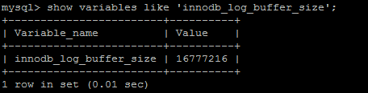

# MVCC

Multi-Version Concurrency Control 多版本[并发控制](https://baike.baidu.com/item/%E5%B9%B6%E5%8F%91%E6%8E%A7%E5%88%B6/3543545)，MVCC 是一种并发控制的方法，一般在数据库管理系统中，实现对数据库的并发访问；在编程语言中实现事务内存。

## Mysql中MVCC逻辑流程-插入

表中每行数据都会有一个隐藏的数据行版本号和删除版本号

插入时，数据行版本号是当前事务版本号，删除版本为null

## Mysql中MVCC逻辑流程-修改

首先会将命中的数据复制一份，将当前的事务版本号插入原来数据行的删除版本号，将当前事务版本号插入新数据行的数据行的版本号(DB_TRX_ID)

## Mysql中MVCC逻辑流程-删除

会将当前的事务版本号，插入当前要删除的数据行的删除版本号。

## Mysql中MVCC逻辑流程-查询

1.  查找数据行版本号早于当前事务版本号的数据行。

    确保事务读取的行，要么是事务开始钱已经存在的，要么是事务自身插入或者修改过的

2.  查找删除版本要么为null要么大于当前事务版本号的数据行。

    确保取出的数据行记录是在事务开启前没有被删除的。

## 问题？

批量删除/修改，事务版本号是同一个还是递增？

如果是递增，在删除/修改的过程中，有其他的增删改查，事务版本号怎么算？

# Undo log

undo log 指事务开始之前，在操作任何数据之前，首先将需要操作的数据备份到一个地方(Undo log)

作用：
保存了事务发生之前的数据的一个版本，可以用于回滚，同时可以提供多版本并发控制下的读（MVCC），也即非锁定读

内容：
逻辑格式的日志，在执行undo的时候，仅仅是将数据从逻辑上恢复至事务之前的状态，而不是从物理页面上操作实现的，这一点是不同于redo log的。

什么时候产生：
事务开始之前，将当前是的版本生成undo log，undo 也会产生 redo 来保证undo log的可靠性

什么时候释放：
当事务提交之后，undo log并不能立马被删除，
而是放入待清理的链表，由purge线程判断是否由其他事务在使用undo段中表的上一个事务之前的版本信息，决定是否可以清理undo log的日志空间。

对应的物理文件：
MySQL5.6之前，undo表空间位于共享表空间的回滚段中，共享表空间的默认的名称是ibdata，位于数据文件目录中。
MySQL5.6之后，undo表空间可以配置成独立的文件，但是提前需要在配置文件中配置，完成数据库初始化后生效且不可改变undo log文件的个数
如果初始化数据库之前没有进行相关配置，那么就无法配置成独立的表空间了。
关于MySQL5.7之后的独立undo 表空间配置参数如下
innodb_undo_directory = /data/undospace/ –undo独立表空间的存放目录
innodb_undo_logs = 128 –回滚段为128KB
innodb_undo_tablespaces = 4 –指定有4个undo log文件

如果undo使用的共享表空间，这个共享表空间中又不仅仅是存储了undo的信息，共享表空间的默认为与MySQL的数据目录下面，其属性由参数innodb_data_file_path配置。

其他：
undo是在事务开始之前保存的被修改数据的一个版本，产生undo日志的时候，同样会伴随类似于保护事务持久化机制的redolog的产生。
默认情况下undo文件是保持在共享表空间的，也即ibdatafile文件中，当数据库中发生一些大的事务性操作的时候，要生成大量的undo信息，全部保存在共享表空间中的。
因此共享表空间可能会变的很大，默认情况下，也就是undo 日志使用共享表空间的时候，被“撑大”的共享表空间是不会也不能自动收缩的。
因此，mysql5.7之后的“独立undo 表空间”的配置就显得很有必要了。

## 当前读、快照读

### 当前读

SQL读取的数据是最新版本。通过锁机制来保证读取的数据无法通过其他事务进行修改

update、delete、insert、select…lock in share mode、select … for update都是当前读。

### 快照读

SQL读取的数据是快照版本，也就是历史版本，普通的selelct就是快照读

innodb快照读，数据的读取将由cache(原本数据)+undo(事务修改过的数据)两部分组成

# Redo log

推荐Innodb_flush_log_at_trx_commit取值为2

作用：
确保事务的持久性。
防止在发生故障的时间点，尚有脏页未写入磁盘，在重启mysql服务的时候，根据redo log进行重做，从而达到事务的持久性这一特性。
内容：
物理格式的日志，记录的是物理数据页面的修改的信息，其redo log是顺序写入redo log file的物理文件中去的。
什么时候产生：
事务开始之后就产生redo log，redo log的落盘并不是随着事务的提交才写入的，而是在事务的执行过程中，便开始写入redo log文件中。
什么时候释放：
当对应事务的脏页写入到磁盘之后，redo log的使命也就完成了，重做日志占用的空间就可以重用（被覆盖）。
对应的物理文件：
默认情况下，对应的物理文件位于数据库的data目录下的ib_logfile1&ib_logfile2
innodb_log_group_home_dir 指定日志文件组所在的路径，默认./ ，表示在数据库的数据目录下。
innodb_log_files_in_group 指定重做日志文件组中文件的数量，默认2
关于文件的大小和数量，由一下两个参数配置
innodb_log_file_size 重做日志文件的大小。
innodb_mirrored_log_groups 指定了日志镜像文件组的数量，默认1
其他：
很重要一点，redo log是什么时候写盘的？前面说了是在事物开始之后逐步写盘的。
之所以说重做日志是在事务开始之后逐步写入重做日志文件，而不一定是事务提交才写入重做日志缓存，
原因就是，重做日志有一个缓存区Innodb_log_buffer，Innodb_log_buffer的默认大小为8M(这里设置的16M),Innodb存储引擎先将重做日志写入innodb_log_buffer中。

然后会通过以下三种方式将innodb日志缓冲区的日志刷新到磁盘
1，Master Thread 每秒一次执行刷新Innodb_log_buffer到重做日志文件。
2，每个事务提交时会将重做日志刷新到重做日志文件。
3，当重做日志缓存可用空间 少于一半时，重做日志缓存被刷新到重做日志文件
由此可以看出，重做日志通过不止一种方式写入到磁盘，尤其是对于第一种方式，Innodb_log_buffer到重做日志文件是Master Thread线程的定时任务。
因此重做日志的写盘，并不一定是随着事务的提交才写入重做日志文件的，而是随着事务的开始，逐步开始的。
另外引用《MySQL技术内幕 Innodb 存储引擎》（page37）上的原话：
即使某个事务还没有提交，Innodb存储引擎仍然每秒会将重做日志缓存刷新到重做日志文件。
这一点是必须要知道的，因为这可以很好地解释再大的事务的提交（commit）的时间也是很短暂的。