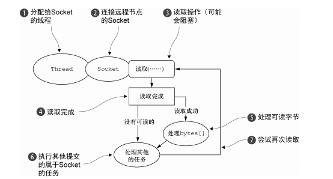
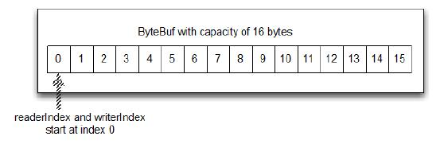

# 核心接口

## Channel 接口

定义了基本的I/O操作（bind()、connect()、read()和 write()）

netty的Channel 接口提供的API，大大降低了直接使用socket类的复杂性。

## EventLoop 接口

定义了 Netty 的核心抽象，用于处理连接的生命周期中所发生的事件。


* 一个 EventLoopGroup 包含一个或者多个 EventLoop；
* 一个 EventLoop 在它的生命周期内只和一个 Thread 绑定；
* 所有由 EventLoop 处理的 I/O 事件都将在它专有的 Thread 上被处理；
* 一个 Channel 在它的生命周期内只注册于一个 EventLoop；
* 一个 EventLoop 可能会被分配给一个或多个 Channel。

## ChannelHandler 接口

它充当了所有处理入站和出站数据的应用程序逻辑的容器。

ChannelHandler 的经典用途包括:

* 将数据从一种格式转换为另一种格式(编解码)；
* 提供异常的通知；
* 提供 Channel 变为活动的或者非活动的通知；
* 提供当 Channel 注册到 EventLoop 或者从 EventLoop 注销时的通知；
* 提供有关用户自定义事件的通知。


## ChannelPipeline 接口

ChannelPipeline 提供了 ChannelHandler 链的容器，并定义了用于在该链上传播入站和出站事件流的 API。

当 Channel 被创建时，它会被自动地分配到它专属的 ChannelPipeline。

ChannelHandler 安装到 ChannelPipeline 中的过程如下所示：

* 一个ChannelInitializer的实现被注册到了ServerBootstrap中 ；
* 当 ChannelInitializer.initChannel()方法被调用时，ChannelInitializer将在 ChannelPipeline 中安装一组自定义的 ChannelHandler；
* ChannelInitializer 将它自己从 ChannelPipeline 中移除。

事件从客户端到服务端，这些事件称之为出站，反之为入站。


# 传输

| 名称                                                         | 包                          | 描述                                                         |
| ------------------------------------------------------------ | --------------------------- | ------------------------------------------------------------ |
| NIO                                                          | io.netty.channel.socket.nio | 使用 java.nio.channels 包作为基础——基于选择器的方式          |
| [Epoll](https://github.com/netty/netty/wiki/Native-transports) | io.nett.channel.eoll        | 由 JNI 驱动的 epoll()和非阻塞 IO。这个传输支持只有在Linux上可用的多种特性，如SO_REUSEPORT，比 NIO 传输更快，而且是完全非阻塞的 |
| OIO                                                          | io.netty.channel.socket.oio | 使用 java.net 包作为基础——使用阻塞流                         |
| Local                                                        | io.netty.channel.local      | 可以在 VM 内部通过管道进行通信的本地传输                     |
| Embedded                                                     | io.netty.channel.embedded   | Embedded 传输，允许使用 ChannelHandler 而又不需要一个真正的基于网络的传输。这在测试你ChannelHandler 实现时非常有用 |

## 传输API

### Channel

传输API的核心是Channel接口。它被用于所有的I/O操作。`io.netty.channel.Channel`

channel类的层次结构：


每个Channel都包含一个ChannelPipeline和ChannelConfig。

### ChannelConfig

ChannelConfig包含了该Channel的所有配置信息，并且支持热更新。


Channel是唯一的，继承java.lang.Comparable接口，是为了保证Channel的顺序。如果两个Channel返回相同的hashCode，AbstractChannel中的compareTo()的实现会抛出一个Error。

### ChannelPipeline


包含了所以处理入站、出站数据及时间的ChannelHandler实例。这些ChannelHandler实现了应用程序处理状态变化及数据的逻辑。

ChannelHandler 的典型用途包括：

* 将数据从一种格式转换为另一种格式；
* 提供异常的通知；
* 提供 Channel 变为活动的或者非活动的通知；
* 提供当 Channel 注册到 EventLoop 或者从 EventLoop 注销时的通知；
* 提供有关用户自定义事件的通知。


## 内置传输类型

### NIO-非阻塞I/O

基于JDK的选择器(selector)API。

可以把选择器理解为注册表，通过选择器可以获取channel状态的变化通知。

* 新的 Channel 已被接受并且就绪；
* Channel 连接已经完成；
* Channel 有已经就绪的可供读取的数据；
* Channel 可用于写数据

选择器运行在一个检查状态变化并对其做出相应响应的线程上，在应用程序对状态的改变做出响应之后，选择器将会被重置，并将重复这个过程。

`java.nio.channels.SelectionKey`定义了位模式：

| 名 称      | 描 述                                                        |
| ---------- | ------------------------------------------------------------ |
| OP_ACCEPT  | 请求在接受新连接并创建 Channel 时获得通知                    |
| OP_CONNECT | 请求在建立一个连接时获得通知                                 |
| OP_READ    | 请求当数据已经就绪，可以从 Channel 中读取时获得通知          |
| OP_WRITE   | 请求当可以向 Channel 中写更多的数据时获得通知。这处理了套接字缓冲区被完全填满时的情况，这种情况通常发生在数据的发送速度比远程节点可处理的速度更快的时候 |

对于所有 Netty 的传输实现都共有的用户级别 API 完全地隐藏了这些 NIO 的内部细节。


### Epoll—用于 Linux 的本地非阻塞传输

Linux JDK NIO API使用了这些epoll调用。

如果应用是在linux系统下使用，可以考虑利用Epoll进行传输。

如果要在代码中使用 epoll 替代 NIO，只需要将 NioEventLoopGroup替换为 EpollEventLoopGroup ，并且将 NioServerSocketChannel.class 替换为EpollServerSocketChannel.class 即可。

### OIO—旧的阻塞 I/O

使用场景：

​	可能要移植使用了一些阻塞调用的库例如:JDBC的遗留代码。




代码如下：

```
public class NettyOioServer {

    public void server(int port) throws Exception {
        final ByteBuf buf = Unpooled.unreleasableBuffer(
                Unpooled.copiedBuffer("Hi!\r\n", Charset.forName("UTF-8")));
        EventLoopGroup group = new OioEventLoopGroup();
        try {
            ServerBootstrap b = new ServerBootstrap();

            b.group(group)
             .channel(OioServerSocketChannel.class)
             .localAddress(new InetSocketAddress(port))
             .childHandler(new ChannelInitializer<SocketChannel>() {
                 @Override
                 public void initChannel(SocketChannel ch) 
                     throws Exception {
                     ch.pipeline().addLast(new ChannelInboundHandlerAdapter() {
                         @Override
                         public void channelActive(ChannelHandlerContext ctx) throws Exception {
                             ctx.writeAndFlush(buf.duplicate()).addListener(ChannelFutureListener.CLOSE);
                         }
                     });
                 }
             });
            ChannelFuture f = b.bind().sync();
            f.channel().closeFuture().sync();
        } finally {
            group.shutdownGracefully().sync();
        }
    }
}
```

### 用于 JVM 内部通信的 Local 传输

Netty 提供了一个 Local 传输，用于在同一个 JVM 中运行的客户端和服务器程序之间的异步通信。同样，这个传输也支持对于所有 Netty 传输实现都共同的 API。

与服务器channel相关的SocketAddress 并没有绑定物理网络地址。只要服务器还在运行，它就被存储在注册表里，在channel关闭时注销。因为传出不接收真正的流量，所以不能和其他传输实现进行交互。

```java
public final class LocalEcho {

    static final String PORT = System.getProperty("port", "test_port");

    public static void main(String[] args) throws Exception {
        // Address to bind on / connect to.
        final LocalAddress addr = new LocalAddress(PORT);

        EventLoopGroup serverGroup = new DefaultEventLoopGroup();
        EventLoopGroup clientGroup = new NioEventLoopGroup(); // NIO event loops are also OK
        try {
            // Note that we can use any event loop to ensure certain local channels
            // are handled by the same event loop thread which drives a certain socket channel
            // to reduce the communication latency between socket channels and local channels.
            ServerBootstrap sb = new ServerBootstrap();
            sb.group(serverGroup)
              .channel(LocalServerChannel.class)
              .handler(new ChannelInitializer<LocalServerChannel>() {
                  @Override
                  public void initChannel(LocalServerChannel ch) throws Exception {
                      ch.pipeline().addLast(new LoggingHandler(LogLevel.INFO));
                  }
              })
              .childHandler(new ChannelInitializer<LocalChannel>() {
                  @Override
                  public void initChannel(LocalChannel ch) throws Exception {
                      ch.pipeline().addLast(
                              new LoggingHandler(LogLevel.INFO),
                              new LocalEchoServerHandler());
                  }
              });

            Bootstrap cb = new Bootstrap();
            cb.group(clientGroup)
              .channel(LocalChannel.class)
              .handler(new ChannelInitializer<LocalChannel>() {
                  @Override
                  public void initChannel(LocalChannel ch) throws Exception {
                      ch.pipeline().addLast(
                              new LoggingHandler(LogLevel.INFO),
                              new LocalEchoClientHandler());
                  }
              });

            // Start the server.
            sb.bind(addr).sync();

            // Start the client.
            Channel ch = cb.connect(addr).sync().channel();

            // Read commands from the stdin.
            System.out.println("Enter text (quit to end)");
            ChannelFuture lastWriteFuture = null;
            BufferedReader in = new BufferedReader(new InputStreamReader(System.in));
            for (;;) {
                String line = in.readLine();
                if (line == null || "quit".equalsIgnoreCase(line)) {
                    break;
                }

                // Sends the received line to the server.
                lastWriteFuture = ch.writeAndFlush(line);
            }

            // Wait until all messages are flushed before closing the channel.
            if (lastWriteFuture != null) {
                lastWriteFuture.awaitUninterruptibly();
            }
        } finally {
            serverGroup.shutdownGracefully();
            clientGroup.shutdownGracefully();
        }
    }
}
```

### Embedded(嵌入式) 传输

Netty提供了一种额外的传输，可以将一组ChannelHandler作为辅助类嵌入到其他的ChannelHandler内部。在不修改ChannelHandler代码的情况下，扩展其功能。

嵌入式传输的关键是EmbeddedChannel 的具体的 Channel实现。

## 传输用例

支持的传输和网络协议

| 传输           | TCP  | UDP  | SCTP   | UDT    |
| -------------- | ---- | ---- | ------ | ------ |
| NIO            | 支持 | 支持 | 支持   | 支持   |
| Epoll(仅linux) | 支持 | 支持 | 不支持 | 不支持 |
| OIO            | 支持 | 支持 | 支持   | 支持   |

```shell
在 Linux 上启用 SCTP
SCTP 需要内核的支持，并且需要安装用户库。
例如，对于 Ubuntu，可以使用下面的命令：
# sudo apt-get install libsctp1
对于 Fedora，可以使用 yum：
#sudo yum install kernel-modules-extra.x86_64 lksctp-tools.x86_64
有关如何启用 SCTP 的详细信息，请参考你的 Linux 发行版的文档。
```

* 非阻塞代码库——如果你的代码库中没有阻塞调用（或者你能够限制它们的范围），那么
  在 Linux 上使用 NIO 或者 epoll 始终是个好主意。虽然 NIO/epoll 旨在处理大量的并发连
  接，但是在处理较小数目的并发连接时，它也能很好地工作，尤其是考虑到它在连接之
  间共享线程的方式。
* 阻塞代码库——正如我们已经指出的，如果你的代码库严重地依赖于阻塞 I/O，而且你的应
  用程序也有一个相应的设计，那么在你尝试将其直接转换为 Netty 的 NIO 传输时，你将可
  能会遇到和阻塞操作相关的问题。不要为此而重写你的代码，可以考虑分阶段迁移：先从
  OIO 开始，等你的代码修改好之后，再迁移到 NIO（或者使用 epoll，如果你在使用 Linux）。
* 在同一个 JVM 内部的通信——在同一个 JVM 内部的通信，不需要通过网络暴露服务，是
  Local 传输的完美用例。这将消除所有真实网络操作的开销，同时仍然使用你的 Netty 代码
  库。如果随后需要通过网络暴露服务，那么你将只需要把传输改为 NIO 或者 OIO 即可。
* 测试你的 ChannelHandler 实现——如果你想要为自己的 ChannelHandler 实现编
  写单元测试，那么请考虑使用 Embedded 传输。这既便于测试你的代码，而又不需要创建大
  量的模拟（mock）对象。你的类将仍然符合常规的 API 事件流，保证该 ChannelHandler
  在和真实的传输一起使用时能够正确地工作。

应用程序的最佳传输

| 应用程序的需求                 | 推荐的传输                       |
| ------------------------------ | -------------------------------- |
| 非阻塞代码库或者一个常规的起点 | NIO（或者在 Linux 上使用 epoll） |
| 阻塞代码库                     | OIO                              |
| 在同一个 JVM 内部的通信        | Local                            |
| 测试 ChannelHandler 的实现     | Embedded(嵌入式)                 |

# ByteBuf

Java NIO中使用ByteBuffer作为字节容器。

Netty中使用ByteBuf作为ByteBuffer的替代品，既解决了JDK API的局限性，又提供了更好的API。


## ByteBuf 的 API

netty通过`io.netty.buffer.ByteBuf`、`io.netty.buffer.ByteBufHolder`进行数据处理。

ByteBuf  API的优点：

* 它可以被用户自定义的缓冲区类型扩展；
* 通过内置的复合缓冲区类型实现了透明的零拷贝；
* 容量可以按需增长（类似于 JDK 的 StringBuilder）；
* 在读和写这两种模式之间切换不需要调用 ByteBuffer 的 flip()方法；
* 读和写使用了不同的索引；
* 支持方法的链式调用；
* 支持引用计数；
* 支持池化。

### ByteBuf 如何在工作

ByteBuf维护了`readerIndex`(读索引)、`writerIndex`(写索引)。

调用 ByteBuf 的 "read" 或 "write" 开头的任何方法都会提升 相应的索引。另一方面，"set" 、 "get"操作字节将不会移动指数；他们只操作相关的通过参数传入方法的索引。




### ByteBuf使用模式

#### 堆缓冲区

最常见的ByteBuf ，将数据存储在JVM的堆空间。通过将数据存储在数组中实现。堆缓冲区可以快速分配，当不使用时也可以快速释放。它还提供了直接访问数组的方法，通过 ByteBuf.array() 来获取 byte[]数据。

```java

ByteBuf heapBuf = ...;
if (heapBuf.hasArray()) {                //1
    byte[] array = heapBuf.array();        //2
    int offset = heapBuf.arrayOffset() + heapBuf.readerIndex();                //3
    int length = heapBuf.readableBytes();//4
    handleArray(array, offset, length); //5

```

1.检查 ByteBuf 是否有支持数组。

2.如果这样得到的引用数组。

3.计算第一字节的偏移量。

4.获取可读的字节数。

5.使用数组，偏移量和长度作为调用方法的参数。

注意：

- 访问非堆缓冲区 ByteBuf 的数组会导致UnsupportedOperationException， 可以使用 ByteBuf.hasArray()来检查是否支持访问数组。
- 这个用法与 JDK 的 ByteBuffer 类似

#### 直接缓冲区

直接缓冲区是另外一种 ByteBuf 模式。在 JDK1.4 中被引入 NIO 的ByteBuffer 类允许一个 JVM 实现通过本地调用分配内存，其目的是

- 通过免去中间交换的内存拷贝, 提升IO处理速度; 直接缓冲区的内容可以驻留的正常垃圾回收以外 堆。
- DirectBuffer 在 -XX:MaxDirectMemorySize=xxM大小限制下, 使用 Heap 之外的内存, GC对此”无能为力”,也就意味着规避了在高负载下频繁的GC过程对应用线程的中断影响.(详见<http://docs.oracle.com/javase/7/docs/api/java/nio/ByteBuffer.html.>)

缺点：

* 分配内存空间和释放内存时比堆缓冲区更复杂
* 配合传统代码，因为数据不是在堆上，所以你不得不进行一次复制

```java
ByteBuf directBuf = ...
if (!directBuf.hasArray()) {            //1
    int length = directBuf.readableBytes();//2
    byte[] array = new byte[length];    //3
    directBuf.getBytes(directBuf.readerIndex(), array);        //4    
    handleArray(array, 0, length);  //5

```

1.检查 ByteBuf 不是由数组支持。如果不是，这是一个直接缓冲液。

2.获取可读的字节数

3.分配一个新的数组来保存字节

4.字节复制到数组

5.调用一些参数是 数组，偏移量和长度 的方法

显然，这涉及到比使用支持数组多做一些工作。因此，如果你知道事先在容器中的数据作为一个数组进行访问，你可能更愿意使用堆内存。

#### 复合缓冲区

我们可以创建多个不同的 ByteBuf，然后提供一个这些 ByteBuf 组合的视图。复合缓冲区就像一个列表，我们可以动态的添加和删除其中的 ByteBuf，JDK 的 ByteBuffer 没有这样的功能。

Netty 提供了 ByteBuf 的子类 CompositeByteBuf 类来处理复合缓冲区，CompositeByteBuf 只是一个视图。

**警告 **CompositeByteBuf 中的 ByteBuf 实例可能同时包含直接内存分配和非直接内存分配。如果其中只有一个实例，那么对 CompositeByteBuf 上的 hasArray()方法的调用将返回该组件上的 hasArray()方法的值；否则它将返回 false。

例如，一条消息由 header 和 body 两部分组成，将 header 和 body 组装成一条消息发送出去，可能 body 相同，只是 header 不同，使用CompositeByteBuf 就不用每次都重新分配一个新的缓冲区。下图显示CompositeByteBuf 组成 header 和 body：


```java
CompositeByteBuf messageBuf = ...;
ByteBuf headerBuf = ...; // 可以支持或直接
ByteBuf bodyBuf = ...; // 可以支持或直接
messageBuf.addComponents(headerBuf, bodyBuf);
// ....
messageBuf.removeComponent(0); // 移除头    //2
 
for (int i = 0; i < messageBuf.numComponents(); i++) {                        //3
    System.out.println(messageBuf.component(i).toString());
}
```

1.追加 ByteBuf 实例的 CompositeByteBuf

2.删除 索引1的 ByteBuf

3.遍历所有 ByteBuf 实例。

CompositeByteBuf 可能不支持访问其支撑数组，因此访问 CompositeByteBuf 中的数据类似于（访问）直接缓冲区的模式。

```java
CompositeByteBuf compBuf = ...;
int length = compBuf.readableBytes();    //1
byte[] array = new byte[length];        //2
compBuf.getBytes(compBuf.readerIndex(), array);    //3
handleArray(array, 0, length);    //4

```

1.得到的可读的字节数。

2.分配一个新的数组,为可读字节长度。

3.读取字节到数组

4.使用数组，偏移量和长度作为参数

CompositeByteBuf API 除了从 ByteBuf 继承的方法，CompositeByteBuf 提供了大量的附加功能.


## 字节级操作

ByteBuf提供了许多基础读、写操作的方法来修改它的数据。

### 随机访问索引

ByteBuf的索引是从0开始的，第一个字节的索引是0，最后一个字节的索引是capacity() - 1

```java
ByteBuf buffer = ...;
for (int i = 0; i < buffer.capacity(); i++) {
	byte b = buffer.getByte(i);
	System.out.println((char)b);
}
```

### 顺序访问索引


### 可丢弃字节

已经度过的字节被标记为`可丢弃字节`，通过调用`discardReadBytes()`方法，可以丢弃它们回收空间。


调用`discardReadBytes()`会重置`readerIndex`和`writerIndex `位置。将可读字节转移到缓冲区开始位置。

**频繁调用可能会发生内存复制**。

### 可读字节

ByteBuf的可读字节存储了实际的数据。

对于每个新分配的ByteBuf，其默认`readerIndex`都为0，任何以read或者skip开头的方法，会检索或者跳过位于当前readerIndex的数据，并且增加`readerIndex`的值。`readerIndex`<=`writerIndex`

```java
ByteBuf buf = ...;
while (buf.isReadable()) {
    System.out.println((char)buf.readByte());
}
```

### 可写字节

可写字段指拥有一段未定义、可写入的内容，新分配的缓冲区默认`writerIndex`为0，任何以write为开头的方法都会增加`writeIndex`的值。

```java
ByteBuf buf = ...;
while (buf.writableBytes() >= 4) {
    buf.writeInt(random.nextInt());
}
```

如果操作的目标也是ByteBuf，源缓冲区的`readerIndex`同样会增加相同的大小。

```java
@Override
    public ByteBuf writeBytes(ByteBuf src) {
        writeBytes(src, src.readableBytes());
        return this;
    }

    @Override
    public ByteBuf writeBytes(ByteBuf src, int length) {
        if (checkBounds) {
            checkReadableBounds(src, length);
        }
        writeBytes(src, src.readerIndex(), length);
        src.readerIndex(src.readerIndex() + length);
        return this;
    }
```

测试代码:

```java
public class ByteBufTest {
    public static void main(String[] args) {
        byte [] bytes = "测试".getBytes();
        ByteBuf src = Unpooled.wrappedBuffer(bytes);
        System.out.println("readerIndex:"+src.readerIndex());
        System.out.println("writerIndex:"+src.writerIndex());
        System.out.println("---------------------------------------");
        ByteBuf buf = Unpooled.buffer();
        buf.writeBytes(src);
        System.out.println("srcReaderIndex:"+src.readerIndex());
        System.out.println("srcWriterIndex:"+src.writerIndex());

    }
}
```


### 索引管理

JDK 的 `InputStream `定义了` mark(int readlimit)`和 `reset()`方法，这些方法分别被用来将流中的当前位置标记为指定的值，以及将流重置到该位置。

`ByteBuf`通过`markReaderIndex()`、`markWriterIndex()`、`resetWriterIndex()`和`resetReaderIndex()`来标记和重置的 `readerIndex `和 `writerIndex`。

也可以通过`readerIndex(int)`或者 `writerIndex(int)`来将索引移动到指定位置。

通过`clear()`方法来将 `readerIndex `和 `writerIndex` 都设置为 0。


