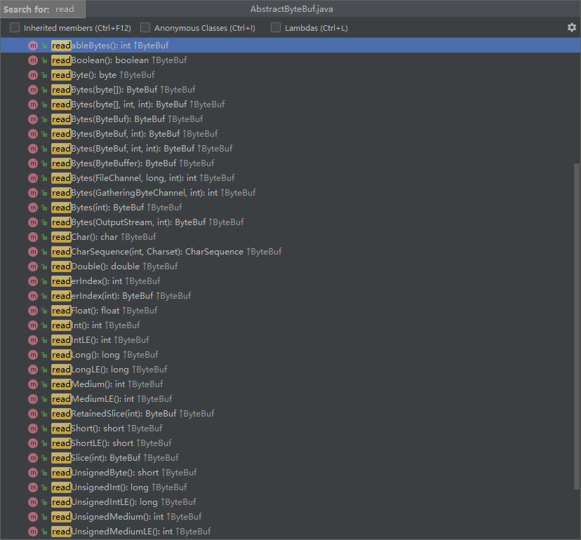
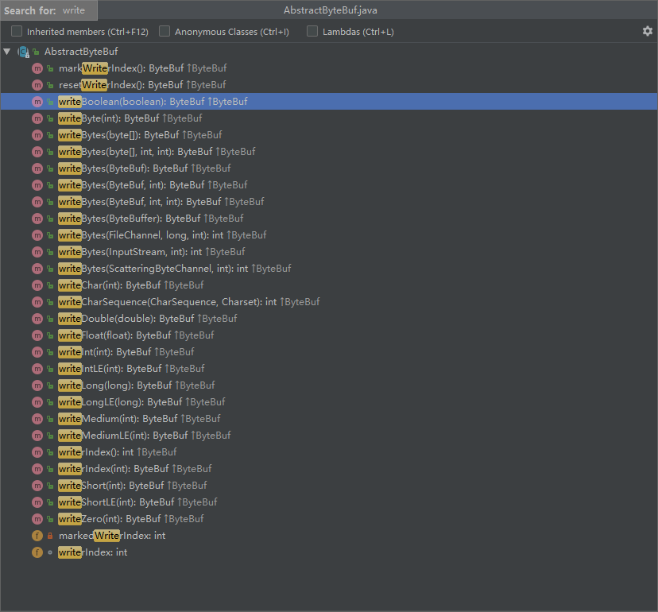

# netty架构图


* Core：核⼼部分，是底层的⽹络通⽤抽象和部分实现。
  * Extensible Event Model ：可拓展的事件模型。Netty 是基于事件模型的⽹络应⽤框架。
  * Universal Communication API ：通⽤的通信 API 层。Netty 定义了⼀套抽象的通⽤通信层的 API 。
  * Zero-Copy-Capable Rich Byte Buffer ：⽀持零拷⻉特性的 Byte Buffer 实现
* Transport Services：传输( 通信 )服务，具体的⽹络传输的定义与实现。
  * Socket & Datagram ：TCP 和 UDP 的传输实现。
  * HTTP Tunnel ：HTTP 通道的传输实现。
  * In-VM Piple ：JVM 内部的传输实现。
* Protocol Support ：协议⽀持。Netty 对于⼀些通⽤协议的编解码实现。例如：HTTP、Redis、DNS 等等。.

# 核心组件

Netty 有如下⼏个核⼼组件：

* Bootstrap & ServerBootstrap
* Channel
* ChannelFuture
* EventLoop & EventLoopGroup
* ChannelHandler
* ChannelPipeline

核⼼组件的⾼层类图如下：


# 核心API

## EventLoopGroup

默认大小为cpu核心数的2倍，因为现在的cpu都是一个核心包含两个线程。

io.netty.channel.MultithreadEventLoopGroup

```java
 private static final int DEFAULT_EVENT_LOOP_THREADS;

    static {
        DEFAULT_EVENT_LOOP_THREADS = Math.max(1, SystemPropertyUtil.getInt(
                "io.netty.eventLoopThreads", NettyRuntime.availableProcessors() * 2));

        if (logger.isDebugEnabled()) {
            logger.debug("-Dio.netty.eventLoopThreads: {}", DEFAULT_EVENT_LOOP_THREADS);
        }
    }

    /**
     * @see MultithreadEventExecutorGroup#MultithreadEventExecutorGroup(int, Executor, Object...)
     */
    protected MultithreadEventLoopGroup(int nThreads, Executor executor, Object... args) {
        super(nThreads == 0 ? DEFAULT_EVENT_LOOP_THREADS : nThreads, executor, args);
    }
```

## ChannelOption.SO_BACKLOG

默认值

io.netty.util.NetUtil

```java
    // Determine the default somaxconn (server socket backlog) value of the platform.
                // The known defaults:
                // - Windows NT Server 4.0+: 200
                // - Linux and Mac OS X: 128
                int somaxconn = PlatformDependent.isWindows() ? 200 : 128;
```

## ByteBuf

类图如下:


### 内存分配

从内存分配角度来说，ByteBuf可以分为两类：

* 堆内存(HeapByteBuf)字节缓冲区：

  * 优点：内存分配和回收速度快，jvm可以自动回收
  * 缺点：如果是socket的I/O操作，额外需要一次内存复制。性能会有一定程度的下降。

* 直接内存(DirectByteBuf)字段缓冲区：

  非堆内存，在堆外进行内存分配。分配和回收速度相对慢些，socket的I/O操作速度快。

最佳实践是在I/O通信线程的读写缓存区使用`DirectByteBuf`,后端业务消息的编解码模块使用`HeapByteBuf`。

### 内存回收

从内存回收角度来看，ByteBuf也可以分为两类：

* 基于对象池的ByteBuf
* 普通ByteBuf

主要区别对象池的ByteBuf可以重用ByteBuf，内部维护了一个内存池，可以循环利用已创建的ByteBuf。提升内存使用率，降低高负载导致的频繁GC。

## AbstractByteBuf

AbstractByteBuf没有定义ByteBuf的缓冲实现，因为AbstractByteBuf不清楚子类到底是基于堆内存还是基于直接内存的。

### 读操作

定义了读操作的公共功能。



### 写操作

定义了写操作的公共功能



写扩容：

io.netty.buffer.AbstractByteBuf#ensureWritable(int)

io.netty.buffer.AbstractByteBuf#ensureWritable0

io.netty.buffer.AbstractByteBufAllocator#calculateNewCapacity

```java
  
@Override
    public int calculateNewCapacity(int minNewCapacity, int maxCapacity) {
        if (minNewCapacity < 0) {
            throw new IllegalArgumentException("minNewCapacity: " + minNewCapacity + " (expected: 0+)");
        }
        if (minNewCapacity > maxCapacity) {
            throw new IllegalArgumentException(String.format(
                    "minNewCapacity: %d (expected: not greater than maxCapacity(%d)",
                    minNewCapacity, maxCapacity));
        }
        final int threshold = CALCULATE_THRESHOLD; // 默认是4M

        if (minNewCapacity == threshold) {
            return threshold;
        }

        // 如果超过阈值，不要加倍，而只是增加阈值。
        if (minNewCapacity > threshold) {
            int newCapacity = minNewCapacity / threshold * threshold;
            if (newCapacity > maxCapacity - threshold) {
                newCapacity = maxCapacity;
            } else {
                newCapacity += threshold;
            }
            return newCapacity;
        }

        // 没有超过门槛。 以64的倍数扩容，指导最大可到4M
        int newCapacity = 64;
        while (newCapacity < minNewCapacity) {
            newCapacity <<= 1;
        }

        return Math.min(newCapacity, maxCapacity);
    }
@Override
    public ByteBuf ensureWritable(int minWritableBytes) {
        if (minWritableBytes < 0) {
            throw new IllegalArgumentException(String.format(
                    "minWritableBytes: %d (expected: >= 0)", minWritableBytes));
        }
        ensureWritable0(minWritableBytes);
        return this;
    }

    final void ensureWritable0(int minWritableBytes) {
        ensureAccessible();
        if (minWritableBytes <= writableBytes()) {
            return;
        }

        if (minWritableBytes > maxCapacity - writerIndex) {
            throw new IndexOutOfBoundsException(String.format(
                    "writerIndex(%d) + minWritableBytes(%d) exceeds maxCapacity(%d): %s",
                    writerIndex, minWritableBytes, maxCapacity, this));
        }

        // Normalize the current capacity to the power of 2.
        int newCapacity = alloc().calculateNewCapacity(writerIndex + minWritableBytes, maxCapacity);

        // 由子类实现
        capacity(newCapacity);
    }
```

### 索引操作


索引操作主要涉及到设置读写索引、mark、rest。

### 重用缓冲区

discardReadBytes

```java
 操作前

      +-------------------+------------------+------------------+
      | discardable bytes |  readable bytes  |  writable bytes  |
      +-------------------+------------------+------------------+
      |                   |                  |                  |
      0    <=     readerIndex <=   writerIndex  <=    capacity


 操作后

      +------------------+--------------------------------------+
      |  readable bytes  |    writable bytes (got more space)   |
      +------------------+--------------------------------------+
      |                  |                                      |
 readerIndex (0) <= writerIndex (decreased)        <=        capacity
```

```java
 @Override
    public ByteBuf discardReadBytes() {
        ensureAccessible();
        //没有可重用缓冲区
        if (readerIndex == 0) {
            return this;
        }
		//已经有可重用缓冲区	
        if (readerIndex != writerIndex) {
            //字节数组重组
            setBytes(0, this, readerIndex, writerIndex - readerIndex);
            writerIndex -= readerIndex;
            //mark
            adjustMarkers(readerIndex);
            readerIndex = 0;
        } else {//没有可读字节数，不需要字节重组
            adjustMarkers(readerIndex);
            writerIndex = readerIndex = 0;
        }
        return this;
    }
```

### skipBytes

忽略指定长度的字节数，读操作直接跳过这些数据。


# 服务器创建流程


摘自<Netty 权威指南>13.2.1节

## 创建ServerBootstrap实例

ServerBootstrap是netty服务端的启动辅助类。采用了`builder模式`设计解决了参数过多的问题。

示例代码:

```java
ServerBootstrap b = new ServerBootstrap();
```

## 设置并绑定Reactor线程池

Netty的Reactor的线程池是`EventLoopGroup`,实际上就是`EventLoop`的数组。默认大小是cpu核心数的2倍

```java
io.netty.channel.MultithreadEventLoopGroup
 private static final int DEFAULT_EVENT_LOOP_THREADS;

    static {
        DEFAULT_EVENT_LOOP_THREADS = Math.max(1, SystemPropertyUtil.getInt(
                "io.netty.eventLoopThreads", NettyRuntime.availableProcessors() * 2));

        if (logger.isDebugEnabled()) {
            logger.debug("-Dio.netty.eventLoopThreads: {}", DEFAULT_EVENT_LOOP_THREADS);
        }
    }
 protected MultithreadEventLoopGroup(int nThreads, Executor executor, Object... args) {
        super(nThreads == 0 ? DEFAULT_EVENT_LOOP_THREADS : nThreads, executor, args);
    }

    /**
     * @see MultithreadEventExecutorGroup#MultithreadEventExecutorGroup(int, ThreadFactory, Object...)
     */
    protected MultithreadEventLoopGroup(int nThreads, ThreadFactory threadFactory, Object... args) {
        super(nThreads == 0 ? DEFAULT_EVENT_LOOP_THREADS : nThreads, threadFactory, args);
    }
```

EventLoop的职责是处理错有注册到本地线程多路复用器Selector上的channel。

selector的轮询操作由绑定的eventloop线程run方法驱动。

EventLoop不仅处理网络I/O事件，还可以处理用户自定义的task和定时任务，实现了线程模型的统一。

netty通过rebuildSelector()解决了EventLoop空轮询的bug。当空轮询达到执行限制后，重建selector。

```java
io.netty.channel.nio.NioEventLoop
public final class NioEventLoop extends SingleThreadEventLoop {

    private static final InternalLogger logger = InternalLoggerFactory.getInstance(NioEventLoop.class);

    private static final int CLEANUP_INTERVAL = 256; // XXX Hard-coded value, but won't need customization.

    private static final boolean DISABLE_KEYSET_OPTIMIZATION =
            SystemPropertyUtil.getBoolean("io.netty.noKeySetOptimization", false);

    private static final int MIN_PREMATURE_SELECTOR_RETURNS = 3;
    private static final int SELECTOR_AUTO_REBUILD_THRESHOLD;

    private final IntSupplier selectNowSupplier = new IntSupplier() {
        @Override
        public int get() throws Exception {
            return selectNow();
        }
    };

    // Workaround for JDK NIO bug.
    //
    // See:
    // - http://bugs.sun.com/view_bug.do?bug_id=6427854
    // - https://github.com/netty/netty/issues/203
    static {
        final String key = "sun.nio.ch.bugLevel";
        final String buglevel = SystemPropertyUtil.get(key);
        if (buglevel == null) {
            try {
                AccessController.doPrivileged(new PrivilegedAction<Void>() {
                    @Override
                    public Void run() {
                        System.setProperty(key, "");
                        return null;
                    }
                });
            } catch (final SecurityException e) {
                logger.debug("Unable to get/set System Property: " + key, e);
            }
        }

        int selectorAutoRebuildThreshold = SystemPropertyUtil.getInt("io.netty.selectorAutoRebuildThreshold", 512);
        if (selectorAutoRebuildThreshold < MIN_PREMATURE_SELECTOR_RETURNS) {
            selectorAutoRebuildThreshold = 0;
        }

        SELECTOR_AUTO_REBUILD_THRESHOLD = selectorAutoRebuildThreshold;

        if (logger.isDebugEnabled()) {
            logger.debug("-Dio.netty.noKeySetOptimization: {}", DISABLE_KEYSET_OPTIMIZATION);
            logger.debug("-Dio.netty.selectorAutoRebuildThreshold: {}", SELECTOR_AUTO_REBUILD_THRESHOLD);
        }
    }

    /**
     * The NIO {@link Selector}.
     */
    private Selector selector;
    private Selector unwrappedSelector;
    private SelectedSelectionKeySet selectedKeys;

    private final SelectorProvider provider;

    /**
     * Boolean that controls determines if a blocked Selector.select should
     * break out of its selection process. In our case we use a timeout for
     * the select method and the select method will block for that time unless
     * waken up.
     */
    private final AtomicBoolean wakenUp = new AtomicBoolean();

    private final SelectStrategy selectStrategy;

    private volatile int ioRatio = 50;
    private int cancelledKeys;
    private boolean needsToSelectAgain;
    
    
    ...
    
    
     /**
     * Replaces the current {@link Selector} of this event loop with newly created {@link Selector}s to work
     * around the infamous epoll 100% CPU bug.
     */
    public void rebuildSelector() {
        if (!inEventLoop()) {
            execute(new Runnable() {
                @Override
                public void run() {
                    rebuildSelector0();
                }
            });
            return;
        }
        rebuildSelector0();
    }

    private void rebuildSelector0() {
        final Selector oldSelector = selector;
        final SelectorTuple newSelectorTuple;

        if (oldSelector == null) {
            return;
        }

        try {
            newSelectorTuple = openSelector();
        } catch (Exception e) {
            logger.warn("Failed to create a new Selector.", e);
            return;
        }

        // Register all channels to the new Selector.
        int nChannels = 0;
        for (SelectionKey key: oldSelector.keys()) {
            Object a = key.attachment();
            try {
                if (!key.isValid() || key.channel().keyFor(newSelectorTuple.unwrappedSelector) != null) {
                    continue;
                }

                int interestOps = key.interestOps();
                key.cancel();
                SelectionKey newKey = key.channel().register(newSelectorTuple.unwrappedSelector, interestOps, a);
                if (a instanceof AbstractNioChannel) {
                    // Update SelectionKey
                    ((AbstractNioChannel) a).selectionKey = newKey;
                }
                nChannels ++;
            } catch (Exception e) {
                logger.warn("Failed to re-register a Channel to the new Selector.", e);
                if (a instanceof AbstractNioChannel) {
                    AbstractNioChannel ch = (AbstractNioChannel) a;
                    ch.unsafe().close(ch.unsafe().voidPromise());
                } else {
                    @SuppressWarnings("unchecked")
                    NioTask<SelectableChannel> task = (NioTask<SelectableChannel>) a;
                    invokeChannelUnregistered(task, key, e);
                }
            }
        }

        selector = newSelectorTuple.selector;
        unwrappedSelector = newSelectorTuple.unwrappedSelector;

        try {
            // time to close the old selector as everything else is registered to the new one
            oldSelector.close();
        } catch (Throwable t) {
            if (logger.isWarnEnabled()) {
                logger.warn("Failed to close the old Selector.", t);
            }
        }

        if (logger.isInfoEnabled()) {
            logger.info("Migrated " + nChannels + " channel(s) to the new Selector.");
        }
    }
      private void select(boolean oldWakenUp) throws IOException {
        Selector selector = this.selector;
        try {
            int selectCnt = 0;
            long currentTimeNanos = System.nanoTime();
            long selectDeadLineNanos = currentTimeNanos + delayNanos(currentTimeNanos);

            for (;;) {
                long timeoutMillis = (selectDeadLineNanos - currentTimeNanos + 500000L) / 1000000L;
                if (timeoutMillis <= 0) {
                    if (selectCnt == 0) {
                        selector.selectNow();
                        selectCnt = 1;
                    }
                    break;
                }

                // If a task was submitted when wakenUp value was true, the task didn't get a chance to call
                // Selector#wakeup. So we need to check task queue again before executing select operation.
                // If we don't, the task might be pended until select operation was timed out.
                // It might be pended until idle timeout if IdleStateHandler existed in pipeline.
                if (hasTasks() && wakenUp.compareAndSet(false, true)) {
                    selector.selectNow();
                    selectCnt = 1;
                    break;
                }

                int selectedKeys = selector.select(timeoutMillis);
                selectCnt ++;

                if (selectedKeys != 0 || oldWakenUp || wakenUp.get() || hasTasks() || hasScheduledTasks()) {
                    // - Selected something,
                    // - waken up by user, or
                    // - the task queue has a pending task.
                    // - a scheduled task is ready for processing
                    break;
                }
                if (Thread.interrupted()) {
                    // Thread was interrupted so reset selected keys and break so we not run into a busy loop.
                    // As this is most likely a bug in the handler of the user or it's client library we will
                    // also log it.
                    //
                    // See https://github.com/netty/netty/issues/2426
                    if (logger.isDebugEnabled()) {
                        logger.debug("Selector.select() returned prematurely because " +
                                "Thread.currentThread().interrupt() was called. Use " +
                                "NioEventLoop.shutdownGracefully() to shutdown the NioEventLoop.");
                    }
                    selectCnt = 1;
                    break;
                }

                long time = System.nanoTime();
                if (time - TimeUnit.MILLISECONDS.toNanos(timeoutMillis) >= currentTimeNanos) {
                    // timeoutMillis elapsed without anything selected.
                    selectCnt = 1;
                } else if (SELECTOR_AUTO_REBUILD_THRESHOLD > 0 &&
                        selectCnt >= SELECTOR_AUTO_REBUILD_THRESHOLD) {
                    // The selector returned prematurely many times in a row.
                    // Rebuild the selector to work around the problem.
                    logger.warn(
                            "Selector.select() returned prematurely {} times in a row; rebuilding Selector {}.",
                            selectCnt, selector);

                    rebuildSelector();
                    selector = this.selector;

                    // Select again to populate selectedKeys.
                    selector.selectNow();
                    selectCnt = 1;
                    break;
                }

                currentTimeNanos = time;
            }

            if (selectCnt > MIN_PREMATURE_SELECTOR_RETURNS) {
                if (logger.isDebugEnabled()) {
                    logger.debug("Selector.select() returned prematurely {} times in a row for Selector {}.",
                            selectCnt - 1, selector);
                }
            }
        } catch (CancelledKeyException e) {
            if (logger.isDebugEnabled()) {
                logger.debug(CancelledKeyException.class.getSimpleName() + " raised by a Selector {} - JDK bug?",
                        selector, e);
            }
            // Harmless exception - log anyway
        }
    }
}
```

## 设置并绑定服务端Channel

NioServerSocketChannel对远程的nio类库进行了封装。通过工厂类，利用反射重建NioServerSocketChannel对象。

```java
b.channel(NioServerSocketChannel.class)
    
 public B channel(Class<? extends C> channelClass) {
        if (channelClass == null) {
            throw new NullPointerException("channelClass");
        }
        return channelFactory(new ReflectiveChannelFactory<C>(channelClass));
    }   
public B channelFactory(io.netty.channel.ChannelFactory<? extends C> channelFactory) {
        return channelFactory((ChannelFactory<C>) channelFactory);
    }

public class ReflectiveChannelFactory<T extends Channel> implements ChannelFactory<T> {

    private final Class<? extends T> clazz;

    public ReflectiveChannelFactory(Class<? extends T> clazz) {
        if (clazz == null) {
            throw new NullPointerException("clazz");
        }
        this.clazz = clazz;
    }

    @Override
    public T newChannel() {
        try {
            return clazz.getConstructor().newInstance();
        } catch (Throwable t) {
            throw new ChannelException("Unable to create Channel from class " + clazz, t);
        }
    }

    @Override
    public String toString() {
        return StringUtil.simpleClassName(clazz) + ".class";
    }
}
```

## 建立链路并初始化ChannelPipeline

ChannelPipeline是一个双向链表

ChannelPipeline本质上是一个负责处理网络事件的职责链，负责管理和执行ChannelHandler。网络事件以事件流的形式在ChannelPipeline中流转。

```java
public class DefaultChannelPipeline implements ChannelPipeline {

    static final InternalLogger logger = InternalLoggerFactory.getInstance(DefaultChannelPipeline.class);

    private static final String HEAD_NAME = generateName0(HeadContext.class);
    private static final String TAIL_NAME = generateName0(TailContext.class);

    private static final FastThreadLocal<Map<Class<?>, String>> nameCaches =
            new FastThreadLocal<Map<Class<?>, String>>() {
        @Override
        protected Map<Class<?>, String> initialValue() throws Exception {
            return new WeakHashMap<Class<?>, String>();
        }
    };

    private static final AtomicReferenceFieldUpdater<DefaultChannelPipeline, MessageSizeEstimator.Handle> ESTIMATOR =
            AtomicReferenceFieldUpdater.newUpdater(
                    DefaultChannelPipeline.class, MessageSizeEstimator.Handle.class, "estimatorHandle");
    final AbstractChannelHandlerContext head;
    final AbstractChannelHandlerContext tail;

    private final Channel channel;
    private final ChannelFuture succeededFuture;
    private final VoidChannelPromise voidPromise;
    private final boolean touch = ResourceLeakDetector.isEnabled();

    private Map<EventExecutorGroup, EventExecutor> childExecutors;
    private volatile MessageSizeEstimator.Handle estimatorHandle;
    private boolean firstRegistration = true;
     private PendingHandlerCallback pendingHandlerCallbackHead;

    /**
     * Set to {@code true} once the {@link AbstractChannel} is registered.Once set to {@code true} the value will never
     * change.
     */
    private boolean registered;

    protected DefaultChannelPipeline(Channel channel) {
        this.channel = ObjectUtil.checkNotNull(channel, "channel");
        succeededFuture = new SucceededChannelFuture(channel, null);
        voidPromise =  new VoidChannelPromise(channel, true);

        tail = new TailContext(this);
        head = new HeadContext(this);

        head.next = tail;
        tail.prev = head;
    }
    ...
        
    public final ChannelPipeline addFirst(EventExecutorGroup group, String name, ChannelHandler handler) {
        final AbstractChannelHandlerContext newCtx;
        synchronized (this) {
            checkMultiplicity(handler);
            name = filterName(name, handler);

            newCtx = newContext(group, name, handler);

            addFirst0(newCtx);

            // If the registered is false it means that the channel was not registered on an eventloop yet.
            // In this case we add the context to the pipeline and add a task that will call
            // ChannelHandler.handlerAdded(...) once the channel is registered.
            if (!registered) {
                newCtx.setAddPending();
                callHandlerCallbackLater(newCtx, true);
                return this;
            }

            EventExecutor executor = newCtx.executor();
            if (!executor.inEventLoop()) {
                newCtx.setAddPending();
                executor.execute(new Runnable() {
                    @Override
                    public void run() {
                        callHandlerAdded0(newCtx);
                    }
                });
                return this;
            }
        }
        callHandlerAdded0(newCtx);
        return this;
    }

    private void addFirst0(AbstractChannelHandlerContext newCtx) {
        AbstractChannelHandlerContext nextCtx = head.next;
        newCtx.prev = head;
        newCtx.next = nextCtx;
        head.next = newCtx;
        nextCtx.prev = newCtx;
    }

    @Override
    public final ChannelPipeline addLast(String name, ChannelHandler handler) {
        return addLast(null, name, handler);
    }

    @Override
    public final ChannelPipeline addLast(EventExecutorGroup group, String name, ChannelHandler handler) {
        final AbstractChannelHandlerContext newCtx;
        synchronized (this) {
            checkMultiplicity(handler);

            newCtx = newContext(group, filterName(name, handler), handler);

            addLast0(newCtx);

            // If the registered is false it means that the channel was not registered on an eventloop yet.
            // In this case we add the context to the pipeline and add a task that will call
            // ChannelHandler.handlerAdded(...) once the channel is registered.
            if (!registered) {
                newCtx.setAddPending();
                callHandlerCallbackLater(newCtx, true);
                return this;
            }

            EventExecutor executor = newCtx.executor();
            if (!executor.inEventLoop()) {
                newCtx.setAddPending();
                executor.execute(new Runnable() {
                    @Override
                    public void run() {
                        callHandlerAdded0(newCtx);
                    }
                });
                return this;
            }
        }
        callHandlerAdded0(newCtx);
        return this;
    }

    private void addLast0(AbstractChannelHandlerContext newCtx) {
        AbstractChannelHandlerContext prev = tail.prev;
        newCtx.prev = prev;
        newCtx.next = tail;
        prev.next = newCtx;
        tail.prev = newCtx;
    }
    
    ...
        
}      
```

网络事件类型：

* 链路注册
* 链路激活
* 链路断开
* 接收到请求消息
* 请求消息接收并处理完毕
* 发送应答消息
* 链路异常消息
* 用户自定义事件

## 添加设置ChannelHandler

问题：为什么要先初始化ChannelPipeline？

答：ChannelPipeline管理着ChannelHandler，所有的事件处理要通过pipeline进行调度。

利用ChannelHandler可以完成大多数的功能定制，例如：消息编解码、心跳、安全认证、TSL/SSL认证、流量控制和流量整形等。

## 绑定并启动监听端口

在绑定端口之前，会做一系列的初始化和检测工作，完成之后绑定端口。并将ServerSocketChannel注册到selector上，监听客户端连接。

```java
io.netty.channel.socket.nio.NioServerSocketChannel
    private static final SelectorProvider DEFAULT_SELECTOR_PROVIDER = SelectorProvider.provider();

    private static ServerSocketChannel newSocket(SelectorProvider provider) {
        try {
            /**
             *  Use the {@link SelectorProvider} to open {@link SocketChannel} and so remove condition in
             *  {@link SelectorProvider#provider()} which is called by each ServerSocketChannel.open() otherwise.
             *
             *  See <a href="https://github.com/netty/netty/issues/2308">#2308</a>.
             */
            return provider.openServerSocketChannel();
        } catch (IOException e) {
            throw new ChannelException(
                    "Failed to open a server socket.", e);
        }
    }
......
    
  @Override
    protected void doBind(SocketAddress localAddress) throws Exception {
        if (PlatformDependent.javaVersion() >= 7) {
            javaChannel().bind(localAddress, config.getBacklog());
        } else {
            javaChannel().socket().bind(localAddress, config.getBacklog());
        }
    }    

```

## Selector轮询

由Reactor线程NioEventLoop负责调用和执行Selector轮询操作。

```java
io.netty.channel.nio.NioEventLoop#select
```

## ChannelPipeline执行相应的方法

当轮询至准备就绪的Channel后，由Reactor线程NioEventLoop执行ChannelPipeline相应的方法，最终调度并执行ChannelHandler


## 执行ChannelHandler

ChannelPipeline根据事件类型调度并执行相应的ChannelHandler

```java
io.netty.channel.DefaultChannelPipeline
```

# channel

## 主要设计理念

* 通过Facade模式进行统一封装，将网络I/O操作及其他相关操作封装起来，统一对外提供
* Channel接口的定义大而全，为socketChannel和ServerSocketChannel提供了统一的视图，由不同的子类实现不同的功能，公共功能在抽象父类中实现。最大程度地实现了功能和接口的重用。
* 具体实现采用聚合而非包含的方式，由Channel统一负责分配和调度，功能实现更加灵活。

## channel工作原理


## channel源码


### AbstractChannel

```java
public abstract class AbstractChannel extends DefaultAttributeMap implements Channel {

    private static final InternalLogger logger = InternalLoggerFactory.getInstance(AbstractChannel.class);
	//刷新关闭异常	
    private static final ClosedChannelException FLUSH0_CLOSED_CHANNEL_EXCEPTION = ThrowableUtil.unknownStackTrace(
            new ClosedChannelException(), AbstractUnsafe.class, "flush0()");
    //确保打开关闭频道的例外情况
    private static final ClosedChannelException ENSURE_OPEN_CLOSED_CHANNEL_EXCEPTION = ThrowableUtil.unknownStackTrace(
            new ClosedChannelException(), AbstractUnsafe.class, "ensureOpen(...)");
    //链路关闭异常
    private static final ClosedChannelException CLOSE_CLOSED_CHANNEL_EXCEPTION = ThrowableUtil.unknownStackTrace(
            new ClosedChannelException(), AbstractUnsafe.class, "close(...)");
    //写关闭异常
    private static final ClosedChannelException WRITE_CLOSED_CHANNEL_EXCEPTION = ThrowableUtil.unknownStackTrace(
            new ClosedChannelException(), AbstractUnsafe.class, "write(...)");
    //链路尚未建立异常
    private static final NotYetConnectedException FLUSH0_NOT_YET_CONNECTED_EXCEPTION = ThrowableUtil.unknownStackTrace(
            new NotYetConnectedException(), AbstractUnsafe.class, "flush0()");
    //父级channel
    private final Channel parent;
    //采用默认方式生成全局唯一id
    private final ChannelId id;
    private final Unsafe unsafe;
    //当前channel对应的pipeline
    private final DefaultChannelPipeline pipeline;
    private final VoidChannelPromise unsafeVoidPromise = new VoidChannelPromise(this, false);
    //自动关闭
    private final CloseFuture closeFuture = new CloseFuture(this);
	//本地socket地址
    private volatile SocketAddress localAddress;
    //远程socket地址
    private volatile SocketAddress remoteAddress;
    //当前channel注册的EventLoop
    private volatile EventLoop eventLoop;
    private volatile boolean registered;
    private boolean closeInitiated;

    /** Cache for the string representation of this channel */
    private boolean strValActive;
    private String strVal;
...
}

```

Netty基于事件驱动，当channel进行I/O操作时会产生对应的I/O事件，然后驱动事件在channelPipeline中传播，对应的ChannelHandler对事件进行拦截和处理，不关心的事件忽略。

使用事件驱动的方式可以非常轻松地通过事件定义来划分事件拦截切面，方便业务的定制和功能的扩展。相比AOP，其性能更高。

网络I/O操作直接调用DefaultChannelPipeline的相关方法，由DefaultChannelPipeline中对应的ChannelHandler进行逻辑处理

```java
 @Override
    public ChannelFuture bind(SocketAddress localAddress) {
        return pipeline.bind(localAddress);
    }

    @Override
    public ChannelFuture connect(SocketAddress remoteAddress) {
        return pipeline.connect(remoteAddress);
    }

    @Override
    public ChannelFuture connect(SocketAddress remoteAddress, SocketAddress localAddress) {
        return pipeline.connect(remoteAddress, localAddress);
    }

    @Override
    public ChannelFuture disconnect() {
        return pipeline.disconnect();
    }

    @Override
    public ChannelFuture close() {
        return pipeline.close();
    }

    @Override
    public ChannelFuture deregister() {
        return pipeline.deregister();
    }

    @Override
    public Channel flush() {
        pipeline.flush();
        return this;
    }

    @Override
    public ChannelFuture bind(SocketAddress localAddress, ChannelPromise promise) {
        return pipeline.bind(localAddress, promise);
    }

    @Override
    public ChannelFuture connect(SocketAddress remoteAddress, ChannelPromise promise) {
        return pipeline.connect(remoteAddress, promise);
    }

    @Override
    public ChannelFuture connect(SocketAddress remoteAddress, SocketAddress localAddress, ChannelPromise promise) {
        return pipeline.connect(remoteAddress, localAddress, promise);
    }

    @Override
    public ChannelFuture disconnect(ChannelPromise promise) {
        return pipeline.disconnect(promise);
    }

    @Override
    public ChannelFuture close(ChannelPromise promise) {
        return pipeline.close(promise);
    }

    @Override
    public ChannelFuture deregister(ChannelPromise promise) {
        return pipeline.deregister(promise);
    }

    @Override
    public Channel read() {
        pipeline.read();
        return this;
    }

    @Override
    public ChannelFuture write(Object msg) {
        return pipeline.write(msg);
    }

    @Override
    public ChannelFuture write(Object msg, ChannelPromise promise) {
        return pipeline.write(msg, promise);
    }

    @Override
    public ChannelFuture writeAndFlush(Object msg) {
        return pipeline.writeAndFlush(msg);
    }

    @Override
    public ChannelFuture writeAndFlush(Object msg, ChannelPromise promise) {
        return pipeline.writeAndFlush(msg, promise);
    }

    @Override
    public ChannelPromise newPromise() {
        return pipeline.newPromise();
    }

    @Override
    public ChannelProgressivePromise newProgressivePromise() {
        return pipeline.newProgressivePromise();
    }

    @Override
    public ChannelFuture newSucceededFuture() {
        return pipeline.newSucceededFuture();
    }

    @Override
    public ChannelFuture newFailedFuture(Throwable cause) {
        return pipeline.newFailedFuture(cause);
    }

```

## AbstractNioChannel

### 成员变量

```java
    //进行I/O操作	
    private final SelectableChannel ch;
    //代表了JDK SelectionKey的OP_READ
    protected final int readInterestOp;
   //channel注册到EventLoop返回的selectionKey
    volatile SelectionKey selectionKey;
    boolean readPending;
    private final Runnable clearReadPendingRunnable = new Runnable() {
        @Override
        public void run() {
            clearReadPending0();
        }
    };
    private ChannelPromise connectPromise;
	//连接超时定时器，用来检测是否超时
    private ScheduledFuture<?> connectTimeoutFuture;
    private SocketAddress requestedRemoteAddress;

```

### 源码分析

#### Channel注册

```java
 @Override
    protected void doRegister() throws Exception {
        boolean selected = false;
        for (;;) {
            try {
                selectionKey = javaChannel().register(eventLoop().unwrappedSelector(), 0, this);
                return;
            } catch (CancelledKeyException e) {
                if (!selected) {
                   //强制选择器现在选择“已取消”的SelectionKey可能仍然被缓存而不会被删除，因为尚未调用Select.select（..）操作。
                    eventLoop().selectNow();
                    selected = true;
                } else {
                    // We forced a select operation on the selector before but the SelectionKey is still cached
                    // for whatever reason. JDK bug ?
                    throw e;
                }
            }
        }
    }
```

注册时需要指定监听的网络操作，来表示Channel对哪几类事件感兴趣。

```java
 	/**
     * 读操作位
     */
    public static final int OP_READ = 1 << 0;

    /**
     * 写操作位
     */
    public static final int OP_WRITE = 1 << 2;

    /**
     * 客户端连接服务端操作
     */
    public static final int OP_CONNECT = 1 << 3;

    /**
     * 服务端接收客户端连接操作
     */
    public static final int OP_ACCEPT = 1 << 4;
```

AbstractNioChannel注册的是0，说明对任何事件都不感兴趣。仅仅完成注册操作。后续Channel接收到的网络事件通知可以从 SelectionKey中重新获取之前的附件进行处理。

#### 读操作

读操作之前需要设置网络操作位为读

```java
@Override
    protected void doBeginRead() throws Exception {
        // Channel.read() or ChannelHandlerContext.read() was called
        final SelectionKey selectionKey = this.selectionKey;
        //先判断Channel是否关闭，如果关闭就直接返回
        if (!selectionKey.isValid()) {
            return;
        }

        readPending = true;

        final int interestOps = selectionKey.interestOps();
        //说明没有设置读操作位
        if ((interestOps & readInterestOp) == 0) {
            //设置读操作位
            selectionKey.interestOps(interestOps | readInterestOp);
        }
    }
```

### AbstractNioByteChannel

```java
@Override
    protected void doWrite(ChannelOutboundBuffer in) throws Exception {
        //写操作的最大循环计数，默认为16
        int writeSpinCount = config().getWriteSpinCount();
        do {
            //获取信息
            Object msg = in.current();
            if (msg == null) {
                // 消息发送完毕,清除写操作位
                clearOpWrite();
                // Directly return here so incompleteWrite(...) is not called.
                return;
            }
            writeSpinCount -= doWriteInternal(in, msg);
        } while (writeSpinCount > 0);//循环将信息写完
		//保证消息被完整写出
        incompleteWrite(writeSpinCount < 0);
    }

   protected final void incompleteWrite(boolean setOpWrite) {
        // 如果没有写完，继续设置写操作位
        if (setOpWrite) {
            setOpWrite();
        } else {
            //有可能我们设置了写入OP，由NIO唤醒，因为套接字是可写的，然后
             //使用我们的写量子 在这种情况下，我们不再需要设置写OP，因为套接字仍然是
             //可写（据我们所知）。 我们将在下次尝试写入套接字是否可写时发现
             //并在必要时设置写入OP。
            clearOpWrite();
            //稍后再次安排刷新，以便在此期间可以选择其他任务
            eventLoop().execute(flushTask);
        }
    }
 protected final void clearOpWrite() {
        final SelectionKey key = selectionKey();
        // Check first if the key is still valid as it may be canceled as part of the deregistration
        // from the EventLoop
        // See https://github.com/netty/netty/issues/2104
        if (!key.isValid()) {
            return;
        }
        final int interestOps = key.interestOps();
        if ((interestOps & SelectionKey.OP_WRITE) != 0) {
            key.interestOps(interestOps & ~SelectionKey.OP_WRITE);
        }
    }
 private int doWriteInternal(ChannelOutboundBuffer in, Object msg) throws Exception {
     //判断消息类型
        if (msg instanceof ByteBuf) {
            //强转
            ByteBuf buf = (ByteBuf) msg;
            //判断消息是否可读
            if (!buf.isReadable()) {
                //说明没有可读字节数
                in.remove();
                return 0;
            }

            final int localFlushedAmount = doWriteBytes(buf);
            if (localFlushedAmount > 0) {
                in.progress(localFlushedAmount);
                if (!buf.isReadable()) {
                    in.remove();
                }
                return 1;
            }
        } else if (msg instanceof FileRegion) {
            FileRegion region = (FileRegion) msg;
            if (region.transferred() >= region.count()) {
                in.remove();
                return 0;
            }

            long localFlushedAmount = doWriteFileRegion(region);
            if (localFlushedAmount > 0) {
                in.progress(localFlushedAmount);
                if (region.transferred() >= region.count()) {
                    in.remove();
                }
                return 1;
            }
        } else {
            // Should not reach here.
            throw new Error();
        }
        return WRITE_STATUS_SNDBUF_FULL;
    }

```

###  NioServerSocketChannel

```java
//定义了ServerSocketChannelConfig，用于配置 ServerSocketChannel的TCP参数
private static final ChannelMetadata METADATA = new ChannelMetadata(false, 16);
//默认的SelectorProvider
    private static final SelectorProvider DEFAULT_SELECTOR_PROVIDER = SelectorProvider.provider();
```


# ChannelPipeline和ChannelHandler

netty的ChannelPipeline和ChannelHandler机制类似于Servlet和Filter。是责任链模式的一种变形，主要是为了方便事件的拦截和用户业务逻辑的定制。

netty的channel过滤器，将channel的数据管道抽象为ChannelPipeline，消息在ChannelPipeline中流动和传递。ChannelPipeline持有事件拦截器ChannelHandler的链表，由ChannelHandler对I/O事件进行拦截和处理，可以通过新增和删除ChannelHandler来实现对不通业务逻辑的定制。

## ChannelPipeline

ChannelPipeline的ChannelHandler链拦截和处理的流程

```java
         									I/O Request
                                            via Channel or
                                        ChannelHandlerContext
                                                      |
  +---------------------------------------------------+---------------+
  |                           ChannelPipeline         |               |
  |                                                  \|/              |
  |    +---------------------+            +-----------+----------+    |
  |    | Inbound Handler  N  |            | Outbound Handler  1  |    |
  |    +----------+----------+            +-----------+----------+    |
  |              /|\                                  |               |
  |               |                                  \|/              |
  |    +----------+----------+            +-----------+----------+    |
  |    | Inbound Handler N-1 |            | Outbound Handler  2  |    |
  |    +----------+----------+            +-----------+----------+    |
  |              /|\                                  .               |
  |               .                                   .               |
  | ChannelHandlerContext.fireIN_EVT() ChannelHandlerContext.OUT_EVT()|
  |        [ method call]                       [method call]         |
  |               .                                   .               |
  |               .                                  \|/              |
  |    +----------+----------+            +-----------+----------+    |
  |    | Inbound Handler  2  |            | Outbound Handler M-1 |    |
  |    +----------+----------+            +-----------+----------+    |
  |              /|\                                  |               |
  |               |                                  \|/              |
  |    +----------+----------+            +-----------+----------+    |
  |    | Inbound Handler  1  |            | Outbound Handler  M  |    |
  |    +----------+----------+            +-----------+----------+    |
  |              /|\                                  |               |
  +---------------+-----------------------------------+---------------+
                  |                                  \|/
  +---------------+-----------------------------------+---------------+
  |               |                                   |               |
  |       [ Socket.read() ]                    [ Socket.write() ]     |
  |                                                                   |
  |  Netty Internal I/O Threads (Transport Implementation)            |
  +-------------------------------------------------------------------+
```

* 底层的SocketChannel read()方法读取ByteBuf，出发ChannelRead事件，由I/O线程NioEventLoop调用ChannelPipeline的fireChannelRead(Object msg)方法，将消息(ByteBuf)传出到ChannelPipeline中。
* 消息依次呗HeadHandler、ChannelHandler1、ChannelHandler2···TailHandler拦截和处理。在此过程中任何ChannelHandler都可以中断当前的流程，结束消息的传递。
* 调用ChannelHandlerContext的write方法发送消息，消息从TailHandler开始，最终被添加到消息发送缓冲区中等待刷新和发送。在此过程中也可以中断消息的传递，例如当编码失败是，就需要中断流程，构造异常的Future返回。

Netty中的事件分为Inbound和Outbound事件。inbound事件通常由I/O线程出发，例如TCP链路的建立事件、链路关闭事件、读事件、异常通知事件等。

出发inbound事件的方法:


