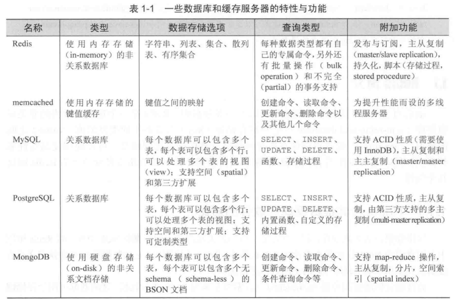

Redis是一个开源（BSD许可），内存数据结构存储，用作数据库，缓存和消息代理。它支持数据结构，如strings, hashes, lists, sets, zset(有序集合) ,bitmaps(位图),hyperloglogs(超级日志) ,具有半径查询的地理空间索引。Redis具有内置复制，Lua脚本，LRU驱逐，事务和不同级别的磁盘持久性，并通过Redis Sentinel提供高可用性并使用Redis Cluster自动分区。

## `memcached`与`redis`的对比：

### 相同点

* 都是nosql数据库
* 两者都是内存型的
* 存储方式：都是键值进行存储的

### 不同点

* redis除了支持字符串键之外，还支持hash（哈希），list（列表），set（集合）及zset(sorted set：有序集合)

* redis支持持久化

  

