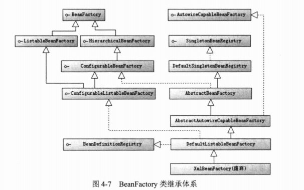

# Resource核心接口


## WritableResource

> org.springframework.core.io.WritableResource

可写资源接口。

## ByteArrayResource

> org.springframework.core.io.ByteArrayResource

二进制数组表示的资源

## FileSystemResource

> org.springframework.core.io.FileSystemResource

文件系统资源

## InputStreamResource

> org.springframework.core.io.InputStreamResource

以输入流返回表示的资源

## 资源地址表达式

| 前缀       | 例子                             | 说明                                 |
| ---------- | -------------------------------- | ------------------------------------ |
| classpath: | `classpath:com/myapp/config.xml` | 从classpath中加载。                  |
| file:      | `file:/data/config.xml`          | 作为 `URL` 从文件系统中加载。        |
| http:      | `http://myserver/logo.png`       | 作为 `URL` 加载。                    |
| (none)     | `/data/config.xml`               | 根据 `ApplicationContext` 进行判断。 |

### Ant风格的资源地址支持3中匹配符

* ? :匹配文件名中的一个字符
* *:匹配文件名中任意字符
* ** :匹配多层路径

# BeanFactory接口



## BeanFactory

```java
public interface BeanFactory {
	/**
	 * 用来表示是bean是工厂bean
	 */
	String FACTORY_BEAN_PREFIX = "&";
	/**
	 * 获取bean
	 */
	Object getBean(String name) throws BeansException;
	/**
	 * 获取bean
	 */
	<T> T getBean(String name, @Nullable Class<T> requiredType) throws BeansException;
	/**
	 * 获取bean
	 */
	Object getBean(String name, Object... args) throws BeansException;
	/**
	 * 获取bean
	 */
	<T> T getBean(Class<T> requiredType) throws BeansException;
	/**
	 * 获取bean
	 */
	<T> T getBean(Class<T> requiredType, Object... args) throws BeansException;
	/**
	 * 是否包含指定的bean
	 */
	boolean containsBean(String name);
	/**
	 * 是否为单例bean
	 */
	boolean isSingleton(String name) throws NoSuchBeanDefinitionException;
	/**
	 * 是否为原型bean
	 */
	boolean isPrototype(String name) throws NoSuchBeanDefinitionException;
	/**
	 * 类型是否匹配
	 */
	boolean isTypeMatch(String name, ResolvableType typeToMatch) throws NoSuchBeanDefinitionException;
	/**
	 * 类型是否匹配
	 */
	boolean isTypeMatch(String name, @Nullable Class<?> typeToMatch) throws NoSuchBeanDefinitionException;
	/**
	 * 获取bean的类型
	 */
	@Nullable
	Class<?> getType(String name) throws NoSuchBeanDefinitionException;
	/**
	 * 获取别名
	 */
	String[] getAliases(String name);

}

```

