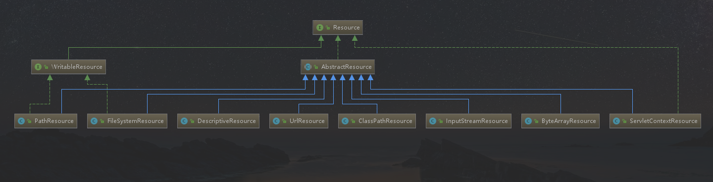
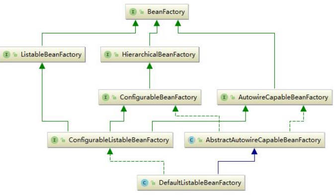
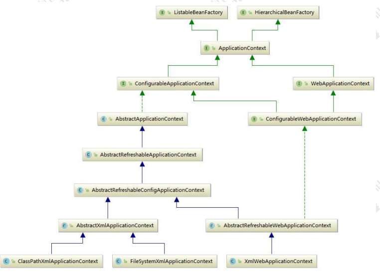
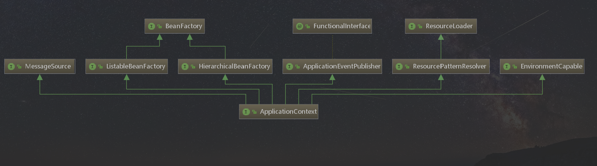
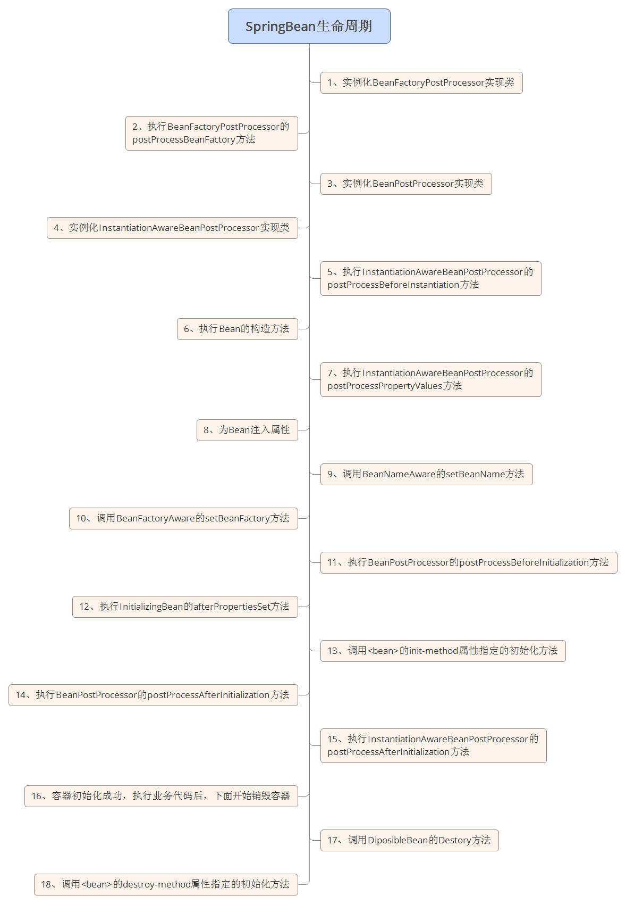
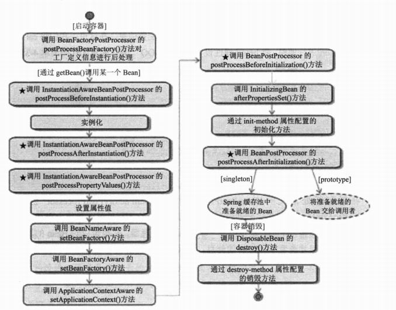

# Resource核心接口




## WritableResource

> org.springframework.core.io.WritableResource

可写资源接口。

## ByteArrayResource

> org.springframework.core.io.ByteArrayResource

二进制数组表示的资源

## FileSystemResource

> org.springframework.core.io.FileSystemResource

文件系统资源

## InputStreamResource

> org.springframework.core.io.InputStreamResource

以输入流返回表示的资源

## 资源地址表达式

| 前缀       | 例子                             | 说明                                 |
| ---------- | -------------------------------- | ------------------------------------ |
| classpath: | `classpath:com/myapp/config.xml` | 从classpath中加载。                  |
| file:      | `file:/data/config.xml`          | 作为 `URL` 从文件系统中加载。        |
| http:      | `http://myserver/logo.png`       | 作为 `URL` 加载。                    |
| (none)     | `/data/config.xml`               | 根据 `ApplicationContext` 进行判断。 |

### Ant风格的资源地址支持3中匹配符

* ? :匹配文件名中的一个字符
* *:匹配文件名中任意字符
* ** :匹配多层路径

# BeanFactory接口



## BeanFactory

`BeanFactory `作为最顶层的一个接口类，它定义了 IOC 容器的基本功能规范，BeanFactory 有三
个子类：`ListableBeanFactory`、`HierarchicalBeanFactory `和 `AutowireCapableBeanFactory`

```java
public interface BeanFactory {
	/**
	 * 用来表示是bean是工厂bean
	 */
	String FACTORY_BEAN_PREFIX = "&";
	/**
	 * 获取bean
	 */
	Object getBean(String name) throws BeansException;
	/**
	 * 获取bean
	 */
	<T> T getBean(String name, @Nullable Class<T> requiredType) throws BeansException;
	/**
	 * 获取bean
	 */
	Object getBean(String name, Object... args) throws BeansException;
	/**
	 * 获取bean
	 */
	<T> T getBean(Class<T> requiredType) throws BeansException;
	/**
	 * 获取bean
	 */
	<T> T getBean(Class<T> requiredType, Object... args) throws BeansException;
	/**
	 * 是否包含指定的bean
	 */
	boolean containsBean(String name);
	/**
	 * 是否为单例bean
	 */
	boolean isSingleton(String name) throws NoSuchBeanDefinitionException;
	/**
	 * 是否为原型bean
	 */
	boolean isPrototype(String name) throws NoSuchBeanDefinitionException;
	/**
	 * 类型是否匹配
	 */
	boolean isTypeMatch(String name, ResolvableType typeToMatch) throws NoSuchBeanDefinitionException;
	/**
	 * 类型是否匹配
	 */
	boolean isTypeMatch(String name, @Nullable Class<?> typeToMatch) throws NoSuchBeanDefinitionException;
	/**
	 * 获取bean的类型
	 */
	@Nullable
	Class<?> getType(String name) throws NoSuchBeanDefinitionException;
	/**
	 * 获取别名
	 */
	String[] getAliases(String name);

}

```

### ListableBeanFactory

提供了批量获取Bean的方法 

```java
public interface ListableBeanFactory extends BeanFactory {

	/**
	 * 判断指定名称的BeanDefinition是否存在
	 */
	boolean containsBeanDefinition(String beanName);

	/**
	 * 获取BeanDefinition的数量
	 */
	int getBeanDefinitionCount();

	/**
	 * 获取BeanDefinition的名称
	 */
	String[] getBeanDefinitionNames();
    /**
	 * 返回匹配给定类型的bean的名称
	 */
    String[] getBeanNamesForType(ResolvableType type);
    String[] getBeanNamesForType(@Nullable Class<?> type);
	String[] getBeanNamesForType(@Nullable Class<?> type, boolean includeNonSingletons, boolean allowEagerInit);

	/**
	 * 返回的bean实例匹配给定的对象类型
	 */
	<T> Map<String, T> getBeansOfType(@Nullable Class<T> type) throws BeansException;
	<T> Map<String, T> getBeansOfType(@Nullable Class<T> type, boolean includeNonSingletons, boolean allowEagerInit)
			throws BeansException;

	/**
	 * 根据给定的annotation获取bean的名称
	 */
	String[] getBeanNamesForAnnotation(Class<? extends Annotation> annotationType);

	/**
	 *根据给定的annotation获取bean的实例
	 */
	Map<String, Object> getBeansWithAnnotation(Class<? extends Annotation> annotationType) throws BeansException;

	/**
	 * 根据bean名称和annotation类型获取指定的bean
	 */
	@Nullable
	<A extends Annotation> A findAnnotationOnBean(String beanName, Class<A> annotationType)
			throws NoSuchBeanDefinitionException;

}
```


### HierarchicalBeanFactory

级联IOC容器。提供父容器的访问功能 

```java
public interface HierarchicalBeanFactory extends BeanFactory {

	/**
	 * 获取父级bean工厂
	 */
	@Nullable
	BeanFactory getParentBeanFactory();

	/**
	 *返回本地bean工厂是否包含给定名称的bean，忽略在父级上下文中定义的bean。
	 */
	boolean containsLocalBean(String name);

}
```


### AutowireCapableBeanFactory

提供了自动装配功能。

```java
public interface AutowireCapableBeanFactory extends BeanFactory {

	/**
	 * 没有定义自动装配
	 */
	int AUTOWIRE_NO = 0;

	/**
	 *通过属性名称自动装配
	 */
	int AUTOWIRE_BY_NAME = 1;

	/**
	 * 通过类型自动装配
	 */
	int AUTOWIRE_BY_TYPE = 2;

	/**
	 * 通过构造器自动装配
	 */
	int AUTOWIRE_CONSTRUCTOR = 3;

	/**
	 * 常量，表示通过内省bean类确定适当的自动装配策略
	 */
	@Deprecated
	int AUTOWIRE_AUTODETECT = 4;


	//-------------------------------------------------------------------------
	// 用于创建和填充外部bean实例的典型方法
	//-------------------------------------------------------------------------

	/**
	 *根据指定的类型创建bean
	 */
	<T> T createBean(Class<T> beanClass) throws BeansException;

	/**
	 *
	 */
	void autowireBean(Object existingBean) throws BeansException;

	/**
	 * 
	 */
	Object configureBean(Object existingBean, String beanName) throws BeansException;


	//-------------------------------------------------------------------------
	// 用于细粒度控制bean生命周期的专用方法
	//-------------------------------------------------------------------------

	/**
	 * 
	 */
	Object createBean(Class<?> beanClass, int autowireMode, boolean dependencyCheck) throws BeansException;

	/**
	 *
	 */
	Object autowire(Class<?> beanClass, int autowireMode, boolean dependencyCheck) throws BeansException;

	/**
	 *
	 */
	void autowireBeanProperties(Object existingBean, int autowireMode, boolean dependencyCheck)
			throws BeansException;

	/**
	 * 
	 */
	void applyBeanPropertyValues(Object existingBean, String beanName) throws BeansException;

	/**
	 *
	 */
	Object initializeBean(Object existingBean, String beanName) throws BeansException;

	/**
	 * 
	 */
	Object applyBeanPostProcessorsBeforeInitialization(Object existingBean, String beanName)
			throws BeansException;

	/**
	 *
	 */
	Object applyBeanPostProcessorsAfterInitialization(Object existingBean, String beanName)
			throws BeansException;

	/**
	 * 
	 */
	void destroyBean(Object existingBean);


	//-------------------------------------------------------------------------
	// 委托解决注入点的方法
	//-------------------------------------------------------------------------

	/**
	 * 
	 */
	<T> NamedBeanHolder<T> resolveNamedBean(Class<T> requiredType) throws BeansException;

	/**
	 * 
	 */
	@Nullable
	Object resolveDependency(DependencyDescriptor descriptor, @Nullable String requestingBeanName) throws BeansException;

	/**
	 * 
	 */
	@Nullable
	Object resolveDependency(DependencyDescriptor descriptor, @Nullable String requestingBeanName,
			@Nullable Set<String> autowiredBeanNames, @Nullable TypeConverter typeConverter) throws BeansException;

}

```

### ConfigurableBeanFactory

增加了IOC容易的可定制性。它定义了设置类装载器、属性表机器、容器初始化后置处理器等方法。

## BeanFactory初始化



IOC 容器的初始化包括 BeanDefinition 的 Resource 定位、载入和注册这三个基本的过程

### ApplicationContext



```java
public class AnnotationServiceTest {
    public static void main(String[] args) {
        AnnotationConfigApplicationContext context = new AnnotationConfigApplicationContext();
       context.register(AnnotationConfig.class);
       context.refresh();
       AnnotationService service = context.getBean(AnnotationService.class);
        System.out.println(service.findStr());
    }
}
public class XmlBeanTest {
    public static void main(String[] args) {
        ApplicationContext context =
                new ClassPathXmlApplicationContext(
                        "classpath:beans.xml","classpath:beans_login.xml");
        UserService service = (UserService) context.getBean("userService");
        UserService login = (UserService) context.getBean("loginService");
        System.out.println(service.findName("123"));
        System.out.println(login.findName("admin"));
    }
}

```

## Bean的生命周期



### 接口方法的分类

Bean的完整生命周期经历了各种方法调用，这些方法可以划分为以下几类：

1、Bean自身的方法：这个包括了Bean本身调用的方法和通过配置文件中<bean>的init-method和destroy-method指定的方法

2、Bean级生命周期接口方法：这个包括了BeanNameAware、BeanFactoryAware、InitializingBean和DiposableBean这些接口的方法

3、容器级生命周期接口方法：这个包括了InstantiationAwareBeanPostProcessor 和 BeanPostProcessor 这两个接口实现，一般称它们的实现类为“后处理器”。

4、工厂后处理器接口方法：这个包括了AspectJWeavingEnabler, ConfigurationClassPostProcessor, CustomAutowireConfigurer等等非常有用的工厂后处理器接口的方法。工厂后处理器也是容器级的。在应用上下文装配配置文件之后立即调用。

| 分类类型               | 所包含方法                                                   |
| ---------------------- | ------------------------------------------------------------ |
| Bean自身的方法         | 配置文件中的init-method和destroy-method配置的方法、Bean对象自己调用的方法 |
| Bean级生命周期接口方法 | BeanNameAware、BeanFactoryAware、InitializingBean、DiposableBean等接口中的方法 |
| 容器级生命周期接口方法 | InstantiationAwareBeanPostProcessor、BeanPostProcessor等后置处理器实现类中重写的方法 |

### ApplicationContext中Bean的生命周期



# IOC容器装配Bean

## 依赖注入

### 属性注入

通过setXxx()注入

可以解决构造注入带来的循环依赖的问题

### 构造器注入

通过构造器将初始化所需的属性/bean注入。

### 工厂方法注入

非静态工厂方法和静态工厂方法

```java
public class CarFactory {
   public Car createHongQiCar(){
	   Car car = new Car();
	   car.setBrand("红旗CA72");
	   return car;
   }
   
   public static Car createCar(){
	   Car car = new Car();
	   return car;
   }
}
```

