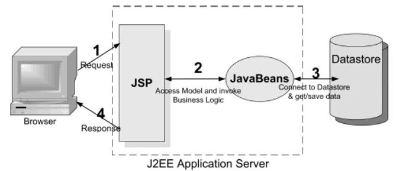
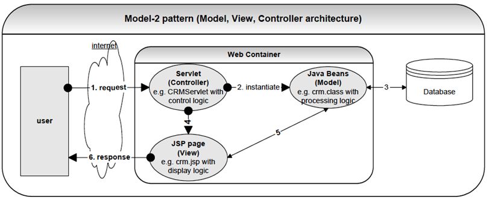
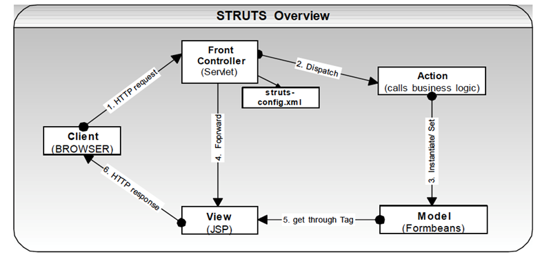
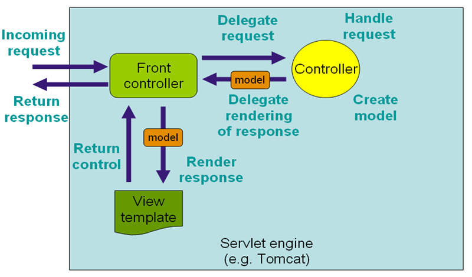

## 动态 Web 内容

### 基本解释

  与静态 Web 内容不同，请求内容通过服务器计算而来

### 特点

* 计算类型：混合类型（I/O、CPU、内存等）

* 交互方式：丰富（用户输入、客户端特征等）
* 资源内容：多样性(指每个人请求返回内容是不一样的。每次请求内容都是变化的。)`内容的多变性`
* 资源路径：逻辑路径（虚拟）
* 请求方法：GET、HEAD、PUT、POST等

### 使用场景

* 页面渲染
* 表单交互(Form)
* AJAX
* XML
* JSON/JSOMP
* Web Services(SOAP、WSDL)
* WebSocket

### 流行 Java Web 服务器

* Servlet 容器（Tomcat、Jetty）
* 非 Servlet容器（Undertow）

### 请求

* 资源定位(URI)
* 请求协议(protocol)
  * get
  * post
  * delete
  * head
* 请求方法（Method） 
* 请求参数（Parameter）
* 请求主体（Body）
* 请求头（Header）
* Cookie

### 响应

* 响应头（Header）
* 响应主体（Body）

### 技术/架构演变

* CGI(Common Gateway Interface )

* Servlet

* JSP（Java Server Page)

* Model 1（JSP + Servlet + JavaBeans）

  

* Model 2（MVC）

* struts Web Mvc

  

* Spring web mvc

### Model 2 与 MVC的细微差异

* Model 2 为面向 Web 服务的架构，MVC 则是面向所有应用场景（比如：PC应用、无线应用）
* 相对于MVC，Model 2 中 Controller 细化为 Front Controller（FC）和Application Controller（AC)，前者（FC)负责路由后者（AC)，后者（AC）负责跳转视图（View）。

## 模板引擎 

### jsp

### Velocity 

### Thymeleaf 

