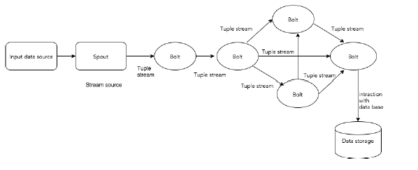
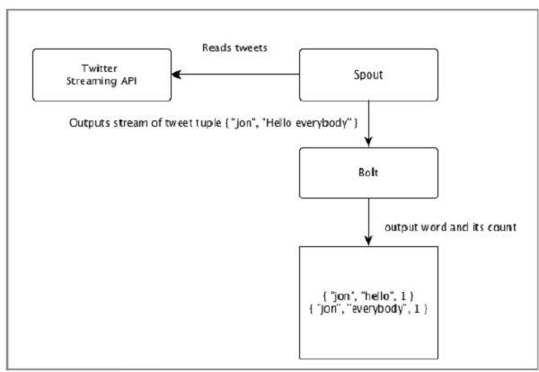
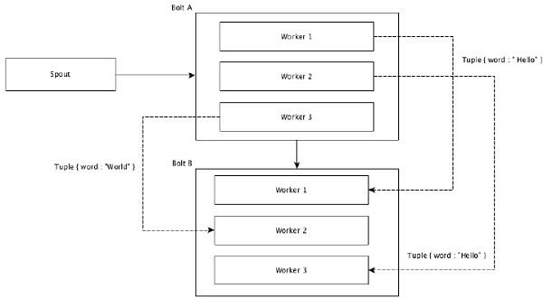
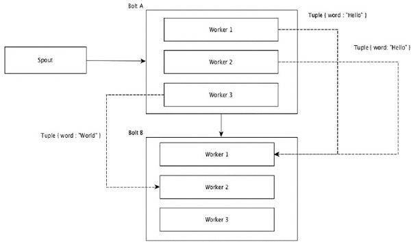
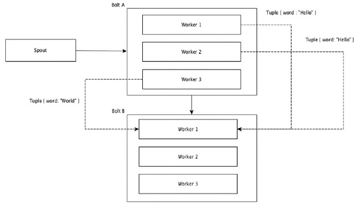
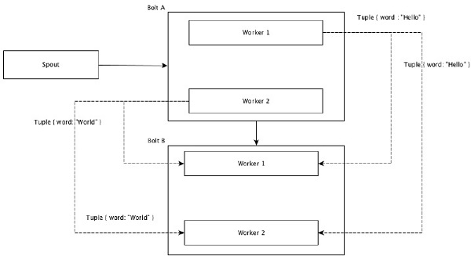
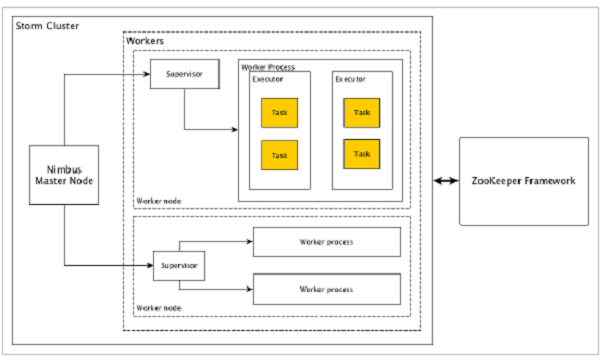
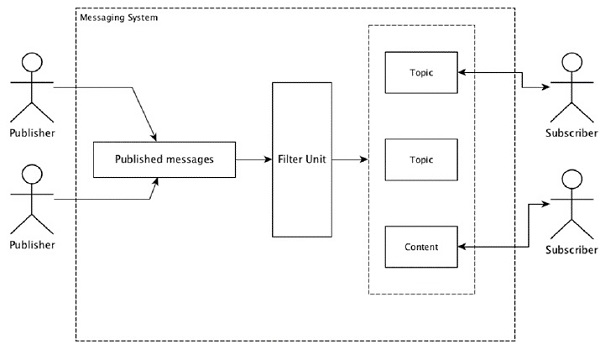

# APACHE STORM - QUICK GUIDE

https://www.tutorialspoint.com/apache_storm/apache_storm_quick_guide.htm


Advertisements

# APACHE STORM - INTRODUCTION

## What is Apache Storm?

Apache Storm is a distributed real-time big data-processing system. Storm is designed to process vast amount of data in a fault-tolerant and horizontal scalable method. It is a streaming data framework that has the capability of highest ingestion rates. Though Storm is stateless, it manages distributed environment and cluster state via Apache ZooKeeper. It is simple and you can execute all kinds of manipulations on real-time data in parallel.

Apache Storm is continuing to be a leader in real-time data analytics. Storm is easy to setup, operate and it guarantees that every message will be processed through the topology at least once.

## Apache Storm vs Hadoop

Basically Hadoop and Storm frameworks are used for analyzing big data. Both of them complement each other and differ in some aspects. Apache Storm does all the operations except persistency, while Hadoop is good at everything but lags in real-time computation. The following table compares the attributes of Storm and Hadoop.

| Storm                                                        | Hadoop                                                       |
| ------------------------------------------------------------ | ------------------------------------------------------------ |
| Real-time stream processing                                  | Batch processing                                             |
| Stateless                                                    | Stateful                                                     |
| Master/Slave architecture with ZooKeeper based coordination. The master node is called as **nimbus** and slaves are **supervisors**. | Master-slave architecture with/without ZooKeeper based coordination. Master node is **job tracker** and slave node is **task tracker**. |
| A Storm streaming process can access tens of thousands messages per second on cluster. | Hadoop Distributed File System HDFSHDFS uses MapReduce framework to process vast amount of data that takes minutes or hours. |
| Storm topology runs until shutdown by the user or an unexpected unrecoverable failure. | MapReduce jobs are executed in a sequential order and completed eventually. |
| **Both are distributed and fault-tolerant**                  |                                                              |
| If nimbus / supervisor dies, restarting makes it continue from where it stopped, hence nothing gets affected. | If the JobTracker dies, all the running jobs are lost.       |

## Use-Cases of Apache Storm

Apache Storm is very famous for real-time big data stream processing. For this reason, most of the companies are using Storm as an integral part of their system. Some notable examples are as follows −

**Twitter** − Twitter is using Apache Storm for its range of “Publisher Analytics products”. “Publisher Analytics Products” process each and every tweets and clicks in the Twitter Platform. Apache Storm is deeply integrated with Twitter infrastructure.

**NaviSite** − NaviSite is using Storm for Event log monitoring/auditing system. Every logs generated in the system will go through the Storm. Storm will check the message against the configured set of regular expression and if there is a match, then that particular message will be saved to the database.

**Wego** − Wego is a travel metasearch engine located in Singapore. Travel related data comes from many sources all over the world with different timing. Storm helps Wego to search real-time data, resolves concurrency issues and find the best match for the end-user.

## Apache Storm Benefits

Here is a list of the benefits that Apache Storm offers −

- Storm is open source, robust, and user friendly. It could be utilized in small companies as well as large corporations.
- Storm is fault tolerant, flexible, reliable, and supports any programming language.
- Allows real-time stream processing.
- Storm is unbelievably fast because it has enormous power of processing the data.
- Storm can keep up the performance even under increasing load by adding resources linearly. It is highly scalable.
- Storm performs data refresh and end-to-end delivery response in seconds or minutes depends upon the problem. It has very low latency.
- Storm has operational intelligence.
- Storm provides guaranteed data processing even if any of the connected nodes in the cluster die or messages are lost.

# APACHE STORM - CORE CONCEPTS

Apache Storm reads raw stream of real-time data from one end and passes it through a sequence of small processing units and output the processed / useful information at the other end.

The following diagram depicts the core concept of Apache Storm.





Let us now have a closer look at the components of Apache Storm −

| Components | Description                                                  |
| ---------- | ------------------------------------------------------------ |
| Tuple      | Tuple is the main data structure in Storm. It is a list of ordered elements. By default, a Tuple supports all data types. Generally, it is modelled as a set of comma separated values and passed to a Storm cluster. |
| Stream     | Stream is an unordered sequence of tuples.                   |
| Spouts     | Source of stream. Generally, Storm accepts input data from raw data sources like Twitter Streaming API, Apache Kafka queue, Kestrel queue, etc. Otherwise you can write spouts to read data from datasources. “ISpout" is the core interface for implementing spouts. Some of the specific interfaces are IRichSpout, BaseRichSpout, KafkaSpout, etc. |
| Bolts      | Bolts are logical processing units. Spouts pass data to bolts and bolts process and produce a new output stream. Bolts can perform the operations of filtering, aggregation, joining, interacting with data sources and databases. Bolt receives data and emits to one or more bolts. “IBolt” is the core interface for implementing bolts. Some of the common interfaces are IRichBolt, IBasicBolt, etc. |

Let’s take a real-time example of “Twitter Analysis” and see how it can be modelled in Apache Storm. The following diagram depicts the structure.




The input for the “Twitter Analysis” comes from Twitter Streaming API. Spout will read the tweets of the users using Twitter Streaming API and output as a stream of tuples. A single tuple from the spout will have a twitter username and a single tweet as comma separated values. Then, this steam of tuples will be forwarded to the Bolt and the Bolt will split the tweet into individual word, calculate the word count, and persist the information to a configured datasource. Now, we can easily get the result by querying the datasource.

## Topology

Spouts and bolts are connected together and they form a topology. Real-time application logic is specified inside Storm topology. In simple words, a topology is a directed graph where vertices are computation and edges are stream of data.

A simple topology starts with spouts. Spout emits the data to one or more bolts. Bolt represents a node in the topology having the smallest processing logic and the output of a bolt can be emitted into another bolt as input.

Storm keeps the topology always running, until you kill the topology. Apache Storm’s main job is to run the topology and will run any number of topology at a given time.

## Tasks

Now you have a basic idea on spouts and bolts. They are the smallest logical unit of the topology and a topology is built using a single spout and an array of bolts. They should be executed properly in a particular order for the topology to run successfully. The execution of each and every spout and bolt by Storm is called as “Tasks”. In simple words, a task is either the execution of a spout or a bolt. At a given time, each spout and bolt can have multiple instances running in multiple separate threads.

## Workers

A topology runs in a distributed manner, on multiple worker nodes. Storm spreads the tasks evenly on all the worker nodes. The worker node’s role is to listen for jobs and start or stop the processes whenever a new job arrives.

## Stream Grouping

Stream of data flows from spouts to bolts or from one bolt to another bolt. Stream grouping controls how the tuples are routed in the topology and helps us to understand the tuples flow in the topology. There are four in-built groupings as explained below.

### Shuffle Grouping

In shuffle grouping, an equal number of tuples is distributed randomly across all of the workers executing the bolts. The following diagram depicts the structure.




### Field Grouping

The fields with same values in tuples are grouped together and the remaining tuples kept outside. Then, the tuples with the same field values are sent forward to the same worker executing the bolts. For example, if the stream is grouped by the field “word”, then the tuples with the same string, “Hello” will move to the same worker. The following diagram shows how Field Grouping works.




### Global Grouping

All the streams can be grouped and forward to one bolt. This grouping sends tuples generated by all instances of the source to a single target instance specifically,picktheworkerwithlowestIDspecifically,picktheworkerwithlowestID.




### All Grouping

All Grouping sends a single copy of each tuple to all instances of the receiving bolt. This kind of grouping is used to send signals to bolts. All grouping is useful for join operations.




# APACHE STORM - CLUSTER ARCHITECTURE

One of the main highlight of the Apache Storm is that it is a fault-tolerant, fast with no “Single Point of Failure” SPOFSPOF distributed application. We can install Apache Storm in as many systems as needed to increase the capacity of the application.

Let’s have a look at how the Apache Storm cluster is designed and its internal architecture. The following diagram depicts the cluster design.




Apache Storm has two type of nodes, **Nimbus** masternodemasternode and **Supervisor** workernodeworkernode. Nimbus is the central component of Apache Storm. The main job of Nimbus is to run the Storm topology. Nimbus analyzes the topology and gathers the task to be executed. Then, it will distributes the task to an available supervisor.

A supervisor will have one or more worker process. Supervisor will delegate the tasks to worker processes. Worker process will spawn as many executors as needed and run the task. Apache Storm uses an internal distributed messaging system for the communication between nimbus and supervisors.

| Components          | Description                                                  |
| ------------------- | ------------------------------------------------------------ |
| Nimbus              | Nimbus is a master node of Storm cluster. All other nodes in the cluster are called as **worker nodes**. Master node is responsible for distributing data among all the worker nodes, assign tasks to worker nodes and monitoring failures. |
| Supervisor          | The nodes that follow instructions given by the nimbus are called as Supervisors. A **supervisor** has multiple worker processes and it governs worker processes to complete the tasks assigned by the nimbus. |
| Worker process      | A worker process will execute tasks related to a specific topology. A worker process will not run a task by itself, instead it creates **executors** and asks them to perform a particular task. A worker process will have multiple executors. |
| Executor            | An executor is nothing but a single thread spawn by a worker process. An executor runs one or more tasks but only for a specific spout or bolt. |
| Task                | A task performs actual data processing. So, it is either a spout or a bolt. |
| ZooKeeper framework | Apache ZooKeeper is a service used by a cluster groupofnodesgroupofnodes to coordinate between themselves and maintaining shared data with robust synchronization techniques. Nimbus is stateless, so it depends on ZooKeeper to monitor the working node status.ZooKeeper helps the supervisor to interact with the nimbus. It is responsible to maintain the state of nimbus and supervisor. |

Storm is stateless in nature. Even though stateless nature has its own disadvantages, it actually helps Storm to process real-time data in the best possible and quickest way.

Storm is *not entirely* stateless though. It stores its state in Apache ZooKeeper. Since the state is available in Apache ZooKeeper, a failed nimbus can be restarted and made to work from where it left. Usually, service monitoring tools like **monit** will monitor Nimbus and restart it if there is any failure.

Apache Storm also have an advanced topology called **Trident Topology** with state maintenance and it also provides a high-level API like Pig. We will discuss all these features in the coming chapters.

# APACHE STORM - WORKFLOW

A working Storm cluster should have one nimbus and one or more supervisors. Another important node is Apache ZooKeeper, which will be used for the coordination between the nimbus and the supervisors.

Let us now take a close look at the workflow of Apache Storm −

- Initially, the nimbus will wait for the “Storm Topology” to be submitted to it.
- Once a topology is submitted, it will process the topology and gather all the tasks that are to be carried out and the order in which the task is to be executed.
- Then, the nimbus will evenly distribute the tasks to all the available supervisors.
- At a particular time interval, all supervisors will send heartbeats to the nimbus to inform that they are still alive.
- When a supervisor dies and doesn’t send a heartbeat to the nimbus, then the nimbus assigns the tasks to another supervisor.
- When the nimbus itself dies, supervisors will work on the already assigned task without any issue.
- Once all the tasks are completed, the supervisor will wait for a new task to come in.
- In the meantime, the dead nimbus will be restarted automatically by service monitoring tools.
- The restarted nimbus will continue from where it stopped. Similarly, the dead supervisor can also be restarted automatically. Since both the nimbus and the supervisor can be restarted automatically and both will continue as before, Storm is guaranteed to process all the task at least once.
- Once all the topologies are processed, the nimbus waits for a new topology to arrive and similarly the supervisor waits for new tasks.

By default, there are two modes in a Storm cluster −

- **Local mode** − This mode is used for development, testing, and debugging because it is the easiest way to see all the topology components working together. In this mode, we can adjust parameters that enable us to see how our topology runs in different Storm configuration environments. In Local mode, storm topologies run on the local machine in a single JVM.
- **Production mode** − In this mode, we submit our topology to the working storm cluster, which is composed of many processes, usually running on different machines. As discussed in the workflow of storm, a working cluster will run indefinitely until it is shut down.

# STORM - DISTRIBUTED MESSAGING SYSTEM

Apache Storm processes real-time data and the input normally comes from a message queuing system. An external distributed messaging system will provide the input necessary for the realtime computation. Spout will read the data from the messaging system and convert it into tuples and input into the Apache Storm. The interesting fact is that Apache Storm uses its own distributed messaging system internally for the communication between its nimbus and supervisor.

## What is Distributed Messaging System?

Distributed messaging is based on the concept of reliable message queuing. Messages are queued asynchronously between client applications and messaging systems. A distributed messaging system provides the benefits of reliability, scalability, and persistence.

Most of the messaging patterns follow the **publish-subscribe** model (simply **Pub-Sub**) where the senders of the messages are called **publishers** and those who want to receive the messages are called **subscribers**.

Once the message has been published by the sender, the subscribers can receive the selected message with the help of a filtering option. Usually we have two types of filtering, one is **topic-based filtering** and another one is **content-based filtering**.

Note that the pub-sub model can communicate only via messages. It is a very loosely coupled architecture; even the senders don’t know who their subscribers are. Many of the message patterns enable with message broker to exchange publish messages for timely access by many subscribers. A real-life example is Dish TV, which publishes different channels like sports, movies, music, etc., and anyone can subscribe to their own set of channels and get them whenever their subscribed channels are available.




The following table describes some of the popular high throughput messaging systems −

| Distributed messaging system            | Description                                                  |
| --------------------------------------- | ------------------------------------------------------------ |
| Apache Kafka                            | Kafka was developed at LinkedIn corporation and later it became a sub-project of Apache. Apache Kafka is based on brokerenabled, persistent, distributed publish-subscribe model. Kafka is fast, scalable, and highly efficient. |
| RabbitMQ                                | RabbitMQ is an open source distributed robust messaging application. It is easy to use and runs on all platforms. |
| JMSJavaMessageServiceJavaMessageService | JMS is an open source API that supports creating, reading, and sending messages from one application to another. It provides guaranteed message delivery and follows publish-subscribe model. |
| ActiveMQ                                | ActiveMQ messaging system is an open source API of JMS.      |
| ZeroMQ                                  | ZeroMQ is broker-less peer-peer message processing. It provides push-pull, router-dealer message patterns. |
| Kestrel                                 | Kestrel is a fast, reliable, and simple distributed message queue. |

## Thrift Protocol

Thrift was built at Facebook for cross-language services development and remote procedure call RPCRPC. Later, it became an open source Apache project. Apache Thrift is an **Interface Definition Language** and allows to define new data types and services implementation on top of the defined data types in an easy manner.

Apache Thrift is also a communication framework that supports embedded systems, mobile applications, web applications, and many other programming languages. Some of the key features associated with Apache Thrift are its modularity, flexibility, and high performance. In addition, it can perform streaming, messaging, and RPC in distributed applications.

Storm extensively uses Thrift Protocol for its internal communication and data definition. Storm topology is simply **Thrift Structs**. Storm Nimbus that runs the topology in Apache Storm is a **Thrift service**.

# APACHE STORM - INSTALLATION

Let us now see how to install Apache Storm framework on your machine. There are three majo steps here −

- Install Java on your system, if you don’t have it already.
- Install ZooKeeper framework.
- Install Apache Storm framework.

## Step 1 − Verifying Java Installation

Use the following command to check whether you have Java already installed on your system.

```
$ java -version
```

If Java is already there, then you would see its version number. Else, download the latest version of JDK.

### Step 1.1 − Download JDK

Download the latest version of JDK by using the following link − [www.oracle.com](http://www.oracle.com/technetwork/java/javase/downloads/index.html)

The latest version is JDK 8u 60 and the file is **“jdk-8u60-linux-x64.tar.gz”**. Download the file on your machine.

### Step 1.2 − Extract files

Generally files are being downloaded onto the **downloads** folder. Extract the tar setup using the following commands.

```
$ cd /go/to/download/path
$ tar -zxf jdk-8u60-linux-x64.gz
```

### Step 1.3 − Move to opt directory

To make Java available to all users, move the extracted java content to “/usr/local/java” folder.

```
$ su
password: (type password of root user)
$ mkdir /opt/jdk
$ mv jdk-1.8.0_60 /opt/jdk/
```

### Step 1.4 − Set path

To set path and JAVA_HOME variables, add the following commands to ~/.bashrc file.

```
export JAVA_HOME =/usr/jdk/jdk-1.8.0_60
export PATH=$PATH:$JAVA_HOME/bin
```

Now apply all the changes in to the current running system.

```
$ source ~/.bashrc
```

### Step 1.5 − Java Alternatives

Use the following command to change Java alternatives.

```
update-alternatives --install /usr/bin/java java /opt/jdk/jdk1.8.0_60/bin/java 100
```

### Step 1.6

Now verify the Java installation using the verification command **java−versionjava−version**explained in Step 1.

## Step 2 − ZooKeeper Framework Installation

### Step 2.1 − Download ZooKeeper

To install ZooKeeper framework on your machine, visit the following link and download the latest version of ZooKeeper <http://zookeeper.apache.org/releases.html>

As of now, the latest version of ZooKeeper is 3.4.6 ZooKeeper−3.4.6.tar.gzZooKeeper−3.4.6.tar.gz.

### Step 2.2 − Extract tar file

Extract the tar file using the following commands −

```
$ cd opt/
$ tar -zxf zookeeper-3.4.6.tar.gz
$ cd zookeeper-3.4.6
$ mkdir data
```

### Step 2.3 − Create configuration file

Open configuration file named “conf/zoo.cfg” using the command "vi conf/zoo.cfg" and setting all the following parameters as starting point.

```
$ vi conf/zoo.cfg
tickTime=2000
dataDir=/path/to/zookeeper/data
clientPort=2181
initLimit=5
syncLimit=2
```

Once the configuration file has been saved successfully, you can start the ZooKeeper server.

### Step 2.4 − Start ZooKeeper Server

Use the following command to start the ZooKeeper server.

```
$ bin/zkServer.sh start
```

After executing this command, you will get a response as follows −

```
$ JMX enabled by default
$ Using config: /Users/../zookeeper-3.4.6/bin/../conf/zoo.cfg
$ Starting zookeeper ... STARTED
```

### Step 2.5 − Start CLI

Use the following command to start the CLI.

```
$ bin/zkCli.sh
```

After executing the above command, you will be connected to the ZooKeeper server and get the following response.

```
Connecting to localhost:2181
................
................
................
Welcome to ZooKeeper!
................
................
WATCHER::
WatchedEvent state:SyncConnected type: None path:null
[zk: localhost:2181(CONNECTED) 0]
```

### Step 2.6 − Stop ZooKeeper Server

After connecting the server and performing all the operations, you can stop the ZooKeeper server by using the following command.

```
bin/zkServer.sh stop
```

You have successfully installed Java and ZooKeeper on your machine. Let us now see the steps to install Apache Storm framework.

## Step 3 − Apache Storm Framework Installation

### Step 3.1 Download Storm

To install Storm framework on your machine, visit the following link and download the latest version of Storm <http://storm.apache.org/downloads.html>

As of now, the latest version of Storm is “apache-storm-0.9.5.tar.gz”.

### Step 3.2 − Extract tar file

Extract the tar file using the following commands −

```
$ cd opt/
$ tar -zxf apache-storm-0.9.5.tar.gz
$ cd apache-storm-0.9.5
$ mkdir data
```

### Step 3.3 − Open configuration file

The current release of Storm contains a file at “conf/storm.yaml” that configures Storm daemons. Add the following information to that file.

```
$ vi conf/storm.yaml
storm.zookeeper.servers:
 - "localhost"
storm.local.dir: “/path/to/storm/data(any path)”
nimbus.host: "localhost"
supervisor.slots.ports:
 - 6700
 - 6701
 - 6702
 - 6703
```

After applying all the changes, save and return to terminal.

### Step 3.4 − Start the Nimbus

```
$ bin/storm nimbus
```

### Step 3.5 − Start the Supervisor

```
$ bin/storm supervisor
```

### Step 3.6 Start the UI

```
$ bin/storm ui
```

After starting Storm user interface application, type the URL **http://localhost:8080**in your favorite browser and you could see Storm cluster information and its running topology. The page should look similar to the following screenshot.


# APACHE STORM - WORKING EXAMPLE

We have gone through the core technical details of the Apache Storm and now it is time to code some simple scenarios.

## Scenario – Mobile Call Log Analyzer

Mobile call and its duration will be given as input to Apache Storm and the Storm will process and group the call between the same caller and receiver and their total number of calls.

## Spout Creation

Spout is a component which is used for data generation. Basically, a spout will implement an IRichSpout interface. “IRichSpout” interface has the following important methods −

- **open** − Provides the spout with an environment to execute. The executors will run this method to initialize the spout.
- **nextTuple** − Emits the generated data through the collector.
- **close** − This method is called when a spout is going to shutdown.
- **declareOutputFields** − Declares the output schema of the tuple.
- **ack** − Acknowledges that a specific tuple is processed
- **fail** − Specifies that a specific tuple is not processed and not to be reprocessed.

### Open

The signature of the **open** method is as follows −

```
open(Map conf, TopologyContext context, SpoutOutputCollector collector)
```

- **conf** − Provides storm configuration for this spout.
- **context** − Provides complete information about the spout place within the topology, its task id, input and output information.
- **collector** − Enables us to emit the tuple that will be processed by the bolts.

### nextTuple

The signature of the **nextTuple** method is as follows −

```
nextTuple()
```

nextTuple is called periodically from the same loop as the ack and fail methods. It must release control of the thread when there is no work to do, so that the other methods have a chance to be called. So the first line of nextTuple checks to see if processing has finished. If so, it should sleep for at least one millisecond to reduce load on the processor before returning.

### close

The signature of the **close** method is as follows −

```
close()
```

### declareOutputFields

The signature of the **declareOutputFields** method is as follows −

```
declareOutputFields(OutputFieldsDeclarer declarer)
```

**declarer** − It is used to declare output stream ids, output fields, etc.

This method is used to specify the output schema of the tuple.

### ack

The signature of the **ack** method is as follows −

```
ack(Object msgId)
```

This method acknowledges that a specific tuple has been processed.

### fail

The signature of the **nextTuple** method is as follows −

```
ack(Object msgId)
```

This method informs that a specific tuple has not been fully processed. Storm will reprocess the specific tuple.

### FakeCallLogReaderSpout

In our scenario, we need to collect the call log details. The information of the call log contains.

- caller number
- receiver number
- duration

Since, we don’t have real-time information of call logs, we will generate fake call logs. The fake information will be created using Random class. The complete program code is given below.

### Coding − FakeCallLogReaderSpout.java

```java
import java.util.*;
//import storm tuple packages
import backtype.storm.tuple.Fields;
import backtype.storm.tuple.Values;

//import Spout interface packages
import backtype.storm.topology.IRichSpout;
import backtype.storm.topology.OutputFieldsDeclarer;
import backtype.storm.spout.SpoutOutputCollector;
import backtype.storm.task.TopologyContext;

//Create a class FakeLogReaderSpout which implement IRichSpout interface 
   to access functionalities
	
public class FakeCallLogReaderSpout implements IRichSpout {
   //Create instance for SpoutOutputCollector which passes tuples to bolt.
   private SpoutOutputCollector collector;
   private boolean completed = false;
	
   //Create instance for TopologyContext which contains topology data.
   private TopologyContext context;
	
   //Create instance for Random class.
   private Random randomGenerator = new Random();
   private Integer idx = 0;

   @Override
   public void open(Map conf, TopologyContext context, SpoutOutputCollector collector) {
      this.context = context;
      this.collector = collector;
   }

   @Override
   public void nextTuple() {
      if(this.idx <= 1000) {
         List<String> mobileNumbers = new ArrayList<String>();
         mobileNumbers.add("1234123401");
         mobileNumbers.add("1234123402");
         mobileNumbers.add("1234123403");
         mobileNumbers.add("1234123404");

         Integer localIdx = 0;
         while(localIdx++ < 100 && this.idx++ < 1000) {
            String fromMobileNumber = mobileNumbers.get(randomGenerator.nextInt(4));
            String toMobileNumber = mobileNumbers.get(randomGenerator.nextInt(4));
				
            while(fromMobileNumber == toMobileNumber) {
               toMobileNumber = mobileNumbers.get(randomGenerator.nextInt(4));
            }
				
            Integer duration = randomGenerator.nextInt(60);
            this.collector.emit(new Values(fromMobileNumber, toMobileNumber, duration));
         }
      }
   }

   @Override
   public void declareOutputFields(OutputFieldsDeclarer declarer) {
      declarer.declare(new Fields("from", "to", "duration"));
   }

   //Override all the interface methods
   @Override
   public void close() {}

   public boolean isDistributed() {
      return false;
   }

   @Override
   public void activate() {}

   @Override 
   public void deactivate() {}

   @Override
   public void ack(Object msgId) {}

   @Override
   public void fail(Object msgId) {}

   @Override
   public Map<String, Object> getComponentConfiguration() {
      return null;
   }
}
```

## Bolt Creation

Bolt is a component that takes tuples as input, processes the tuple, and produces new tuples as output. Bolts will implement **IRichBolt** interface. In this program, two bolt classes **CallLogCreatorBolt** and **CallLogCounterBolt** are used to perform the operations.

IRichBolt interface has the following methods −

- **prepare** − Provides the bolt with an environment to execute. The executors will run this method to initialize the spout.
- **execute** − Process a single tuple of input.
- **cleanup** − Called when a bolt is going to shutdown.
- **declareOutputFields** − Declares the output schema of the tuple.

### Prepare

The signature of the **prepare** method is as follows −

```
prepare(Map conf, TopologyContext context, OutputCollector collector)
```

- **conf** − Provides Storm configuration for this bolt.
- **context** − Provides complete information about the bolt place within the topology, its task id, input and output information, etc.
- **collector** − Enables us to emit the processed tuple.

### execute

The signature of the **execute** method is as follows −

```
execute(Tuple tuple)
```

Here **tuple** is the input tuple to be processed.

The **execute** method processes a single tuple at a time. The tuple data can be accessed by getValue method of Tuple class. It is not necessary to process the input tuple immediately. Multiple tuple can be processed and output as a single output tuple. The processed tuple can be emitted by using the OutputCollector class.

### cleanup

The signature of the **cleanup** method is as follows −

```
cleanup()
```

### declareOutputFields

The signature of the **declareOutputFields** method is as follows −

```
declareOutputFields(OutputFieldsDeclarer declarer)
```

Here the parameter **declarer** is used to declare output stream ids, output fields, etc.

This method is used to specify the output schema of the tuple

## Call log Creator Bolt

Call log creator bolt receives the call log tuple. The call log tuple has caller number, receiver number, and call duration. This bolt simply creates a new value by combining the caller number and the receiver number. The format of the new value is "Caller number – Receiver number" and it is named as new field, "call". The complete code is given below.

### Coding − CallLogCreatorBolt.java

```java
//import util packages
import java.util.HashMap;
import java.util.Map;

import backtype.storm.tuple.Fields;
import backtype.storm.tuple.Values;
import backtype.storm.task.OutputCollector;
import backtype.storm.task.TopologyContext;

//import Storm IRichBolt package
import backtype.storm.topology.IRichBolt;
import backtype.storm.topology.OutputFieldsDeclarer;
import backtype.storm.tuple.Tuple;

//Create a class CallLogCreatorBolt which implement IRichBolt interface
public class CallLogCreatorBolt implements IRichBolt {
   //Create instance for OutputCollector which collects and emits tuples to produce output
   private OutputCollector collector;

   @Override
   public void prepare(Map conf, TopologyContext context, OutputCollector collector) {
      this.collector = collector;
   }

   @Override
   public void execute(Tuple tuple) {
      String from = tuple.getString(0);
      String to = tuple.getString(1);
      Integer duration = tuple.getInteger(2);
      collector.emit(new Values(from + " - " + to, duration));
   }

   @Override
   public void cleanup() {}

   @Override
   public void declareOutputFields(OutputFieldsDeclarer declarer) {
      declarer.declare(new Fields("call", "duration"));
   }
	
   @Override
   public Map<String, Object> getComponentConfiguration() {
      return null;
   }
}
```

## Call log Counter Bolt

Call log counter bolt receives call and its duration as a tuple. This bolt initializes a dictionary MapMap object in the prepare method. In **execute** method, it checks the tuple and creates a new entry in the dictionary object for every new “call” value in the tuple and sets a value 1 in the dictionary object. For the already available entry in the dictionary, it just increment its value. In simple terms, this bolt saves the call and its count in the dictionary object. Instead of saving the call and its count in the dictionary, we can also save it to a datasource. The complete program code is as follows −

### Coding − CallLogCounterBolt.java

```
import java.util.HashMap;
import java.util.Map;

import backtype.storm.tuple.Fields;
import backtype.storm.tuple.Values;
import backtype.storm.task.OutputCollector;
import backtype.storm.task.TopologyContext;
import backtype.storm.topology.IRichBolt;
import backtype.storm.topology.OutputFieldsDeclarer;
import backtype.storm.tuple.Tuple;

public class CallLogCounterBolt implements IRichBolt {
   Map<String, Integer> counterMap;
   private OutputCollector collector;

   @Override
   public void prepare(Map conf, TopologyContext context, OutputCollector collector) {
      this.counterMap = new HashMap<String, Integer>();
      this.collector = collector;
   }

   @Override
   public void execute(Tuple tuple) {
      String call = tuple.getString(0);
      Integer duration = tuple.getInteger(1);
		
      if(!counterMap.containsKey(call)){
         counterMap.put(call, 1);
      }else{
         Integer c = counterMap.get(call) + 1;
         counterMap.put(call, c);
      }
		
      collector.ack(tuple);
   }

   @Override
   public void cleanup() {
      for(Map.Entry<String, Integer> entry:counterMap.entrySet()){
         System.out.println(entry.getKey()+" : " + entry.getValue());
      }
   }

   @Override
   public void declareOutputFields(OutputFieldsDeclarer declarer) {
      declarer.declare(new Fields("call"));
   }
	
   @Override
   public Map<String, Object> getComponentConfiguration() {
      return null;
   }
	
}
```

## Creating Topology

The Storm topology is basically a Thrift structure. TopologyBuilder class provides simple and easy methods to create complex topologies. The TopologyBuilder class has methods to set spout **setSpoutsetSpout** and to set bolt **setBoltsetBolt**. Finally, TopologyBuilder has createTopology to create topology. Use the following code snippet to create a topology −

```java
TopologyBuilder builder = new TopologyBuilder();

builder.setSpout("call-log-reader-spout", new FakeCallLogReaderSpout());

builder.setBolt("call-log-creator-bolt", new CallLogCreatorBolt())
   .shuffleGrouping("call-log-reader-spout");

builder.setBolt("call-log-counter-bolt", new CallLogCounterBolt())
   .fieldsGrouping("call-log-creator-bolt", new Fields("call"));
```

**shuffleGrouping** and **fieldsGrouping** methods help to set stream grouping for spout and bolts.

## Local Cluster

For development purpose, we can create a local cluster using "LocalCluster" object and then submit the topology using "submitTopology" method of "LocalCluster" class. One of the arguments for "submitTopology" is an instance of "Config" class. The "Config" class is used to set configuration options before submitting the topology. This configuration option will be merged with the cluster configuration at run time and sent to all task spoutandboltspoutandbolt with the prepare method. Once topology is submitted to the cluster, we will wait 10 seconds for the cluster to compute the submitted topology and then shutdown the cluster using “shutdown” method of "LocalCluster". The complete program code is as follows −

### Coding − LogAnalyserStorm.java

```java
import backtype.storm.tuple.Fields;
import backtype.storm.tuple.Values;

//import storm configuration packages
import backtype.storm.Config;
import backtype.storm.LocalCluster;
import backtype.storm.topology.TopologyBuilder;

//Create main class LogAnalyserStorm submit topology.
public class LogAnalyserStorm {
   public static void main(String[] args) throws Exception{
      //Create Config instance for cluster configuration
      Config config = new Config();
      config.setDebug(true);
		
      //
      TopologyBuilder builder = new TopologyBuilder();
      builder.setSpout("call-log-reader-spout", new FakeCallLogReaderSpout());

      builder.setBolt("call-log-creator-bolt", new CallLogCreatorBolt())
         .shuffleGrouping("call-log-reader-spout");

      builder.setBolt("call-log-counter-bolt", new CallLogCounterBolt())
         .fieldsGrouping("call-log-creator-bolt", new Fields("call"));
			
      LocalCluster cluster = new LocalCluster();
      cluster.submitTopology("LogAnalyserStorm", config, builder.createTopology());
      Thread.sleep(10000);
		
      //Stop the topology
		
      cluster.shutdown();
   }
}
```

## Building and Running the Application

The complete application has four Java codes. They are −

- FakeCallLogReaderSpout.java
- CallLogCreaterBolt.java
- CallLogCounterBolt.java
- LogAnalyerStorm.java

The application can be built using the following command −

```
javac -cp “/path/to/storm/apache-storm-0.9.5/lib/*” *.java
```

The application can be run using the following command −

```
java -cp “/path/to/storm/apache-storm-0.9.5/lib/*”:. LogAnalyserStorm
```

### Output

Once the application is started, it will output the complete details about the cluster startup process, spout and bolt processing, and finally, the cluster shutdown process. In "CallLogCounterBolt", we have printed the call and its count details. This information will be displayed on the console as follows −

```java
1234123402 - 1234123401 : 78
1234123402 - 1234123404 : 88
1234123402 - 1234123403 : 105
1234123401 - 1234123404 : 74
1234123401 - 1234123403 : 81
1234123401 - 1234123402 : 81
1234123403 - 1234123404 : 86
1234123404 - 1234123401 : 63
1234123404 - 1234123402 : 82
1234123403 - 1234123402 : 83
1234123404 - 1234123403 : 86
1234123403 - 1234123401 : 93
```

## Non-JVM languages

Storm topologies are implemented by Thrift interfaces which makes it easy to submit topologies in any language. Storm supports Ruby, Python and many other languages. Let’s take a look at python binding.

### Python Binding

Python is a general-purpose interpreted, interactive, object-oriented, and high-level programming language. Storm supports Python to implement its topology. Python supports emitting, anchoring, acking, and logging operations.

As you know, bolts can be defined in any language. Bolts written in another language are executed as sub-processes, and Storm communicates with those sub-processes with JSON messages over stdin/stdout. First take a sample bolt WordCount that supports python binding.

```java
public static class WordCount implements IRichBolt {
   public WordSplit() {
      super("python", "splitword.py");
   }
	
   public void declareOutputFields(OutputFieldsDeclarer declarer) {
      declarer.declare(new Fields("word"));
   }
}
```

Here the class **WordCount** implements the **IRichBolt** interface and running with python implementation specified super method argument "splitword.py". Now create a python implementation named "splitword.py".

```java
import storm
   class WordCountBolt(storm.BasicBolt):
      def process(self, tup):
         words = tup.values[0].split(" ")
         for word in words:
         storm.emit([word])
WordCountBolt().run()
```

This is the sample implementation for Python that counts the words in a given sentence. Similarly you can bind with other supporting languages as well.

# APACHE STORM - TRIDENT

Trident is an extension of Storm. Like Storm, Trident was also developed by Twitter. The main reason behind developing Trident is to provide a high-level abstraction on top of Storm along with stateful stream processing and low latency distributed querying.

Trident uses spout and bolt, but these low-level components are auto-generated by Trident before execution. Trident has functions, filters, joins, grouping, and aggregation.

Trident processes streams as a series of batches which are referred as transactions. Generally the size of those small batches will be on the order of thousands or millions of tuples, depending on the input stream. This way, Trident is different from Storm, which performs tuple-by-tuple processing.

Batch processing concept is very similar to database transactions. Every transaction is assigned a transaction ID. The transaction is considered successful, once all its processing complete. However, a failure in processing one of the transaction's tuples will cause the entire transaction to be retransmitted. For each batch, Trident will call beginCommit at the beginning of the transaction, and commit at the end of it.

## Trident Topology

Trident API exposes an easy option to create Trident topology using “TridentTopology” class. Basically, Trident topology receives input stream from spout and do ordered sequence of operation filter,aggregation,grouping,etc.,filter,aggregation,grouping,etc., on the stream. Storm Tuple is replaced by Trident Tuple and Bolts are replaced by operations. A simple Trident topology can be created as follow −

```
TridentTopology topology = new TridentTopology();
```

## Trident Tuples

Trident tuple is a named list of values. The TridentTuple interface is the data model of a Trident topology. The TridentTuple interface is the basic unit of data that can be processed by a Trident topology.

## Trident Spout

Trident spout is similar to Storm spout, with additional options to use the features of Trident. Actually, we can still use the IRichSpout, which we have used in Storm topology, but it will be non-transactional in nature and we won’t be able to use the advantages provided by Trident.

The basic spout having all the functionality to use the features of Trident is "ITridentSpout". It supports both transactional and opaque transactional semantics. The other spouts are IBatchSpout, IPartitionedTridentSpout, and IOpaquePartitionedTridentSpout.

In addition to these generic spouts, Trident has many sample implementation of trident spout. One of them is FeederBatchSpout spout, which we can use to send named list of trident tuples easily without worrying about batch processing, parallelism, etc.

FeederBatchSpout creation and data feeding can be done as shown below −

```java
TridentTopology topology = new TridentTopology();
FeederBatchSpout testSpout = new FeederBatchSpout(
   ImmutableList.of("fromMobileNumber", "toMobileNumber", “duration”));
topology.newStream("fixed-batch-spout", testSpout)
testSpout.feed(ImmutableList.of(new Values("1234123401", "1234123402", 20)));
```

## Trident Operations

Trident relies on the “Trident Operation” to process the input stream of trident tuples. Trident API has a number of in-built operations to handle simple-to-complex stream processing. These operations range from simple validation to complex grouping and aggregation of trident tuples. Let us go through the most important and frequently used operations.

### Filter

Filter is an object used to perform the task of input validation. A Trident filter gets a subset of trident tuple fields as input and returns either true or false depending on whether certain conditions are satisfied or not. If true is returned, then the tuple is kept in the output stream; otherwise, the tuple is removed from the stream. Filter will basically inherit from the **BaseFilter** class and implement the **isKeep** method. Here is a sample implementation of filter operation −

```java
public class MyFilter extends BaseFilter {
   public boolean isKeep(TridentTuple tuple) {
      return tuple.getInteger(1) % 2 == 0;
   }
}

input

[1, 2]
[1, 3]
[1, 4]

output

[1, 2]
[1, 4]
```

Filter function can be called in the topology using “each” method. “Fields” class can be used to specify the input subsetoftridenttuplesubsetoftridenttuple. The sample code is as follows −

```java
TridentTopology topology = new TridentTopology();
topology.newStream("spout", spout)
.each(new Fields("a", "b"), new MyFilter())
```

### Function

**Function** is an object used to perform a simple operation on a single trident tuple. It takes a subset of trident tuple fields and emits zero or more new trident tuple fields.

**Function** basically inherits from the **BaseFunction** class and implements the **execute** method. A sample implementation is given below −

```java
public class MyFunction extends BaseFunction {
   public void execute(TridentTuple tuple, TridentCollector collector) {
      int a = tuple.getInteger(0);
      int b = tuple.getInteger(1);
      collector.emit(new Values(a + b));
   }
}

input

[1, 2]
[1, 3]
[1, 4]

output

[1, 2, 3]
[1, 3, 4]
[1, 4, 5]
```

Just like Filter operation, Function operation can be called in a topology using the **each** method. The sample code is as follows −

```
TridentTopology topology = new TridentTopology();
topology.newStream("spout", spout)
   .each(new Fields(“a, b"), new MyFunction(), new Fields(“d")));
```

### Aggregation

Aggregation is an object used to perform aggregation operations on an input batch or partition or stream. Trident has three types of aggregation. They are as follows −

- **aggregate** − Aggregates each batch of trident tuple in isolation. During the aggregate process, the tuples are initially repartitioned using the global grouping to combine all partitions of the same batch into a single partition.
- **partitionAggregate** − Aggregates each partition instead of the entire batch of trident tuple. The output of the partition aggregate completely replaces the input tuple. The output of the partition aggregate contains a single field tuple.
- **persistentaggregate** − Aggregates on all trident tuple across all batch and stores the result in either memory or database.

```java
TridentTopology topology = new TridentTopology();

// aggregate operation
topology.newStream("spout", spout)
   .each(new Fields(“a, b"), new MyFunction(), new Fields(“d”))
   .aggregate(new Count(), new Fields(“count”))
	
// partitionAggregate operation
topology.newStream("spout", spout)
   .each(new Fields(“a, b"), new MyFunction(), new Fields(“d”))
   .partitionAggregate(new Count(), new Fields(“count"))
	
// persistentAggregate - saving the count to memory
topology.newStream("spout", spout)
   .each(new Fields(“a, b"), new MyFunction(), new Fields(“d”))
   .persistentAggregate(new MemoryMapState.Factory(), new Count(), new Fields("count"));
```

Aggregation operation can be created using either CombinerAggregator, ReducerAggregator, or generic Aggregator interface. The "count” aggregator used in the above example is one of the build-in aggregators. It is implemented using “CombinerAggregator”. The implementation is as follows −

```java
public class Count implements CombinerAggregator<Long> {
   @Override
   public Long init(TridentTuple tuple) {
      return 1L;
   }
	
   @Override
   public Long combine(Long val1, Long val2) {
      return val1 + val2;
   }
	
   @Override
   public Long zero() {
      return 0L;
   }
}
```

### Grouping

Grouping operation is an inbuilt operation and can be called by the **groupBy**method. The groupBy method repartitions the stream by doing a partitionBy on the specified fields, and then within each partition, it groups tuples together whose group fields are equal. Normally, we use “groupBy” along with “persistentAggregate” to get the grouped aggregation. The sample code is as follows −

```java
TridentTopology topology = new TridentTopology();

// persistentAggregate - saving the count to memory
topology.newStream("spout", spout)
   .each(new Fields(“a, b"), new MyFunction(), new Fields(“d”))
   .groupBy(new Fields(“d”)
   .persistentAggregate(new MemoryMapState.Factory(), new Count(), new Fields("count"));
```

### Merging and Joining

Merging and joining can be done by using “merge” and “join” method respectively. Merging combines one or more streams. Joining is similar to merging, except the fact that joining uses trident tuple field from both sides to check and join two streams. Moreover, joining will work under batch level only. The sample code is as follows −

```java
TridentTopology topology = new TridentTopology();
topology.merge(stream1, stream2, stream3);
topology.join(stream1, new Fields("key"), stream2, new Fields("x"), 
   new Fields("key", "a", "b", "c"));
```

## State Maintenance

Trident provides a mechanism for state maintenance. State information can be stored in the topology itself, otherwise you can store it in a separate database as well. The reason is to maintain a state that if any tuple fails during processing, then the failed tuple is retried. This creates a problem while updating the state because you are not sure whether the state of this tuple has been updated previously or not. If the tuple has failed before updating the state, then retrying the tuple will make the state stable. However, if the tuple has failed after updating the state, then retrying the same tuple will again increase the count in the database and make the state unstable. One needs to perform the following steps to ensure a message is processed only once −

- Process the tuples in small batches.
- Assign a unique ID to each batch. If the batch is retried, it is given the same unique ID.
- The state updates are ordered among batches. For example, the state update of the second batch will not be possible until the state update for the first batch has completed.

## Distributed RPC

Distributed RPC is used to query and retrieve the result from the Trident topology. Storm has an inbuilt distributed RPC server. The distributed RPC server receives the RPC request from the client and passes it to the topology. The topology processes the request and sends the result to the distributed RPC server, which is redirected by the distributed RPC server to the client. Trident's distributed RPC query executes like a normal RPC query, except for the fact that these queries are run in parallel.

## When to Use Trident?

As in many use-cases, if the requirement is to process a query only once, we can achieve it by writing a topology in Trident. On the other hand, it will be difficult to achieve exactly once processing in the case of Storm. Hence Trident will be useful for those use-cases where you require exactly once processing. Trident is not for all use cases, especially high-performance use-cases because it adds complexity to Storm and manages the state.

## Working Example of Trident

We are going to convert our call log analyzer application worked out in the previous section to Trident framework. Trident application will be relatively easy as compared to plain storm, thanks to its high-level API. Storm will be basically required to perform any one of Function, Filter, Aggregate, GroupBy, Join and Merge operations in Trident. Finally we will start the DRPC Server using the **LocalDRPC** class and search some keyword using the **execute** method of LocalDRPC class.

### Formatting the call information

The purpose of the FormatCall class is to format the call information comprising “Caller number” and “Receiver number”. The complete program code is as follows −

### Coding: FormatCall.java

```java
import backtype.storm.tuple.Values;

import storm.trident.operation.BaseFunction;
import storm.trident.operation.TridentCollector;
import storm.trident.tuple.TridentTuple;

public class FormatCall extends BaseFunction {
   @Override
   public void execute(TridentTuple tuple, TridentCollector collector) {
      String fromMobileNumber = tuple.getString(0);
      String toMobileNumber = tuple.getString(1);
      collector.emit(new Values(fromMobileNumber + " - " + toMobileNumber));
   }
}
```

### CSVSplit

The purpose of the CSVSplit class is to split the input string based on “comma ,,” and emit every word in the string. This function is used to parse the input argument of distributed querying. The complete code is as follows −

### Coding: CSVSplit.java

```java
import backtype.storm.tuple.Values;

import storm.trident.operation.BaseFunction;
import storm.trident.operation.TridentCollector;
import storm.trident.tuple.TridentTuple;

public class CSVSplit extends BaseFunction {
   @Override
   public void execute(TridentTuple tuple, TridentCollector collector) {
      for(String word: tuple.getString(0).split(",")) {
         if(word.length() > 0) {
            collector.emit(new Values(word));
         }
      }
   }
}
```

### Log Analyzer

This is the main application. Initially, the application will initialize the TridentTopology and feed caller information using **FeederBatchSpout**. Trident topology stream can be created using the **newStream** method of TridentTopology class. Similarly, Trident topology DRPC stream can be created using the **newDRCPStream** method of TridentTopology class. A simple DRCP server can be created using LocalDRPC class. **LocalDRPC** has execute method to search some keyword. The complete code is given below.

### Coding: LogAnalyserTrident.java

```java
import java.util.*;

import backtype.storm.Config;
import backtype.storm.LocalCluster;
import backtype.storm.LocalDRPC;
import backtype.storm.utils.DRPCClient;
import backtype.storm.tuple.Fields;
import backtype.storm.tuple.Values;

import storm.trident.TridentState;
import storm.trident.TridentTopology;
import storm.trident.tuple.TridentTuple;

import storm.trident.operation.builtin.FilterNull;
import storm.trident.operation.builtin.Count;
import storm.trident.operation.builtin.Sum;
import storm.trident.operation.builtin.MapGet;
import storm.trident.operation.builtin.Debug;
import storm.trident.operation.BaseFilter;

import storm.trident.testing.FixedBatchSpout;
import storm.trident.testing.FeederBatchSpout;
import storm.trident.testing.Split;
import storm.trident.testing.MemoryMapState;

import com.google.common.collect.ImmutableList;

public class LogAnalyserTrident {
   public static void main(String[] args) throws Exception {
      System.out.println("Log Analyser Trident");
      TridentTopology topology = new TridentTopology();
		
      FeederBatchSpout testSpout = new FeederBatchSpout(ImmutableList.of("fromMobileNumber",
         "toMobileNumber", "duration"));

      TridentState callCounts = topology
         .newStream("fixed-batch-spout", testSpout)
         .each(new Fields("fromMobileNumber", "toMobileNumber"), 
         new FormatCall(), new Fields("call"))
         .groupBy(new Fields("call"))
         .persistentAggregate(new MemoryMapState.Factory(), new Count(), 
         new Fields("count"));

      LocalDRPC drpc = new LocalDRPC();

      topology.newDRPCStream("call_count", drpc)
         .stateQuery(callCounts, new Fields("args"), new MapGet(), new Fields("count"));

      topology.newDRPCStream("multiple_call_count", drpc)
         .each(new Fields("args"), new CSVSplit(), new Fields("call"))
         .groupBy(new Fields("call"))
         .stateQuery(callCounts, new Fields("call"), new MapGet(), 
         new Fields("count"))
         .each(new Fields("call", "count"), new Debug())
         .each(new Fields("count"), new FilterNull())
         .aggregate(new Fields("count"), new Sum(), new Fields("sum"));

      Config conf = new Config();
      LocalCluster cluster = new LocalCluster();
      cluster.submitTopology("trident", conf, topology.build());
      Random randomGenerator = new Random();
      int idx = 0;
		
      while(idx < 10) {
         testSpout.feed(ImmutableList.of(new Values("1234123401", 
            "1234123402", randomGenerator.nextInt(60))));

         testSpout.feed(ImmutableList.of(new Values("1234123401", 
            "1234123403", randomGenerator.nextInt(60))));

         testSpout.feed(ImmutableList.of(new Values("1234123401", 
            "1234123404", randomGenerator.nextInt(60))));

         testSpout.feed(ImmutableList.of(new Values("1234123402", 
            "1234123403", randomGenerator.nextInt(60))));

         idx = idx + 1;
      }

      System.out.println("DRPC : Query starts");
      System.out.println(drpc.execute("call_count","1234123401 - 1234123402"));
      System.out.println(drpc.execute("multiple_call_count", "1234123401 -
         1234123402,1234123401 - 1234123403"));
      System.out.println("DRPC : Query ends");

      cluster.shutdown();
      drpc.shutdown();

      // DRPCClient client = new DRPCClient("drpc.server.location", 3772);
   }
}
```

## Building and Running the Application

The complete application has three Java codes. They are as follows −

- FormatCall.java
- CSVSplit.java
- LogAnalyerTrident.java

The application can be built by using the following command −

```
javac -cp “/path/to/storm/apache-storm-0.9.5/lib/*” *.java
```

The application can be run by using the following command −

```
java -cp “/path/to/storm/apache-storm-0.9.5/lib/*”:. LogAnalyserTrident
```

### Output

Once the application is started, the application will output the complete details about the cluster startup process, operations processing, DRPC Server and client information, and finally, the cluster shutdown process. This output will be displayed on the console as shown below.

```
DRPC : Query starts
[["1234123401 - 1234123402",10]]
DEBUG: [1234123401 - 1234123402, 10]
DEBUG: [1234123401 - 1234123403, 10]
[[20]]
DRPC : Query ends
```

# APACHE STORM IN TWITTER

Here in this chapter, we will discuss a real-time application of Apache Storm. We will see how Storm is used in Twitter.

## Twitter

Twitter is an online social networking service that provides a platform to send and receive user tweets. Registered users can read and post tweets, but unregistered users can only read tweets. Hashtag is used to categorize tweets by keyword by appending # before the relevant keyword. Now let us take a real-time scenario of finding the most used hashtag per topic.

### Spout Creation

The purpose of spout is to get the tweets submitted by people as soon as possible. Twitter provides “Twitter Streaming API”, a web service based tool to retrieve the tweets submitted by people in real time. Twitter Streaming API can be accessed in any programming language.

**twitter4j** is an open source, unofficial Java library, which provides a Java based module to easily access the Twitter Streaming API. **twitter4j** provides a listener-based framework to access the tweets. To access the Twitter Streaming API, we need to sign in for Twitter developer account and should get the following OAuth authentication details.

- Customerkey
- CustomerSecret
- AccessToken
- AccessTookenSecret

Storm provides a twitter spout, **TwitterSampleSpout,** in its starter kit. We will be using it to retrieve the tweets. The spout needs OAuth authentication details and at least a keyword. The spout will emit real-time tweets based on keywords. The complete program code is given below.

### Coding: TwitterSampleSpout.java

```java
import java.util.Map;
import java.util.concurrent.LinkedBlockingQueue;

import twitter4j.FilterQuery;
import twitter4j.StallWarning;
import twitter4j.Status;
import twitter4j.StatusDeletionNotice;
import twitter4j.StatusListener;

import twitter4j.TwitterStream;
import twitter4j.TwitterStreamFactory;
import twitter4j.auth.AccessToken;
import twitter4j.conf.ConfigurationBuilder;

import backtype.storm.Config;
import backtype.storm.spout.SpoutOutputCollector;

import backtype.storm.task.TopologyContext;
import backtype.storm.topology.OutputFieldsDeclarer;
import backtype.storm.topology.base.BaseRichSpout;
import backtype.storm.tuple.Fields;
import backtype.storm.tuple.Values;

import backtype.storm.utils.Utils;

@SuppressWarnings("serial")
public class TwitterSampleSpout extends BaseRichSpout {
   SpoutOutputCollector _collector;
   LinkedBlockingQueue<Status> queue = null;
   TwitterStream _twitterStream;
		
   String consumerKey;
   String consumerSecret;
   String accessToken;
   String accessTokenSecret;
   String[] keyWords;
		
   public TwitterSampleSpout(String consumerKey, String consumerSecret,
      String accessToken, String accessTokenSecret, String[] keyWords) {
         this.consumerKey = consumerKey;
         this.consumerSecret = consumerSecret;
         this.accessToken = accessToken;
         this.accessTokenSecret = accessTokenSecret;
         this.keyWords = keyWords;
   }
		
   public TwitterSampleSpout() {
      // TODO Auto-generated constructor stub
   }
		
   @Override
   public void open(Map conf, TopologyContext context,
      SpoutOutputCollector collector) {
         queue = new LinkedBlockingQueue<Status>(1000);
         _collector = collector;
         StatusListener listener = new StatusListener() {
            @Override
            public void onStatus(Status status) {
               queue.offer(status);
            }
					
            @Override
            public void onDeletionNotice(StatusDeletionNotice sdn) {}
					
            @Override
            public void onTrackLimitationNotice(int i) {}
					
            @Override
            public void onScrubGeo(long l, long l1) {}
					
            @Override
            public void onException(Exception ex) {}
					
            @Override
            public void onStallWarning(StallWarning arg0) {
               // TODO Auto-generated method stub
            }
         };
				
         ConfigurationBuilder cb = new ConfigurationBuilder();
				
         cb.setDebugEnabled(true)
            .setOAuthConsumerKey(consumerKey)
            .setOAuthConsumerSecret(consumerSecret)
            .setOAuthAccessToken(accessToken)
            .setOAuthAccessTokenSecret(accessTokenSecret);
					
         _twitterStream = new TwitterStreamFactory(cb.build()).getInstance();
         _twitterStream.addListener(listener);
				
         if (keyWords.length == 0) {
            _twitterStream.sample();
         }else {
            FilterQuery query = new FilterQuery().track(keyWords);
            _twitterStream.filter(query);
         }
   }
			
   @Override
   public void nextTuple() {
      Status ret = queue.poll();
				
      if (ret == null) {
         Utils.sleep(50);
      } else {
         _collector.emit(new Values(ret));
      }
   }
			
   @Override
   public void close() {
      _twitterStream.shutdown();
   }
			
   @Override
   public Map<String, Object> getComponentConfiguration() {
      Config ret = new Config();
      ret.setMaxTaskParallelism(1);
      return ret;
   }
			
   @Override
   public void ack(Object id) {}
			
   @Override
   public void fail(Object id) {}
			
   @Override
   public void declareOutputFields(OutputFieldsDeclarer declarer) {
      declarer.declare(new Fields("tweet"));
   }
}
```

## Hashtag Reader Bolt

The tweet emitted by spout will be forwarded to **HashtagReaderBolt**, which will process the tweet and emit all the available hashtags. HashtagReaderBolt uses **getHashTagEntities** method provided by twitter4j. getHashTagEntities reads the tweet and returns the list of hashtag. The complete program code is as follows −

### Coding: HashtagReaderBolt.java

```java
import java.util.HashMap;
import java.util.Map;

import twitter4j.*;
import twitter4j.conf.*;

import backtype.storm.tuple.Fields;
import backtype.storm.tuple.Values;

import backtype.storm.task.OutputCollector;
import backtype.storm.task.TopologyContext;
import backtype.storm.topology.IRichBolt;
import backtype.storm.topology.OutputFieldsDeclarer;
import backtype.storm.tuple.Tuple;

public class HashtagReaderBolt implements IRichBolt {
   private OutputCollector collector;

   @Override
   public void prepare(Map conf, TopologyContext context, OutputCollector collector) {
      this.collector = collector;
   }

   @Override
   public void execute(Tuple tuple) {
      Status tweet = (Status) tuple.getValueByField("tweet");
      for(HashtagEntity hashtage : tweet.getHashtagEntities()) {
         System.out.println("Hashtag: " + hashtage.getText());
         this.collector.emit(new Values(hashtage.getText()));
      }
   }

   @Override
   public void cleanup() {}

   @Override
   public void declareOutputFields(OutputFieldsDeclarer declarer) {
      declarer.declare(new Fields("hashtag"));
   }
	
   @Override
   public Map<String, Object> getComponentConfiguration() {
      return null;
   }
	
}
```

## Hashtag Counter Bolt

The emitted hashtag will be forwarded to **HashtagCounterBolt**. This bolt will process all the hashtags and save each and every hashtag and its count in memory using Java Map object. The complete program code is given below.

### Coding: HashtagCounterBolt.java

```java
import java.util.HashMap;
import java.util.Map;

import backtype.storm.tuple.Fields;
import backtype.storm.tuple.Values;

import backtype.storm.task.OutputCollector;
import backtype.storm.task.TopologyContext;

import backtype.storm.topology.IRichBolt;
import backtype.storm.topology.OutputFieldsDeclarer;
import backtype.storm.tuple.Tuple;

public class HashtagCounterBolt implements IRichBolt {
   Map<String, Integer> counterMap;
   private OutputCollector collector;

   @Override
   public void prepare(Map conf, TopologyContext context, OutputCollector collector) {
      this.counterMap = new HashMap<String, Integer>();
      this.collector = collector;
   }

   @Override
   public void execute(Tuple tuple) {
      String key = tuple.getString(0);

      if(!counterMap.containsKey(key)){
         counterMap.put(key, 1);
      }else{
         Integer c = counterMap.get(key) + 1;
         counterMap.put(key, c);
      }
		
      collector.ack(tuple);
   }

   @Override
   public void cleanup() {
      for(Map.Entry<String, Integer> entry:counterMap.entrySet()){
         System.out.println("Result: " + entry.getKey()+" : " + entry.getValue());
      }
   }

   @Override
   public void declareOutputFields(OutputFieldsDeclarer declarer) {
      declarer.declare(new Fields("hashtag"));
   }
	
   @Override
   public Map<String, Object> getComponentConfiguration() {
      return null;
   }
	
}
```

## Submitting a Topology

Submitting a topology is the main application. Twitter topology consists of **TwitterSampleSpout**, **HashtagReaderBolt**, and **HashtagCounterBolt**. The following program code shows how to submit a topology.

### Coding: TwitterHashtagStorm.java

```java
import java.util.*;

import backtype.storm.tuple.Fields;
import backtype.storm.tuple.Values;
import backtype.storm.Config;
import backtype.storm.LocalCluster;
import backtype.storm.topology.TopologyBuilder;

public class TwitterHashtagStorm {
   public static void main(String[] args) throws Exception{
      String consumerKey = args[0];
      String consumerSecret = args[1];
		
      String accessToken = args[2];
      String accessTokenSecret = args[3];
		
      String[] arguments = args.clone();
      String[] keyWords = Arrays.copyOfRange(arguments, 4, arguments.length);
		
      Config config = new Config();
      config.setDebug(true);
		
      TopologyBuilder builder = new TopologyBuilder();
      builder.setSpout("twitter-spout", new TwitterSampleSpout(consumerKey,
         consumerSecret, accessToken, accessTokenSecret, keyWords));

      builder.setBolt("twitter-hashtag-reader-bolt", new HashtagReaderBolt())
         .shuffleGrouping("twitter-spout");

      builder.setBolt("twitter-hashtag-counter-bolt", new HashtagCounterBolt())
         .fieldsGrouping("twitter-hashtag-reader-bolt", new Fields("hashtag"));
			
      LocalCluster cluster = new LocalCluster();
      cluster.submitTopology("TwitterHashtagStorm", config,
         builder.createTopology());
      Thread.sleep(10000);
      cluster.shutdown();
   }
}
```

## Building and Running the Application

The complete application has four Java codes. They are as follows −

- TwitterSampleSpout.java
- HashtagReaderBolt.java
- HashtagCounterBolt.java
- TwitterHashtagStorm.java

You can compile the application using the following command −

```
javac -cp “/path/to/storm/apache-storm-0.9.5/lib/*”:”/path/to/twitter4j/lib/*” *.java
```

Execute the application using the following commands −

```
javac -cp “/path/to/storm/apache-storm-0.9.5/lib/*”:”/path/to/twitter4j/lib/*”:.
TwitterHashtagStorm <customerkey> <customersecret> <accesstoken> <accesstokensecret>
<keyword1> <keyword2> … <keywordN>
```

### Output

The application will print the current available hashtag and its count. The output should be similar to the following −

```java
Result: jazztastic : 1
Result: foodie : 1
Result: Redskins : 1
Result: Recipe : 1
Result: cook : 1
Result: android : 1
Result: food : 2
Result: NoToxicHorseMeat : 1
Result: Purrs4Peace : 1
Result: livemusic : 1
Result: VIPremium : 1
Result: Frome : 1
Result: SundayRoast : 1
Result: Millennials : 1
Result: HealthWithKier : 1
Result: LPs30DaysofGratitude : 1
Result: cooking : 1
Result: gameinsight : 1
Result: Countryfile : 1
Result: androidgames : 1
```

# APACHE STORM IN YAHOO! FINANCE

Yahoo! Finance is the Internet's leading business news and financial data website. It is a part of Yahoo! and gives information about financial news, market statistics, international market data and other information about financial resources that anyone can access.

If you are a registered Yahoo! user, then you can customize Yahoo! Finance to take advantage of its certain offerings. Yahoo! Finance API is used to query financial data from Yahoo!

This API displays data that is delayed by 15-minutes from real time, and updates its database every 1 minute, to access current stock-related information. Now let us take a real-time scenario of a company and see how to raise an alert when its stock value goes below 100.

## Spout Creation

The purpose of spout is to get the details of the company and emit the prices to bolts. You can use the following program code to create a spout.

### Coding: YahooFinanceSpout.java

```java
import java.util.*;
import java.io.*;
import java.math.BigDecimal;

//import yahoofinace packages
import yahoofinance.YahooFinance;
import yahoofinance.Stock;

import backtype.storm.tuple.Fields;
import backtype.storm.tuple.Values;

import backtype.storm.topology.IRichSpout;
import backtype.storm.topology.OutputFieldsDeclarer;

import backtype.storm.spout.SpoutOutputCollector;
import backtype.storm.task.TopologyContext;

public class YahooFinanceSpout implements IRichSpout {
   private SpoutOutputCollector collector;
   private boolean completed = false;
   private TopologyContext context;
	
   @Override
   public void open(Map conf, TopologyContext context, SpoutOutputCollector collector){
      this.context = context;
      this.collector = collector;
   }

   @Override
   public void nextTuple() {
      try {
         Stock stock = YahooFinance.get("INTC");
         BigDecimal price = stock.getQuote().getPrice();

         this.collector.emit(new Values("INTC", price.doubleValue()));
         stock = YahooFinance.get("GOOGL");
         price = stock.getQuote().getPrice();

         this.collector.emit(new Values("GOOGL", price.doubleValue()));
         stock = YahooFinance.get("AAPL");
         price = stock.getQuote().getPrice();

         this.collector.emit(new Values("AAPL", price.doubleValue()));
      } catch(Exception e) {}
   }

   @Override
   public void declareOutputFields(OutputFieldsDeclarer declarer) {
      declarer.declare(new Fields("company", "price"));
   }

   @Override
   public void close() {}
	
   public boolean isDistributed() {
      return false;
   }

   @Override
   public void activate() {}

   @Override
   public void deactivate() {}

   @Override
   public void ack(Object msgId) {}

   @Override
   public void fail(Object msgId) {}

   @Override
   public Map<String, Object> getComponentConfiguration() {
      return null;
   }
	
}
```

## Bolt Creation

Here the purpose of bolt is to process the given company’s prices when the prices fall below 100. It uses Java Map object to set the cutoff price limit alert as **true** when the stock prices fall below 100; otherwise false. The complete program code is as follows −

### Coding: PriceCutOffBolt.java

```java
import java.util.HashMap;
import java.util.Map;

import backtype.storm.tuple.Fields;
import backtype.storm.tuple.Values;

import backtype.storm.task.OutputCollector;
import backtype.storm.task.TopologyContext;

import backtype.storm.topology.IRichBolt;
import backtype.storm.topology.OutputFieldsDeclarer;

import backtype.storm.tuple.Tuple;

public class PriceCutOffBolt implements IRichBolt {
   Map<String, Integer> cutOffMap;
   Map<String, Boolean> resultMap;
	
   private OutputCollector collector;

   @Override
   public void prepare(Map conf, TopologyContext context, OutputCollector collector) {
      this.cutOffMap = new HashMap <String, Integer>();
      this.cutOffMap.put("INTC", 100);
      this.cutOffMap.put("AAPL", 100);
      this.cutOffMap.put("GOOGL", 100);

      this.resultMap = new HashMap<String, Boolean>();
      this.collector = collector;
   }

   @Override
   public void execute(Tuple tuple) {
      String company = tuple.getString(0);
      Double price = tuple.getDouble(1);

      if(this.cutOffMap.containsKey(company)){
         Integer cutOffPrice = this.cutOffMap.get(company);

         if(price < cutOffPrice) {
            this.resultMap.put(company, true);
         } else {
            this.resultMap.put(company, false);
         }
      }
		
      collector.ack(tuple);
   }

   @Override
   public void cleanup() {
      for(Map.Entry<String, Boolean> entry:resultMap.entrySet()){
         System.out.println(entry.getKey()+" : " + entry.getValue());
      }
   }

   @Override
   public void declareOutputFields(OutputFieldsDeclarer declarer) {
      declarer.declare(new Fields("cut_off_price"));
   }
	
   @Override
   public Map<String, Object> getComponentConfiguration() {
      return null;
   }
	
}
```

## Submitting a Topology

This is the main application where YahooFinanceSpout.java and PriceCutOffBolt.java are connected together and produce a topology. The following program code shows how you can submit a topology.

### Coding: YahooFinanceStorm.java

```java
import backtype.storm.tuple.Fields;
import backtype.storm.tuple.Values;

import backtype.storm.Config;
import backtype.storm.LocalCluster;
import backtype.storm.topology.TopologyBuilder;

public class YahooFinanceStorm {
   public static void main(String[] args) throws Exception{
      Config config = new Config();
      config.setDebug(true);
		
      TopologyBuilder builder = new TopologyBuilder();
      builder.setSpout("yahoo-finance-spout", new YahooFinanceSpout());

      builder.setBolt("price-cutoff-bolt", new PriceCutOffBolt())
         .fieldsGrouping("yahoo-finance-spout", new Fields("company"));
			
      LocalCluster cluster = new LocalCluster();
      cluster.submitTopology("YahooFinanceStorm", config, builder.createTopology());
      Thread.sleep(10000);
      cluster.shutdown();
   }
}
```

## Building and Running the Application

The complete application has three Java codes. They are as follows −

- YahooFinanceSpout.java
- PriceCutOffBolt.java
- YahooFinanceStorm.java

The application can be built using the following command −

```
javac -cp “/path/to/storm/apache-storm-0.9.5/lib/*”:”/path/to/yahoofinance/lib/*” *.java
```

The application can be run using the following command −

```
javac -cp “/path/to/storm/apache-storm-0.9.5/lib/*”:”/path/to/yahoofinance/lib/*”:.
YahooFinanceStorm
```

### Output

The output will be similar to the following −

```
GOOGL : false
AAPL : false
INTC : true
```

# APACHE STORM - APPLICATIONS

Apache Storm framework supports many of the today's best industrial applications. We will provide a very brief overview of some of the most notable applications of Storm in this chapter.

## Klout

Klout is an application that uses social media analytics to rank its users based on online social influence through **Klout Score**, which is a numerical value between 1 and 100. Klout uses Apache Storm’s inbuilt Trident abstraction to create complex topologies that stream data.

## The Weather Channel

The Weather Channel uses Storm topologies to ingest weather data. It has tied up with Twitter to enable weather-informed advertising on Twitter and mobile applications. **OpenSignal** is a company that specializes in wireless coverage mapping. **StormTag** and **WeatherSignal** are weather-based projects created by OpenSignal. StormTag is a Bluetooth weather station that attaches to a keychain. The weather data collected by the device is sent to the WeatherSignal app and OpenSignal servers.

## Telecom Industry

Telecommunication providers process millions of phone calls per second. They perform forensics on dropped calls and poor sound quality. Call detail records flow in at a rate of millions per second and Apache Storm processes those in real-time and identifies any troubling patterns. Storm analysis can be used to continuously improve call quality.