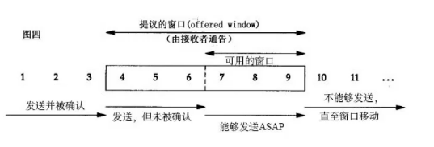
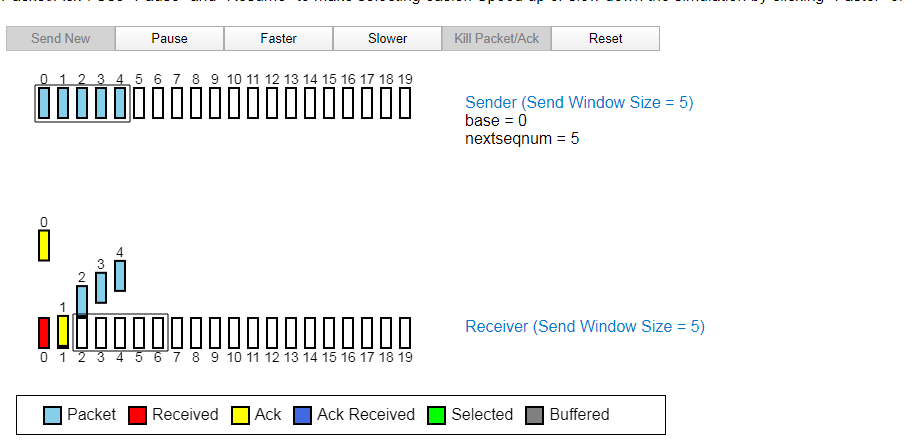
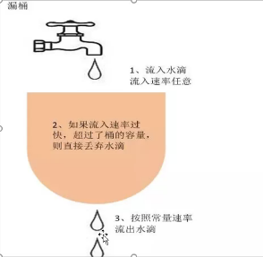
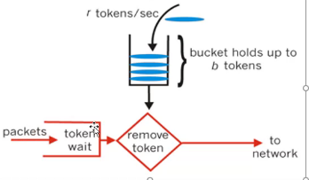

# 高并发场景下的限流策略

## 缓存

对热点数据进行缓存。

## 限流和降级

缓存

 **降级**

*   人工降级
*   自动降级

限流是降级的一种手段

 **限流**

 业务限流

在促销时，防止流量过大导致服务器宕机。会采用限流措施。

**针对恶意流量限流**

放置恶意流量攻击导致业务无法使用。

### **针对资源**

限流策略、熔断策略

### 限流

#### 限流算法

##### [滑动窗口](https://media.pearsoncmg.com/aw/ecs_kurose_compnetwork_7/cw/content/interactiveanimations/selective-repeat-protocol/index.html)

TCP协议中的流量整形手段

*   TCP发送缓冲区
*   TCP接收缓冲区

滑动窗口可以解决大量流量在同一时刻发起请求，但是滑动窗口也会存在临界点。

##### 计数器算法

通过计数器，当流量达到一定量时采取限流措施。

##### 漏桶算法

使用队列实现漏桶算法，类比MQ及线程池

##### 令牌桶算法

指定的时间会生成一定数量的token放到令牌桶中。例如：20ms生成一个token

当令牌桶满了之后，就暂停生成token。

初始化时会先预热一定数量的token放到令牌桶中。

每次请求的时候，先从令牌桶中获取token。获取到token就进行后续处理，获取不到就采取拒绝策略。

**好处**

令牌桶算法可以解决突发访问流量过大的问题。

**与漏桶算法对比**

漏桶算法无法处理突发流量问题。

guava

